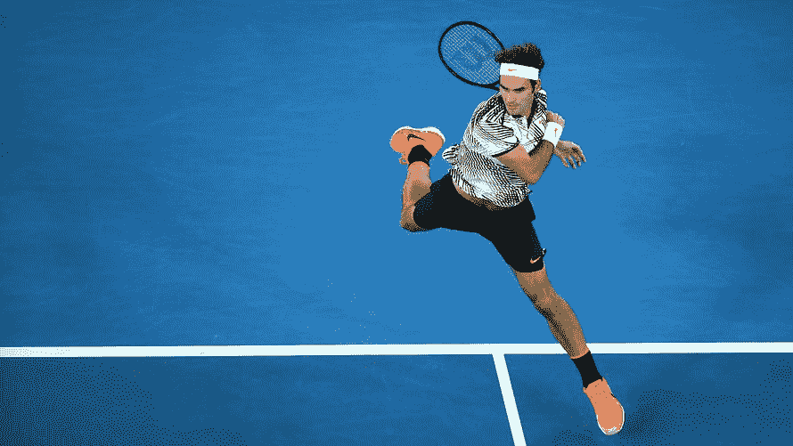
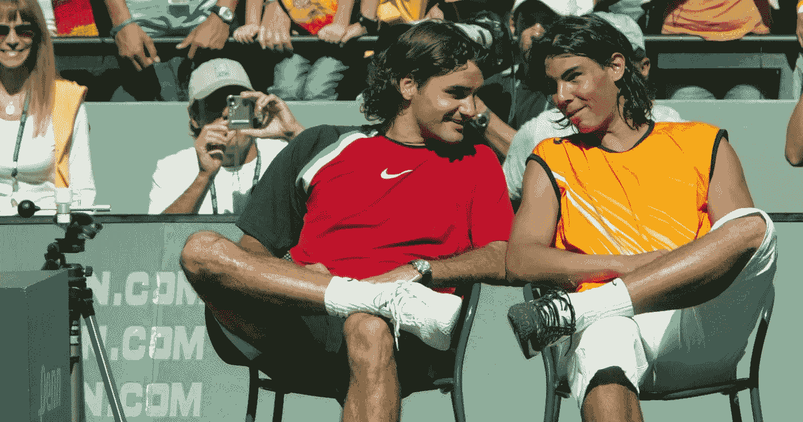
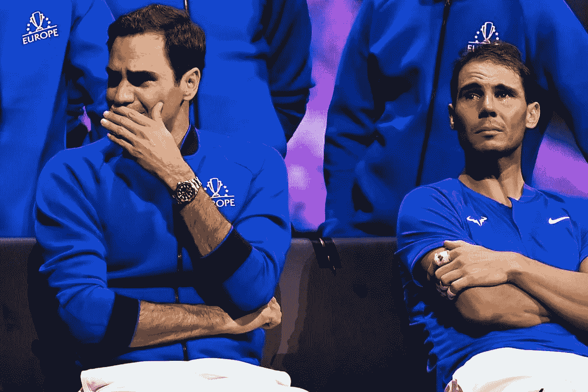

# 甚至连冠军都仰视的冠军。

> 原文：<https://medium.com/coinmonks/the-champion-that-even-champions-looked-up-to-803ba3cea195?source=collection_archive---------59----------------------->

Federer will retire as one of the most talented, successful and accomplished player in Tennis history.

就像每个人都有自己喜欢的快餐一样(我的快餐是进进出出)，每个人都有一个体育偶像。

很长一段时间，我的是费德勒。

纳达尔不知从哪里冒出来，抢尽了风头。

纳达尔顽强不屈，令人不安。

不管在什么情况下，他都追逐每一个目标，从不放弃。

但最后总是费德勒。

他流畅的笔触，优雅的举止和完美主义的完美瑞士光环。

对我来说，他永远是网球之神。

There are stronger players with harder serves and more powerful strokes, but for me, the smoothest, slickest, most graceful and precise backhand belongs to Federer.

“我今年 41 岁；费德勒在社交媒体上发布的一段音频剪辑中说:“我在 24 年里参加了 1500 多场比赛。“网球比我想象的更慷慨地对待我，现在我必须认识到是时候结束我的竞技生涯了。”

我是说这个传说还需要说什么？

他已经确立了自己网球史上最伟大的球员之一的地位，有人说是体育界最伟大的球员。

“费德勒带着历史上最伟大的竞争记录之一离开了比赛:103 个巡回单打冠军，20 个大满贯单打冠军，310 周排名第一，创纪录地在赛季结束的巡回赛决赛中获得 6 场胜利。而且，也许最值得注意的是，考虑到他的长跑，他从来没有因为受伤而被迫停止比赛。”

传奇的定义是什么？

这不是一个人谈论他们自己多少或者他们得到多少宣传。

我的意思是这在某种程度上是有帮助的，但更确切地说，是观察他们周围的其他人。

Yup, they were young men once — Federer-Nadal were such fierce and powerful competitors fans started calling the duo “Fedal”.

体育记者对费德勒有什么看法？

粉丝们对他有什么看法？

其他竞争者对他有什么看法？

名人堂成员是如何看待他的成就的？

你想知道一个人有多伟大吗？

看看周围其他人对他的真实看法。

我听过其他球员如何谈论德约科维奇的爆发，麦肯罗的崩溃，基尔吉奥斯的脾气，当然，费德勒年轻时脾气暴躁。

但是这些年来，没有人说过费德勒的坏话。

没有一件事情，没有史诗般的崩溃，没有疯狂的爆发，场内场外的斗殴，当然也没有法律上的麻烦。

一个真正的运动绅士。

历史上第一位收入超过 1B 的现役网球运动员。

他和其他人一起，把网球运动变成了一种全球性的热情。

这是我们作为运动员和社会人士都可以学习的东西。

你想知道费德勒有多棒吗？

当他退役时，他的长期对手拉斐尔·纳达尔在仪式上在他身边哭泣。

You know how great you are when even your oldest and fiercest rival cries for you when you retire. You really don’t see that often.

这辈子有一件事是不可避免的。

时间短暂，转瞬即逝。

尽管我们很害怕，费德勒的退役只是一个信号，预示着更多的未来。

纳达尔、德约科维奇和许多其他人也在变老。

时间将继续前进。

我们需要活出最好的自己，不要让任何事情拖累我们。

费德勒优雅、谦逊、伟大地退役了。

在整整一代看着他长大的孩子们心中，他将永远是一个网球传奇。

我很期待看到这位瑞士大师的下一部作品。

-

罗杰·费德勒退役你难过吗？

-

#创业#商业#创业#成长#成功#社交媒体#文化#创业#战略#罗杰费德勒#费德勒#网球#纳达尔#退役#冠军#亿万富翁#罗杰滕尼斯

> 交易新手？试试[加密交易机器人](/coinmonks/crypto-trading-bot-c2ffce8acb2a)或者[复制交易](/coinmonks/top-10-crypto-copy-trading-platforms-for-beginners-d0c37c7d698c)