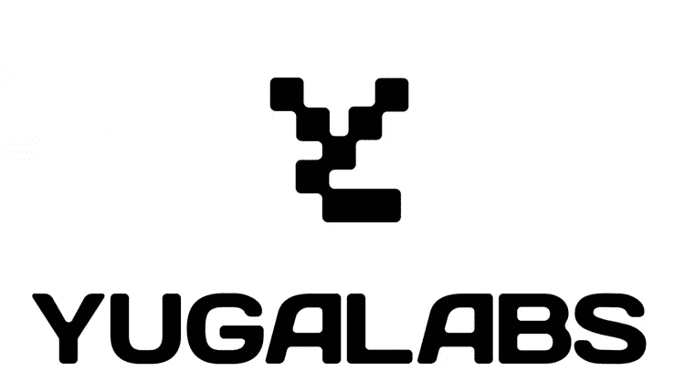

# 针对宇迦实验室的集体诉讼

> 原文：<https://medium.com/coinmonks/the-class-action-lawsuit-against-yuga-labs-3014615db68e?source=collection_archive---------21----------------------->

NFTs 是证券吗？今天，我们探讨一个对整个 Web 3 行业有着重大影响的基本问题。

律师事务所 Scott+Scott 目前正在组织针对无聊猿游艇俱乐部背后的公司[宇迦实验室](https://www.linkedin.com/company/yuga-labs/)的集体诉讼。该诉讼称，BAYC 和他们的本地令牌 Apecoin 被虚假地作为有保证回报的证券进行营销，而这些数字资产在过去几个月中价值暴跌。

这场诉讼成功的关键将是法院对 NFTs 和 Apecoin 是否应被归类为证券的裁定。为了被归类为证券，金融产品必须通过豪伊测试。测试的方式是，如果合同满足所有 4 个“叉”，它“通过”豪威测试，因此，被归类为证券。用于确定某物是否为证券的四个方面如下:

(1)金钱投资
(2)对普通企业的投资
(3)期望从他人的努力中获得利润
(4)。

虽然 Howie 测试的各种分支及其对 NFTs 和 crypto 的应用可以辩论，但在现实中，当 SEC 决定要监管它时，某些东西将被标记为安全。目前看来，证交会并不打算监管非金融交易。原因很简单，将非金融交易贴上证券标签将为 SEC 打开潘多拉魔盒。根据[解密](https://www.linkedin.com/company/decrypt-media/)“对于证券交易委员会来说，开始监管绘画、雕塑和挂毯的销售不再是一件难事——这些物品与该机构赖以生存的股票截然不同。”

虽然美国证券交易委员会不想监管艺术品市场，但像 Apecoin 这样的本土代币可能是一个不同的故事。Ape Coin 是 ApeCoin DAO 推出的加密货币，分发给无聊的 Ape NFTs 持有者。Apecoin 是宇迦实验室生态系统中使用的主要货币。它允许持有者购买数字资产，如另一边元宇宙的土地，并允许持有者对 ApeCoin DAO 的治理提案进行投票。有趣的是，Apecoin 往往会随着 BAYC 和宇迦实验室的当前地位而波动。可以说 Apecoin 满足了 Howie 测试的四个方面，因此是一种安全性。

Scott+Scott 尚未向联邦法院提交正式申诉，因为他们仍处于寻找因投资宇迦实验室而遭受损失的原告的初步阶段。作为一个资金雄厚、拥有众多律师的组织，宇迦很可能已经为这种可能性做好了准备。有趣的是，这种类型的案件将如何在联邦法院进行，因为它将为整个 Web 3 行业开创一个先例。

感谢您的阅读。

看看我在推特上未经过滤的想法:

[https://twitter.com/wasifmrahman](https://twitter.com/wasifmrahman)

在 LinkedIn 上关注我的职业生涯:

【https://www.linkedin.com/in/wasifmrahman/ 号

我对媒体的另一个想法是:

【https://medium.com/@wasifmrahman 

来源:

[https://decrypt . co/105871/yuga-labs-以可能的集体诉讼相威胁](https://decrypt.co/105871/yuga-labs-threatened-with-possible-class-action-lawsuit)

[https://block works . co/yuga-labs-faces-potential-class-action-law-over-inflated-bayc-nfts/](https://blockworks.co/yuga-labs-faces-potential-class-action-lawsuit-over-inflated-bayc-nfts/)

[https://news . bit coin . com/yuga-labs-may-face-a-potential-class-action-court-over-ape coin-and-NFT-sales/](https://news.bitcoin.com/yuga-labs-may-face-a-potential-class-action-lawsuit-over-apecoin-and-nft-sales/)

[https://coin telegraph . com/news/yuga-labs-不当诱导-bayc-investors-集体诉讼](https://cointelegraph.com/news/yuga-labs-inappropriately-induced-bayc-investors-class-action)

> 交易新手？尝试[加密交易机器人](/coinmonks/crypto-trading-bot-c2ffce8acb2a)或[复制交易](/coinmonks/top-10-crypto-copy-trading-platforms-for-beginners-d0c37c7d698c)
> 
> 加入 Coinmonks [电报频道](https://t.me/coincodecap)和 [Youtube 频道](https://www.youtube.com/c/coinmonks/videos)获取每日[加密新闻](http://coincodecap.com/)

## 另外，阅读

*   [复制交易](/coinmonks/top-10-crypto-copy-trading-platforms-for-beginners-d0c37c7d698c) | [加密税务软件](/coinmonks/crypto-tax-software-ed4b4810e338)
*   [网格交易](https://coincodecap.com/grid-trading) | [加密硬件钱包](/coinmonks/the-best-cryptocurrency-hardware-wallets-of-2020-e28b1c124069)
*   [密码电报信号](/coinmonks/top-3-telegram-channels-for-crypto-traders-in-2021-8385f4411ff4) | [密码交易机器人](/coinmonks/crypto-trading-bot-c2ffce8acb2a)
*   [最佳加密交易所](/coinmonks/crypto-exchange-dd2f9d6f3769) | [印度最佳加密交易所](/coinmonks/bitcoin-exchange-in-india-7f1fe79715c9)
*   [开发者最佳加密 API](/coinmonks/best-crypto-apis-for-developers-5efe3a597a9f)
*   最佳[密码借贷平台](/coinmonks/top-5-crypto-lending-platforms-in-2020-that-you-need-to-know-a1b675cec3fa)
*   [免费加密信号](/coinmonks/free-crypto-signals-48b25e61a8da) | [加密交易机器人](/coinmonks/crypto-trading-bot-c2ffce8acb2a)
*   杠杆代币的终极指南