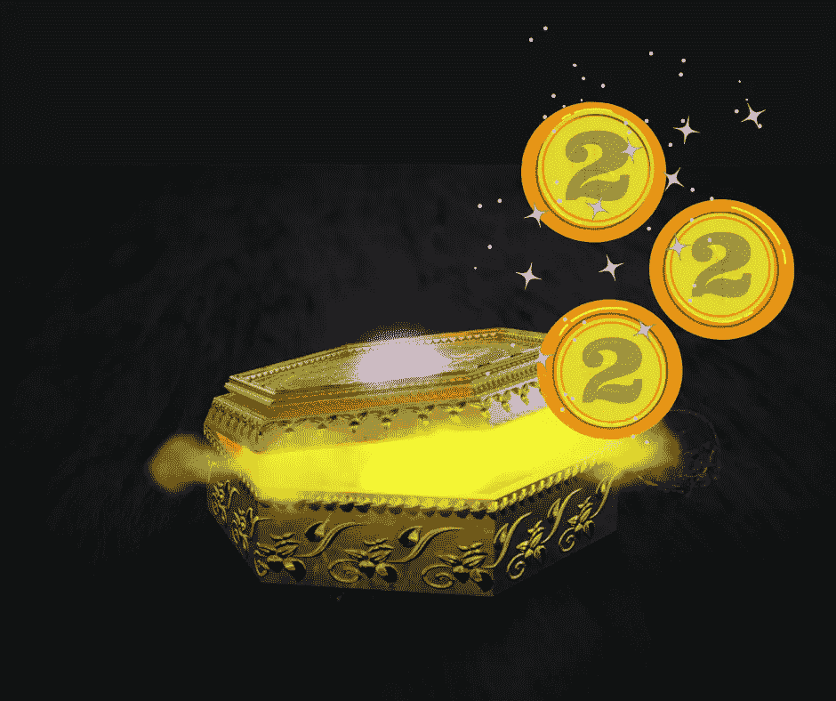
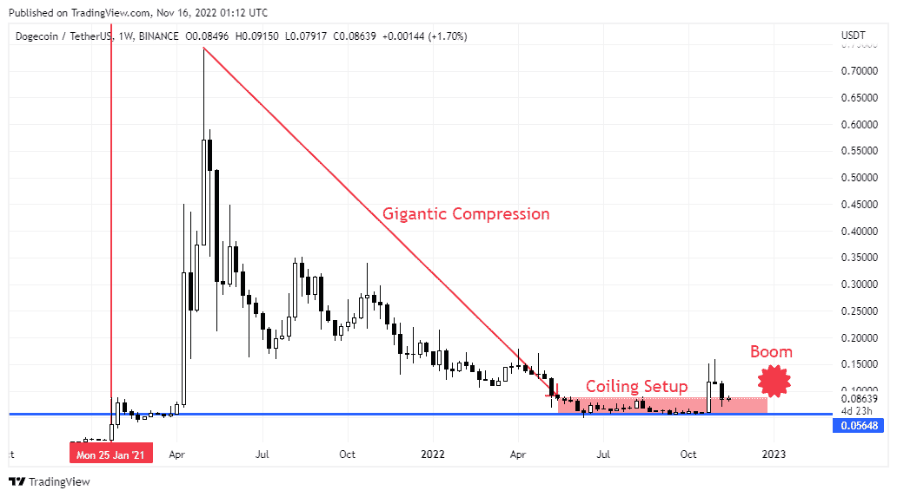
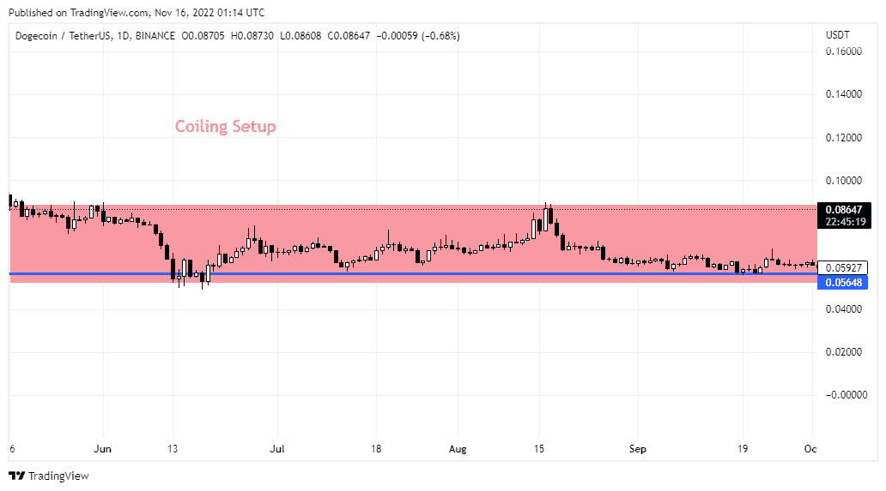

# 硬币潘多拉盒子:2 号线圈硬币揭晓

> 原文：<https://medium.com/coinmonks/the-coins-pandora-box-the-coiled-coin-2-revealed-4cd49f934734?source=collection_archive---------24----------------------->

Secret Coins to Wealth Revealed

# 每人一便士硬币

嘿，我们又见面了，伙计们！你今天过得怎么样？

在继续阅读这篇文章之前，对于那些还没有阅读“硬币潘多拉盒子:拆封绝密”第一系列的人来说，请先看看在 Medium 或， [Publish0x](https://www.publish0x.com/crypto-market-investment-ideas-cmii/the-coins-pandora-box-unboxing-the-top-secret-xlqepyx?a=K9b6XL77eE) 或[我的博客](https://www.estreetstall.site/blog/crypto-idea)上的原文。

现在，我猜你一定很好奇，想知道这样的潘多拉魔盒中第二枚硬币的确切名称和特征，也就是卷起来的硬币#2。不用担心，因为你很快就会在这篇文章中清楚地认识到这一点。这枚硬币对所有普通人来说都是非常好的投资品，因为它的价格非常便宜，仍然低于 10 美分，哇…这太令人兴奋了。但是，请阅读本文末尾的免责声明。

# 极度挤压的硬币

盘绕的硬币#2 经历了类似以太坊的弹簧加载压缩模式，甚至更长更紧。所以要释放的能量爆炸很可能会更强大(很多情况下)。你将在下文中看到基于价格行为方法的硬币分析。

# 卷硬币的名字#2

不要拐弯抹角，在我看来，这是卷绕硬币#2 是 Dogecoin (DOGE)。我不需要告诉你这枚硬币是什么和谁，因为你们大多数人已经知道它，或者你可以自己在互联网上找到这么多信息。但你只能在这篇文章中找到这种对 Dogecoin 作为 2022 年底前预期的盘绕硬币#2 的分析。请看下面的周线图，图中显示了道格/USDT 的线圈结构模式:

当我把它放大到每天的时间范围，你会真正感受到这只狗非同寻常的压缩状态。这难道不意味着什么吗？请再次记住从第一篇文章引用的**越长，越紧，越有力**。请看下面的日线图，图中放大显示了道格/USDT 的卷绕结构模式:

现在，请再看一下上面第一张图表的红色标签上的日期。是的，你必须在 2022 年底之前预期第二个 Dogecoin 爆炸周期，这可能会在 2023 年初形成一个强劲的上升趋势。你只需要少量的投资就可以开始养狗，大多数人都买得起。但是记得看我这篇文章末尾的免责声明。

祝你好运，周末愉快，顾！

*免责声明:本文基于我的研究和个人观点。这不是命令，也不是邀请。投资加密货币市场既有好处也有风险。每个投资决策都是做出决策的个人的责任。请根据您的个人风险状况进行投资。*

> 交易新手？试试[密码交易机器人](/coinmonks/crypto-trading-bot-c2ffce8acb2a)或者[复制交易](/coinmonks/top-10-crypto-copy-trading-platforms-for-beginners-d0c37c7d698c)