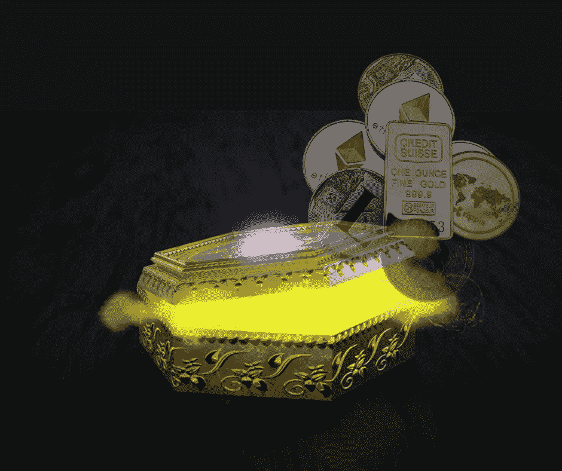
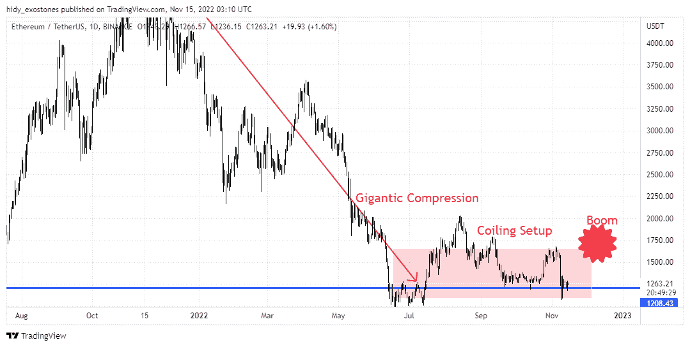
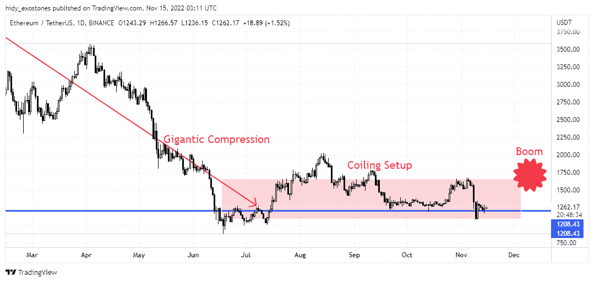
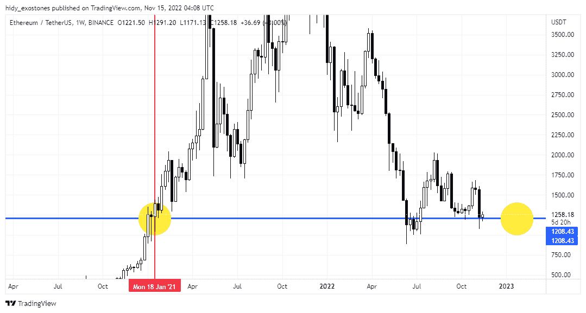

# 硬币潘多拉盒子:揭开最高机密

> 原文：<https://medium.com/coinmonks/the-coins-pandora-box-unboxing-the-top-secret-915784931804?source=collection_archive---------16----------------------->

The Crypto Coins Pandora Box

# 该卷绕结构

嘿！怎么了，伙计们？

你知道在价格行动方法中，你只需要通过图表屏幕观察所有最近发生的秘密市场现象。所有的市场行为和基本面都被整合到图表的模式和运动中。

在这篇加密博客文章中，我想分享一个实际上非常简单但非常强大的特殊技术。通过这种技术，我试图揭示当前加密货币形势及其投影的最高机密。好吧，我给你介绍一下**盘绕结构**技术。但在继续之前，请阅读本文末尾的免责声明。

盘绕结构看起来像一个完全**压缩的弹簧**，它保存了全部势能，以便在某个动量下以强大的运动爆发性地释放出来(在许多情况下)。向相反方向压缩一段时间后会向一个方向爆炸。就蜡烛线而言，它被称为盘绕设置，其中后续蜡烛线或更多蜡烛线比前一根蜡烛线低，这意味着它比前一根蜡烛线越来越紧，就像被压缩的弹簧一样，一根接一根。

原文由作者发表在这个[博客](https://www.estreetstall.site/blog/crypto-idea)上。

# 时间越长，力量越大

见解，为什么这种盘绕结构运动发生在市场上？这是因为大型市场参与者不喜欢在不运营资本的情况下，被紧紧束缚在一项沉睡的业务或投资中。如果被压缩的市场范围很短，并且周转很快，它只会给市场参与者带来更低的利润。而市场价格的长期压缩将产生强大的压力和摩擦，最终需要通过强大的爆炸来释放。这种盘旋状态持续的时间越长，力量越大，因为当它爆发时，加密市场通常会朝着突破方向大幅波动。

# 哪些加密硬币？

2022 年，已知有 20，931 种加密货币存在，并不时保持增长。在这篇文章中，我想分享一个关于哪些潜在的加密硬币具有其卷绕结构的当前状况的想法。

从成千上万枚现有的加密硬币中选择一枚似乎并不容易。每个人都可以自由选择自己的硬币。但我认为，如果我们选择的硬币可以在分析的基础上共享并互相挑战，那会更好。

告诉人们一个目前正在建立盘绕结构并准备在不久的将来大爆发的加密硬币名称就像打开潘多拉的盒子。它揭示了非常有价值的秘密宝藏，可以改变你的生活。但在继续之前，请阅读本文末尾的免责声明。

原文由作者发表在这个[博客](https://www.estreetstall.site/blog/crypto-idea)上。

# 盘绕的加密硬币#1

首先我会投票给线圈硬币的领导者，我的选择是**以太坊(ETH)** 。价格行为与基本面和市场情绪无关，所以图表本身就能说明问题。让我们来看看下面这张 ETH/USDT 的图表:

我想你现在开始明白了。对，没错，以太坊从 4800s 到 1200s 主支撑吸收了巨大的势能。事实上，这就像弹簧在主支撑处达到压缩终点时的压力。但是你好像看不清楚以太坊盘绕结构是在哪里形成的。好，让我们放大 ETHUSDT 图表，如下所示:

现在在压缩范围内更加清晰，如上所述**卷绕越长，动力越大**。

好了，现在我们开始计算投资潜力。以太坊的价格从底部均价 300s 涨到了峰值价格 4800s，这意味着以太坊投资有 4800/300 = 1600%(16x)的增长。这个 1，600% (16x)的潜在投资数字将是我选择下一个潜在线圈硬币的参考。那么有多少潜在的卷币可供选择呢？正如名言所说，*不要把所有的鸡蛋放在一个篮子里*。

我认为这是需要有一个线圈硬币的清单 8 是 16 的一半。然后我们只投资 16 的三分之一，也就是 5 个硬币。计算方法是，例如，你有 500 美元的初始资本，那么至少有 1 个硬币是赢家，从 1 个硬币的 100 美元初始资本变成 1600 美元，其他 4 个硬币的 400 美元初始资本是亏损，那么你仍然获得 1600 美元的利润——500 美元= 1100 美元，这太神奇了。那么，如果有超过 1 个硬币获胜，并且您的初始资本为 1000 美元或更多，您会怎么想？那么你的投资就会变成 110 万美元。你所做的只是点击然后忘记，这就是 Price Action 的终极策略，*开火然后忘记*。但是，在继续之前，请阅读本文末尾的免责声明。

# 突围何时发生？

这是另一个很难回答的问题。这也是打开潘多拉魔盒的秘密。价格行动当然不会像如果俄罗斯-乌克兰战争结束，或者如果美国总统更换，或者如果埃隆·马斯克买下埃瑟伦博物馆，等等。价格行为简单地用如下所示的图表来回答:

请注意上面的红色日期标签，是的，最有可能在 2023 年初发生爆炸。这是一种自然的循环模式。这意味着您必须在 2022 年 12 月 31 日之前做好准备。是的，我已经完全打开了潘多拉的盒子。

但是其他 7 个盘绕的硬币在哪里？我试图在下一篇文章中回顾和分享它们。请再次阅读以下免责声明。

原文由作者在[博客](https://www.estreetstall.site/blog/crypto-idea)上发表。

*免责声明:本文基于本人的研究和个人观点。这不是命令或邀请。投资于密码货币市场既有好处，也有风险。每个投资决定都是做出决定的个人的责任。请根据您的个人风险状况进行投资。*

> 交易新手？试试[密码交易机器人](/coinmonks/crypto-trading-bot-c2ffce8acb2a)或者[拷贝交易](/coinmonks/top-10-crypto-copy-trading-platforms-for-beginners-d0c37c7d698c)
> 
> 加入 Coinmonks [电报频道](https://t.me/coincodecap)和 [Youtube 频道](https://www.youtube.com/c/coinmonks/videos)获取每日[加密新闻](http://coincodecap.com/)

## 此外，请阅读

*   [拷贝交易](/coinmonks/top-10-crypto-copy-trading-platforms-for-beginners-d0c37c7d698c) | [密码税务软件](/coinmonks/crypto-tax-software-ed4b4810e338)
*   [网格交易](https://coincodecap.com/grid-trading) | [加密硬件钱包](/coinmonks/the-best-cryptocurrency-hardware-wallets-of-2020-e28b1c124069)
*   [密码电报信号](/coinmonks/top-3-telegram-channels-for-crypto-traders-in-2021-8385f4411ff4) | [密码交易机器人](/coinmonks/crypto-trading-bot-c2ffce8acb2a)
*   [最佳加密交换机](/coinmonks/crypto-exchange-dd2f9d6f3769) | [印度最佳加密交换机](/coinmonks/bitcoin-exchange-in-india-7f1fe79715c9)
*   [开发人员的最佳加密 API](/coinmonks/best-crypto-apis-for-developers-5efe3a597a9f)
*   最佳[密码借贷平台](/coinmonks/top-5-crypto-lending-platforms-in-2020-that-you-need-to-know-a1b675cec3fa)
*   [免费加密信号](/coinmonks/free-crypto-signals-48b25e61a8da) | [加密交易机器人](/coinmonks/crypto-trading-bot-c2ffce8acb2a)
*   杠杆代币的终极指南