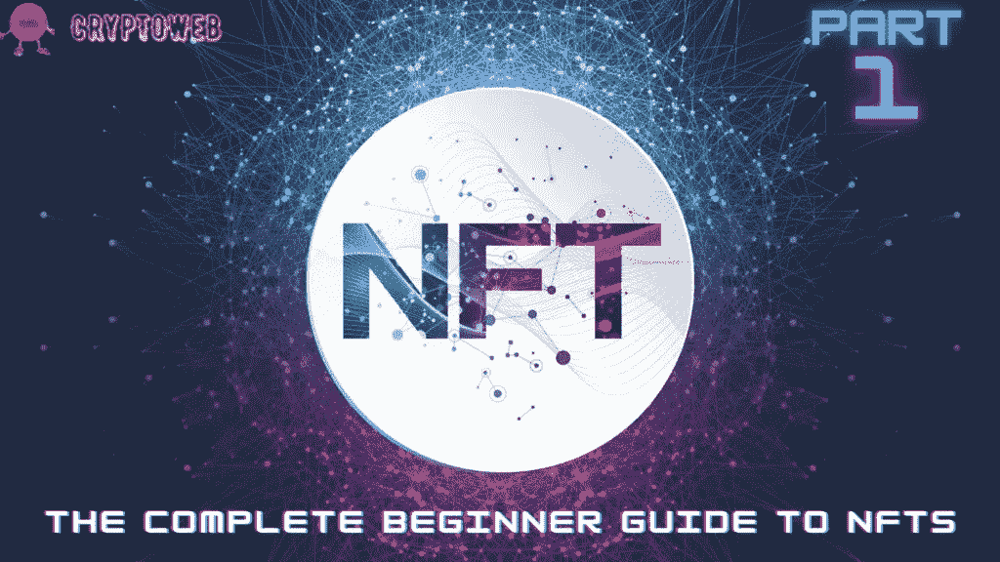

# NFTs 完全入门指南|第 1 部分|什么是 NFTs？

> 原文：<https://medium.com/coinmonks/the-complete-beginner-guide-to-nfts-part-1-what-are-nfts-32888f8e6f27?source=collection_archive---------20----------------------->

在这份完整的初学者指南中，我们将回答以下所有问题，并始终保持更新，因此请确保将该指南添加到您的浏览器中:

> [**什么是 NFT？你需要知道的一切。**](https://cryptoweb.wiki/the-complete-beginner-guide-to-nfts-part-1-what-are-nfts/)
> 
> [**如何选购 NFTs？最好最安全的方法。**](https://cryptoweb.wiki/the-complete-beginner-guide-to-nfts-part-2-how-to-buy-nfts/)
> 
> [**如何铸造 NFT？简单的方法。**](https://cryptoweb.wiki/the-complete-beginner-guide-to-nfts-part-3-how-to-mint-nfts/)
> 
> [**如何销售 NFT？比较最佳平台。**](https://cryptoweb.wiki/the-complete-beginner-guide-to-nfts-part-4-how-to-sell-nfts/)
> 
> [**现在买入并持有的最佳 NFT？**](https://cryptoweb.wiki/best-nfts-to-buy-and-hold-right-now/)
> 
> [**如何开始投资 NFTs？**](https://cryptoweb.wiki/the-complete-beginner-guide-to-nfts-part-6-how-to-start-investing-in-nfts/)
> 
> [**解释所有 NFT 公用事业**](https://cryptoweb.wiki/the-complete-beginner-guide-to-nfts-part-7-all-nft-utilities-explained/)

NFT 有史以来最贵的一次购买是 9100 万美元。自 2017 年以来，已有超过 230 亿美元用于非正规金融服务。但是为什么呢？我总是收到这样的问题:什么是 NFT，它们是如何工作的？我为什么要为我可以免费点击并保存的东西付费呢？在本指南中，我们将回答所有这些问题。

因此，在深入 NFT 世界之前，确保你订阅了时事通讯，并喜欢和评论成为第一个获得最新更新和新闻的人。

# 那么，什么是 NFT 呢？

简而言之，不可替代的令牌是基于区块链技术的独特资产。音乐、gif、艺术、游戏、名牌鞋和视频都是数字资产的例子。

NFT 具有独特的识别码和信息，有助于相互区分。从本质上讲，非功能性交易不能随意交易或交换。它们以数字方式买卖，经常使用比特币和以太坊等加密货币，并使用与其他加密货币类似的基础软件进行编码。

NFTs 可以将在线艺术品和其他收藏品转换为独特的、可验证的资产，这些资产易于在区块链上买卖，并为任何特定对象的所有权提供数字认证。

虽然 NFT 最早出现在 2014 年，但现在它越来越受欢迎，成为一种流行的购买和销售在线艺术品和创意的方法。

2021 年的统计数据显示，NFT 市场的价值约为 410 亿美元。

总体而言，截至 5 月 1 日，收藏者已在 2022 年向 NFT 市场发送了超过 370 亿美元的资金，有望超过 2021 年发送的 410 亿美元。

# NFTs 是如何工作的？

如果你正在考虑购买 NFT 作为投资，请记住，价值增长是没有保证的。一些 NFT 价值数亿美元，而另一些则几乎一文不值。

大多数 NFT 都是在以太网上创建和存储的，只有少数例外，它们是在其他区块链网络上创建和存储的，比如 Solana 和 Cardano。

如果你不熟悉区块链这个词，它只是指记录所有网络交易的分布式公共分类账。数字项目的大小并不重要，因为它与区块链无关。

艺术家和创作者可以通过铸造来创造 NFT。在区块链系统上表示艺术家文件的行为被称为铸造。

一旦 NFT 被铸造出来，创作者就可以出售、购买或交易它。即使有人试图复制有问题的对象，他们也不能更改所有权记录，除非现有所有者提供许可。

# 我为什么要为我可以免费点击并保存的东西付费？

这是一个很好的问题，可以用一个简单的类比来回答。获得蒙娜丽莎的复制品很简单，但最终，你并不拥有蒙娜丽莎；你拥有一幅蒙娜丽莎的复制品。类似地，当你右击并保存数字艺术时，你有一个拷贝。你并不拥有原件。

数字艺术 NFT 空间解决了传统艺术空间中的许多挑战。它涵盖了真实性和评估等问题，以及现实世界中的其他问题，如美术馆、经纪人和其他中间人。

非传统艺术是为稀缺性而生的，每件原创艺术品都只有少数几件纪念品。虽然每件 NFT 作品在技术上都是独一无二的，但有些却是独一无二的。为一件艺术品创造的代币越少，藏品的价值就越高。资产价值高的主要因素之一是其稀有性。

# 最贵的 NFT

由艺术家 Pak 创作的这幅《合并》,创下了最昂贵的 NFT 作品拍卖纪录，9180 万美元。

最初，NFT 由黑色背景上的三个大点组成。随着买家数量的攀升，圆点的大小也在增加。

**第一个 5000 天**是一个巨大的收藏，收藏了 5000 件艺术作品，这些作品从 2007 年开始每天都在创作，主题、形式和风格各不相同。目前为 6930 万美元。

**时钟**，以 5274 万美元售出，旨在筹集资金为朱利安·阿桑奇在 2019 年 5 月备受争议的监禁后辩护。时钟显示了阿桑奇被关押的天数。

# NFT 是如何开始的？

NFTs 的想法源于所谓的“彩色硬币”，最初于 2012-2013 年在比特币区块链上发行。

之后有了 CryptoCats 的发布，CryptoCats 发布后不久，Axion Labs 推出了 CryptoKitties。这些代币于 2017 年 10 月亮相，成为市场上的下一个 NFT 现象。

CryptoKitties 是一款可以购买、交易和繁殖数字猫的游戏，被认为是最早的 NFT 之一。这是区块链首批非金融用途的案例之一。

# 继网络、加密和人工智能炒作之后，NFTs 将是下一个大趋势。

总而言之，当你购买 NFT 时，你获得了一项资产的所有权，交易被记录在区块链上，不能被删除或操纵。

NFTs 在 2021 年席卷全球，带来了一场数字艺术革命，并成为今年发展最快的新兴资产类别之一。

NFTs 可以有多种形式，并不总是数字艺术作品。

所有这些统计数据显示了国家森林信托基金不断发展的效用，以及它们如何已经在建设社区，促成独特和可交易的资产，并为元宇宙的所有权和身份奠定基础。

**感谢您花时间阅读这篇文章，不要忘记点赞、评论并订阅我的时事通讯，成为第一个阅读下一篇文章的人，以获得更多加密、web3、NFT 和金融更新和新闻。**

> ***NFT，比特币，Web3.0，DeFi，以及针对初学者的加密货币***
> 
> *使用*[*CryptoWeb*](http://cryptoweb.wiki/)*免费的初学加密指南掌握 web3.0 世界的基础知识，在这里，我们深入了解了该领域中一些顶级的 NFT、加密和元宇宙项目，以便您在投资之前得到通知。*

> 交易新手？尝试[加密交易机器人](/coinmonks/crypto-trading-bot-c2ffce8acb2a)或[复制交易](/coinmonks/top-10-crypto-copy-trading-platforms-for-beginners-d0c37c7d698c)