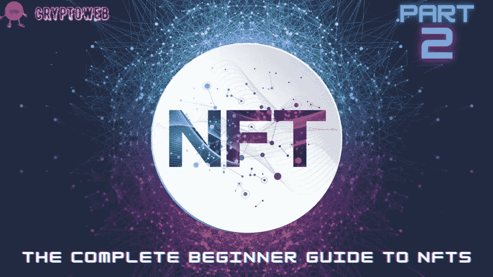

# NFTs 完全入门指南|第 2 部分|如何购买 NFTs？

> 原文：<https://medium.com/coinmonks/the-complete-beginner-guide-to-nfts-part-2-how-to-buy-nfts-78021ef656e9?source=collection_archive---------61----------------------->

在这份完整的初学者指南中，我们将回答以下所有问题，并始终保持更新，因此请确保将该指南添加到您的浏览器中:

> [**什么是 NFT？你需要知道的一切。**](https://cryptoweb.wiki/the-complete-beginner-guide-to-nfts-part-1-what-are-nfts/)
> 
> [**如何选购 NFTs？最好最安全的方法。**](https://cryptoweb.wiki/the-complete-beginner-guide-to-nfts-part-2-how-to-buy-nfts/)
> 
> [**如何铸造 NFT？简单的方法。**](https://cryptoweb.wiki/the-complete-beginner-guide-to-nfts-part-3-how-to-mint-nfts/)
> 
> [**如何销售 NFT？比较最佳平台。**](https://cryptoweb.wiki/the-complete-beginner-guide-to-nfts-part-4-how-to-sell-nfts/)
> 
> [**现在买入并持有的最佳 NFT？**](https://cryptoweb.wiki/best-nfts-to-buy-and-hold-right-now/)
> 
> [**如何开始投资 NFTs？**](https://cryptoweb.wiki/the-complete-beginner-guide-to-nfts-part-6-how-to-start-investing-in-nfts/)
> 
> [**解释所有 NFT 公用事业**](https://cryptoweb.wiki/the-complete-beginner-guide-to-nfts-part-7-all-nft-utilities-explained/)

据彭博称，NFT 市场正在下滑。根据 NFT 追踪机构 NonFungible 的数据，不可伪造代币的平均交易价值最近大幅下降，从年初的近 7000 美元跌至约 2000 美元。因此，如果你正在考虑购买一些非功能性食物，这可能是正确的时间。

在本指南中，我们将指导您如何购买第一台 NFT，以及在购买 NFT 之前需要设置的事项。

在本文后面深入探讨之前，让我们快速浏览一下购买 NFT 所需的步骤，如果您已经熟悉这些步骤，可以随意跳过一两步。

1.  **设置您的加密钱包**
2.  **获得一些加密货币；大部分平台接受 ETH。**
3.  **将加密货币发送到您的钱包。**
4.  在您选择的平台上购买 NFT。
5.  在站台上看到你的 NFT。

# 那么，让我们突破购买 NFT 所需的步骤。

购买你的第一个 NFT 可能会令人生畏。不管社交媒体倾向于反映什么，只有极小比例的公众加入了 NFT 市场，并熟悉购买和销售 NFT 的基本原理。

# 设置您的加密钱包

要购买 NFT，你必须连接区块链服务，加密钱包让你这样做，同时也持有资产。在 Web3 的世界里，你将拥有自己的金钱和数字资产。但是，如果你的资产储存在比特币基地或币安这样的加密交易所，你仍然不拥有它，因为交易所拥有并控制它，就像银行一样。你可以在你的加密钱包中保存你购买的所有资产，就像你可以在你的物理钱包中存储和拥有现金一样。

MetaMask 是市场上最安全和用户友好的钱包。请保留一份您的密码短语并将其保存在安全的地方，以备您将来需要恢复它或在另一台设备上使用您的钱包。

# 弄点加密货币；大部分平台接受 ETH。

设置好钱包后，下一步就是买一些 ETH。区块链以太坊使用加密货币 ETH。我们需要以太网来购买非功能性网络传输，因为大多数非功能性网络传输都是在区块链以太坊举办的。

最简单和最便宜的选择是从 Crypto.com、比特币基地、币安等交易所购买。阅读本指南的大多数人应该能够使用其中一个交易所，但如果你的国家没有覆盖，你可以谷歌一下你的国家可以使用哪些交易所。在大多数主要交易所，这个过程应该很简单。

# 将加密货币发送到您的钱包。

现在，让我们送一些 ETH 到你的钱包，一旦你买了一些。你将需要你的钱包地址这样做。

你可以和其他人分享你的钱包地址，他们可以用它给你发送 NFTs 或 ETH。当我们将 ETH 从您的比特币基地帐户转移到您的 Metamask wallet 地址时，我们需要知道您刚刚创建的 Metamask wallet 的地址。

如果您使用手机，请访问 Metamask 应用程序；如果您使用笔记本电脑，请访问 Metamask 浏览器扩展。一旦你进入 Metamask，你可以在侧边栏菜单中点击“钱包”，然后你会在中间看到一个地址，点击地址，它就会被复制。

复制完地址后，去比特币基地，点击屏幕顶部的发送/接收按钮。确保将默认选择从比特币改为以太坊。然后输入要发送的金额(这将比您之前支付的金额少一点，因为比特币基地收取一些费用)。然后将你的地址粘贴到“收件人”部分。

# 在你选择的平台上购买 NFT。

现在，您终于准备好在您选择的平台上购买 NFT 了！

选择平台后，如 OpenSea 或币安。

转到您想要购买的 NFT 的收藏页面，选择您喜欢的一个，并通过检查您同意服务条款并单击“确认结账”来确认结账

一旦你这样做了，Metamask 就会弹出并显示确认屏幕。完成此交易最简单的方法是点击“确认”就这样，恭喜你，你刚买了你的第一辆 NFT！

# 在站台上看到你的 NFT。

首先，是等待。您的钱包可能会显示“待定”，这意味着该交易仍将被添加到区块链中，因此非常安全。在资金被永久转移之前，数以千计的电脑将记录交易细节，确认你对 NFT 的所有权。

这就是加密货币交易安全的原因——你不必信任出售 NFT 的人。你必须相信区块链。如果你担心正在发生的事情或者为什么一些事情花费的时间比应该的长，你可以在任何区块链浏览器上检查你的钱包地址或交易细节，以确认这个过程正在发生。以太扫描就是一个著名的例子。

如果你从 OpenSea 购买了 NFT，你应该在你的账户页面的个人资料下看到它。

# 最后的想法

希望这一切都有意义！现在，你可以在任何平台上使用任何加密货币购买任何你想要的 NFT。这个过程类似于我们在指南的这一部分中介绍的内容。

不要忘记喜欢、评论和订阅我的时事通讯，成为第一个阅读下一篇文章的人，以获得更多加密、web3、NFT 和金融更新和新闻。

> ***NFT、比特币、Web3.0、DeFi、初学者加密货币***
> 
> *使用*[*CryptoWeb*](http://cryptoweb.wiki/)*免费的初学加密指南掌握 web3.0 世界的基础知识，在这里，我们深入了解了该领域中一些顶级的 NFT、加密和元宇宙项目，以便您在投资之前得到通知。*

> 加入 Coinmonks [电报频道](https://t.me/coincodecap)和 [Youtube 频道](https://www.youtube.com/c/coinmonks/videos)获取每日[加密新闻](http://coincodecap.com/)

# 另外，阅读

*   [SmithBot 评论](https://coincodecap.com/smithbot-review) | [4 款最佳免费开源交易机器人](https://coincodecap.com/free-open-source-trading-bots)
*   [比特币基地僵尸程序](/coinmonks/coinbase-bots-ac6359e897f3) | [AscendEX 审查](/coinmonks/ascendex-review-53e829cf75fa) | [OKEx 交易僵尸程序](/coinmonks/okex-trading-bots-234920f61e60)
*   [如何在印度购买比特币？](/coinmonks/buy-bitcoin-in-india-feb50ddfef94) | [瓦济克斯评论](/coinmonks/wazirx-review-5c811b074f5b)
*   [密码交易机器人](/coinmonks/crypto-trading-bot-c2ffce8acb2a) | [概率评估](https://coincodecap.com/probit-review)
*   [CryptoHopper 替代品](/coinmonks/cryptohopper-alternatives-d67287b16d27) | [HitBTC 审查](/coinmonks/hitbtc-review-c5143c5d53c2)