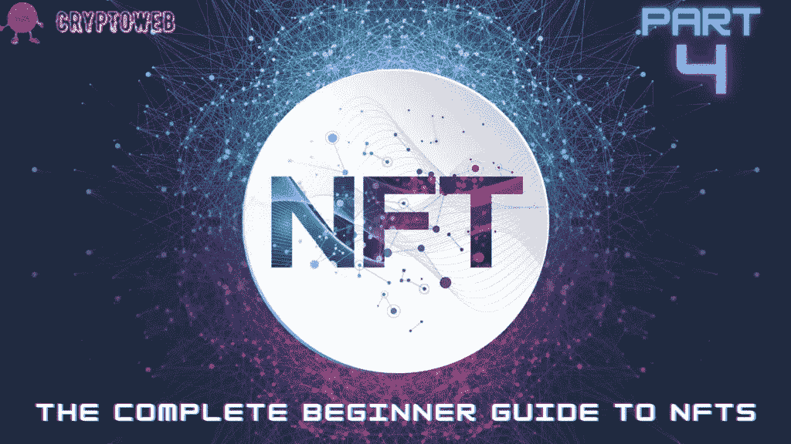

# NFTs 完全入门指南|第 4 部分|如何销售 NFTs？

> 原文：<https://medium.com/coinmonks/the-complete-beginner-guide-to-nfts-part-4-how-to-sell-nfts-8d58abdb0c59?source=collection_archive---------27----------------------->

在这份完整的初学者指南中，我们将回答以下所有问题，并始终保持更新，因此请确保将该指南添加到您的浏览器中:

1.  [**什么是 NFT？你需要知道的一切。**](https://cryptoweb.wiki/the-complete-beginner-guide-to-nfts-part-1-what-are-nfts/)
2.  [**如何选购 NFTs？最好最安全的方法。**](https://cryptoweb.wiki/the-complete-beginner-guide-to-nfts-part-2-how-to-buy-nfts/)
3.  [**如何铸造 NFT？简单的方法。**](https://cryptoweb.wiki/the-complete-beginner-guide-to-nfts-part-3-how-to-mint-nfts/)
4.  [**如何销售 NFT？比较最佳平台。**](https://cryptoweb.wiki/the-complete-beginner-guide-to-nfts-part-4-how-to-sell-nfts/)
5.  [**现在买入并持有的最佳 NFT？**](https://cryptoweb.wiki/best-nfts-to-buy-and-hold-right-now/)
6.  [**如何开始投资 NFTs？**](https://cryptoweb.wiki/the-complete-beginner-guide-to-nfts-part-6-how-to-start-investing-in-nfts/)
7.  [**解释所有 NFT 公用事业**](https://cryptoweb.wiki/the-complete-beginner-guide-to-nfts-part-7-all-nft-utilities-explained/)

所以你终于准备好了你的 NFTs，现在准备出售它们。除了一个小问题。你还是不知道怎么去的，也不知道去了哪里！你不知道如何避免高额的油费。你已经尝试了一些应用程序，但不太成功，并且不熟悉这个 NFT 世界。好了，别担心了。这份指南将拯救世界！

在我们完整的 NFTs 初学者指南的第四部分，你将学习在你选择的平台上销售你的第一个 NFT 的分步指南。又是什么让 NFTs 有价值呢？

# 但是，首先，您需要知道是什么让 NFTs 有价值。

NFT 是区块链上的数据表示。因此，理解这些数据代表了什么(如果有的话)至关重要。币安发表了一篇优秀的文章，概述了确定 NFT 价值的广泛方法。

该公司表示，在确定 NFT 的客观价值时，三个最重要的变量是稀有性、实用性和有形性。

# 稀薄

世界上任何东西的稀有程度经常被用来定义它的价值。不幸的是，许多 NFT 项目用这个概念来说服客户，“独特”的想法适用于他们发行的每一个 NFT。虽然理论上是真的，但它的稀有程度远不能与野生大熊猫相比。相反，这个罕见的定义排除了公众对这个问题的兴趣。野生大熊猫现在很有价值，因为世界在很大程度上喜欢它们，它们对动物园和帮助保护它们安全的政府来说很有市场。此外，今天创作的绝大多数 NFT 作品背后几乎没有意识形态。

# 效用

一个对象的效用取决于它在现实世界或数字世界中的有用程度。

NFTs 可以通过解锁不同的游戏内功能或访问内容(例如，NFT 的持有者可以访问非持有者无法访问的在线内容)来提供 NFT 世界中的功能。

NFTs 可以通过解锁不同的游戏内功能或访问内容(例如，NFT 的持有者可以访问非持有者无法访问的在线内容)来提供 NFT 世界中的功能。

此外，就像其他主要以盈利为目的的非金融交易一样，许多人声称是有益的。然而，一个详细的检查将揭示许多项目正在以错误的顺序做事情，首先发布 NFT，然后确定它可能用于什么。

# 确切性

NFT 是独一无二的，可以代表物理或数字世界中的任何事物。以这种方式，NFT 发行者可以将数字资产链接到现实世界或数字项目。

现在发布的很多 NFT 都没有这个链接。这些资产依靠其独特性来吸引目标受众的注意力。总的来说，拥有 NFT 并不意味着拥有其他任何权利。

# 以下是一些销售非功能性食物的热门市场

政策、使用条款和功能因市场而异。我们将简要介绍一下销售您的 NFT 的最受欢迎的平台。

1.  [**OpenSea**](https://opensea.io/) **:为初学者提供了一个简单的 UI，因为交易是向买家收费的，卖家在创建账户时只需支付交易汽油费。但最近，该平台充斥着 NFT，这使得它更难从竞争中脱颖而出。**
2.  ****:这个市场有一种叫做“RARI”的代币，他们会把代币发给最活跃的用户。每个 NFT 的创建都要收费，这个平台的竞争也很激烈。****
3.  **[**基金会**](https://foundation.app/) **:挂牌一个 NFT 是免费的，但平台从每笔销售中抽取 15%。在这个市场注册更复杂，需要邀请。****
4.  **[**Mintbase**](https://www.mintbase.io/) **:第一批以 NFT 形式托管音频录音的市场之一。由于交易费用较低，平台使用了 NEAR 协议。在这个平台上也可以使用菲亚特支付。****

# **以下是出售你的 NFT 的 4 个快速步骤**

**当你铸造了你的 NFT、一个市场和一个装有所需加密货币的钱包时，你就可以开始出售你的艺术品了。上市过程的步骤在任何平台上都几乎相同:**

1.  ****注册:在 OpenSea 等许多热门平台上，只需连接你的钱包，注册就可以很简单。还可以选择填写你的个人资料，添加图片，链接你的社交资料，整理 NFT 收藏，如果你有的话。****
2.  ****上传您的 NFT:以支持的格式之一上传包含您的数字艺术的文件，添加其名称和描述，并确认 NFT 创作。费用支付过程因市场而异。有些市场对 NFT 的创作收费，有些是出售，有些是让买家付费。****
3.  **销售:在你的 NFT 页面上找到“销售”按钮。你可以以固定价格或举行拍卖来出售你的 NFT，并选择接受出价的时间。**
4.  **推广你的 NFTs:由于 NFT 市场现在充斥着各种各样的艺术，你需要让你的产品脱颖而出。你可以提供一个伟大的艺术作品，社区将热烈欢迎。这里最主要的是吸引潜在买家的注意力。**

# **最后一点，**

**所有实体经济的放缓或回落无疑将影响数字经济，而那些基础不稳定的数字资产将承受大部分影响。对于只购买非金融资产的个人来说，这可能是评估其投资组合的好时机。**

**然而，在任何平台上销售你的 NFT 都不像创建独特的 NFT 并吸引潜在买家那么复杂。但是，完全随机的东西往往会变得流行，所以请在这个不断增长的市场中试试你的运气吧！**

> ****NFT、比特币、Web3.0、DeFi 和面向初学者的加密货币****
> 
> **通过免费的初学者加密指南掌握 web3.0 世界的基础知识，我们深入了解了该领域的一些顶级 NFT、加密和元宇宙项目，以便您在投资前获得信息。**

> **交易新手？试试[加密交易机器人](/coinmonks/crypto-trading-bot-c2ffce8acb2a)或者[复制交易](/coinmonks/top-10-crypto-copy-trading-platforms-for-beginners-d0c37c7d698c)**