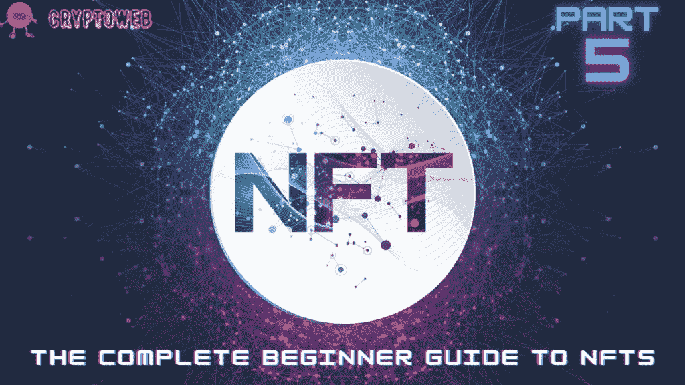

# NFTs 完全入门指南|第 5 部分|现在购买和持有的最佳 NFTs？

> 原文：<https://medium.com/coinmonks/the-complete-beginner-guide-to-nfts-part-5-best-nfts-to-buy-and-hold-right-now-5b7a43587456?source=collection_archive---------58----------------------->

# 在这份完整的初学者指南中，我们将回答以下所有问题，并始终保持更新，因此请确保将该指南添加到您的浏览器中:

1.  [**什么是 NFT？你需要知道的一切。**](https://cryptoweb.wiki/the-complete-beginner-guide-to-nfts-part-1-what-are-nfts/)
2.  [**如何选购 NFTs？最好最安全的方法。**](https://cryptoweb.wiki/the-complete-beginner-guide-to-nfts-part-2-how-to-buy-nfts/)
3.  [**如何铸造 NFT？简单的方法。**](https://cryptoweb.wiki/the-complete-beginner-guide-to-nfts-part-3-how-to-mint-nfts/)
4.  [**如何销售 NFT？比较最佳平台。**](https://cryptoweb.wiki/the-complete-beginner-guide-to-nfts-part-4-how-to-sell-nfts/)
5.  [**现在买入并持有的最佳 NFT？**](https://cryptoweb.wiki/best-nfts-to-buy-and-hold-right-now/)
6.  [**如何开始投资 NFTs？**](https://cryptoweb.wiki/the-complete-beginner-guide-to-nfts-part-6-how-to-start-investing-in-nfts/)
7.  [**解释所有 NFT 公用事业**](https://cryptoweb.wiki/the-complete-beginner-guide-to-nfts-part-7-all-nft-utilities-explained/)

从 2021 年初到 2022 年，NFT 一直是 web3 行业、区块链技术领域的头条新闻，甚至在拥有自己的 NFT 的名人中也是如此。

它们通过保留独特数字资产的所有权，为人们在数字世界中考虑可收藏物品的方式带来了重大变化。

本指南将介绍最好的非功能性食物，在哪里可以买到这些非功能性食物，以及目前 NFT 市场的情况。

但是，在考虑投资一些非金融资产之前，你应该了解 NFT 市场的现状。

# NFT 市场目前的情况如何？

我们可以假设，在 2021 年 3 月至 2022 年 3 月期间，情况发生了显著变化。让我们来看看在短短一年内彻底改变商业面貌的一些因素:

让我们来看看仅在一年内就从根本上改变了企业面貌的一些因素:

*   过度投机减缓了交易，增加了转售损失。
*   公众正在对这一数字资产类别失去兴趣，其 80%的 NFT 在流通中的价值主张留下了一些期望。
*   我们注意到 NFT 市场明显饱和:根据 NonFungible.com 的数据，流通中的 NFT 数量增加了 126 %，从 2021 年 2 月的 1420 万增加到一年后的 3210 万。
*   乌克兰战争创造了一个复杂的地缘政治背景，自然吸引了所有的注意力，使得报道 NFTs 销售的机会更少。
*   此外，杰克·多西第一条推文的 NFT 正在由加密企业家新浪 Estavi 在 OpenSea 上转售，他去年以 290 万美元收购了该公司，最高出价不到 7000 美元。和数百万其他非功能性食物一起。没有特定的环境，迷失在噪音中，却被未能规范可疑行为的市场空气所污染。

换句话说，NFT 市场饱受过度投机之苦，市场已经被低价值资产饱和，公众开始不信任 NFT 能够提供的真正价值，对俄乌战争的关注超过了对 NFT 交易的关注。

不会再有 6900 万美元的大拍卖让买家相信任何 NFT 都能以数千万的价格成交。

# 以下是现在可以买入并持有的最佳 5 种 NFT。

我们将在本指南中揭示的非功能性食品代表了值得购买的最佳非功能性食品，这要归功于它们的主流吸引力和潜在的价值增长。

让我们深入探讨这些非功能性测试，以理解为什么它们现在被认为是最好的。

1.  MEMELAND 的 POTATOZ

“POTATOZ”是 9999 个实用功能的 PFP(个人资料图片)的集合。每个 Potatoz 都是你进入伟大的 Memeland 生态系统的入场券。它们是一道很棒的配菜，但有些人可能觉得有必要成为主菜。有传言说他们和迷因列表、$迷因、MVP 等等有秘密联系！

他们对这个项目如何融入他们的大局守口如瓶。他们上周的最后一次造币活动在上线几个小时内就创造了 300 万美元的收入。

**2。月鸟，NFT 奇闻**

PROOF 的月鸟 NFT 系列有 10，000 件物品。他们最近进入市场，今年 3 月加入 Twitter。然后，在 4 月份，他们推出了他们的主要系列，立即获得了成功。

月鸟母公司的创始人凯文·罗斯是一名风险投资家。他一直是不断发展的 web3 行业的有力推动者。

**3。他方的他方契约**

在制作本指南时，Otherdeed for Otherside 在过去 24 小时内的交易量排名第二，在过去 7 天内排名第三。根据 OpenSea 的数据,《Otherdeed for Otherside》在过去 30 天内成为第二大畅销 NFT 系列，销量为 22，800 ETH。

**4。密码朋克**

区块链以太坊储存了 10，000 个独特的可收藏角色的所有权证明。

这个项目引发了今天的密码艺术革命。2018 年和 2022 年，选定的媒体和露面包括美国消费者新闻与商业频道、金融时报、彭博、BreakerMag 和纽约时报。

加密朋克是以太坊上首批“不可替代令牌”的例子之一，他们启发了 ERC-721 标准，该标准为大多数数字艺术和收藏品提供了动力。

NFT 的最低售价是 75 ETH(113，835 美元)。

**5。无聊猿游艇俱乐部**

BAYC 是一个由 10，000 个无聊的猿 NFT 组成的集合——生活在以太坊区块链上的独特的数字收藏品。你的无聊猿兼作你的游艇俱乐部会员卡，并授予进入会员专属福利，首先是进入浴室。一旦预售期结束，这个合作涂鸦板将开始运作。社区可以通过路线图激活解锁未来的领域和福利。

这里没有成键曲线。买一只无聊的猿要花 0.08 ETH。没有价格等级；BAYC 会员费用对每个人都一样。

每只无聊的猿都是独一无二的，由超过 170 种可能的特征通过编程生成，包括表情、头饰、衣服等等。所有的类人猿都是兴奋剂，但有些比其他的更罕见。

当你购买一只无聊的猿时，你不仅仅是购买一个化身或一件可证明是稀有的艺术品。你正在获得一个俱乐部的会员资格，该俱乐部的福利和产品将随着时间的推移而增加。你的无聊猿可以作为你的数字身份，为你打开数字之门。

# 总而言之，

本指南揭示了现在应该购买和持有的最佳非金融资产，回顾了前五大集合，并展示了它们值得投资的原因。随着越来越多的知名公司进入 NFT 市场，投资这一潜在有利可图的趋势是前所未有的好时机。

> ***NFT、比特币、Web3.0、DeFi、初学者加密货币***
> 
> *使用*[*CryptoWeb*](http://cryptoweb.wiki/)*免费的初学加密指南掌握 web3.0 世界的基础知识，在这里，我们深入了解了该领域中一些顶级的 NFT、加密和元宇宙项目，以便您在投资之前得到通知。*

> 交易新手？尝试[加密交易机器人](/coinmonks/crypto-trading-bot-c2ffce8acb2a)或[复制交易](/coinmonks/top-10-crypto-copy-trading-platforms-for-beginners-d0c37c7d698c)