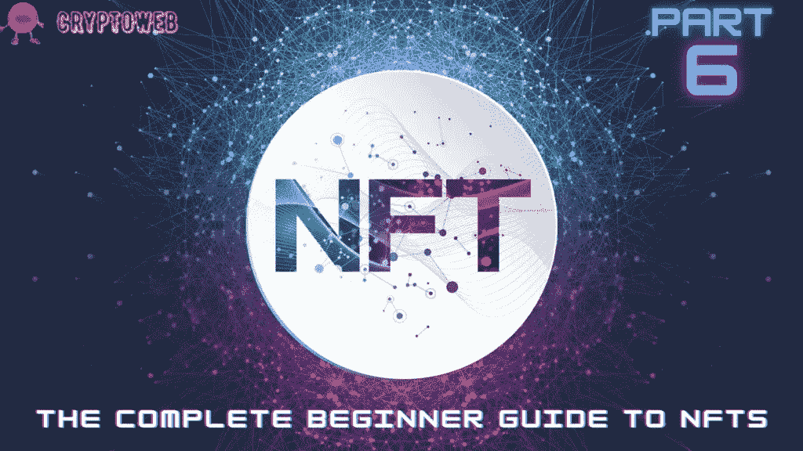

# NFTs 完全入门指南|第 6 部分|如何开始投资 NFTs

> 原文：<https://medium.com/coinmonks/the-complete-beginner-guide-to-nfts-part-6-how-to-start-investing-in-nfts-54db8fb18cdc?source=collection_archive---------53----------------------->

在这份完整的初学者指南中，我们将回答以下所有问题，并始终保持更新，因此请确保将该指南添加到您的浏览器中:

1.  [**什么是 NFT？你需要知道的一切。**](https://cryptoweb.wiki/the-complete-beginner-guide-to-nfts-part-1-what-are-nfts/)
2.  [**如何选购 NFTs？最好最安全的方法。**](https://cryptoweb.wiki/the-complete-beginner-guide-to-nfts-part-2-how-to-buy-nfts/)
3.  [**如何铸造 NFT？简单的方法。**](https://cryptoweb.wiki/the-complete-beginner-guide-to-nfts-part-3-how-to-mint-nfts/)
4.  [**如何销售 NFT？比较最佳平台。**](https://cryptoweb.wiki/the-complete-beginner-guide-to-nfts-part-4-how-to-sell-nfts/)
5.  [**现在买入并持有的最佳 NFT？**](https://cryptoweb.wiki/best-nfts-to-buy-and-hold-right-now/)
6.  [**如何开始投资 NFTs？**](https://cryptoweb.wiki/the-complete-beginner-guide-to-nfts-part-6-how-to-start-investing-in-nfts/)
7.  [**解释所有 NFT 公用事业**](https://cryptoweb.wiki/the-complete-beginner-guide-to-nfts-part-7-all-nft-utilities-explained/)

NFTs 是区块链技术的另一个非常令人兴奋的副产品。NFT 主要是数字艺术，但也可能包括其他资产。基于区块链技术，NFT 是一种非常令人兴奋的保护数字财产所有权的新方法。

NFT 以加密数据为特征，这使得它们是唯一且不可能复制的。当然，可以在没有所有权的情况下查看 NFT，这让我们不禁要问:

是什么赋予了 NFT 如此大的价值？

然而，一些 NFT 已经以数百万美元的价格售出。杰克·多西的第一条推文卖了 300 万美元。

有史以来最有价值的 NFT 是艺术家 Pak 创作的艺术品 **The Merge** ，它以 9180 万美元的价格保持着最昂贵 NFT 的纪录。

那么你如何投资 NFTs 呢？这是我们完整的 NFTs 初学者指南这一部分的目标，为此，我们将关注以下内容:

*   什么是 NFT？
*   你应该投资 NFTs 吗
*   如何开始投资 NFTs？循序渐进的指南。

# 什么是 NFT？

NFT 是数字资产，用于表示现实世界中有价值的资产，如艺术、音乐和视频。

NFTs 提供了一种保证数字资产所有权的方法。它通过利用加密货币使用的区块链技术来实现这一点。区块链是一种公共分类账，记录的交易一旦增加就不能更改。这项技术使得比特币和其他加密技术成为有效的支付方式。

与加密货币不同，NFT 是不可替代的，这意味着它们不容易被攻破。

它们的价值也不相等，因为每个 NFT 都有一个独特的签名，这使得它们不可能等价交换。

例如，EVERYDAYS 不等于一个 NBA 顶级投篮剪辑，即使它们都是 NFT。

一旦 NFT 被铸造出来，它就会在区块链上启动，这个过程被称为“上线”一旦直播，NFT 现在可以买卖，所有的记录都可以让公众看到。

以太坊是最常用于购买和出售非功能性交易的区块链，但其他区块链也支持使用非功能性交易。

# 一些最常见的非功能性测试包括:

*   涂漆
*   鞋子
*   音乐
*   视频，如体育集锦
*   视频游戏配件
*   艺术
*   收藏品。

NFT 提供证明资产所有权的证据。NFT 拥有独特的数据，如内置于系统中的识别码。区块链技术使得复制资产变得不可能。

有趣的是，许多人可以在不拥有 NFT 的情况下查看它们。当你意识到许多人花费数千美元购买他们可以免费观看甚至下载的资产时，这就更加有趣了。

NFT 的优点是，虽然它们可以被观看，但是原始的不能被复制。这对于艺术家和需要出售数字资产同时保护其资产所有权的人非常有用。

与其他加密货币一样，NFT 可以在交易所交易。这通常是通过支持加密钱包的点对点交易来完成的，或者通过使用加密交换钱包的虚拟拍卖来完成。

# 你应该投资 NFTs 吗

NFT 仍然是一个非常新的投资类别，没有太多的历史来判断它们。它们在数字艺术和其他资产的创作和销售中肯定是有用的。这对创作者来说非常重要。

除此之外，购买 NFT 作为投资是非常冒险的。这项资产仍然具有很高的投机性。关于非森林交易的市场法规即使没有也很少。

NFT 价格最重要的预测因素是对资产或艺术品本身的需求。NFT 不像加密货币那样受到经济力量的影响。

对那些喜欢收藏艺术品如绘画、音乐等的人来说，投资 NFT 会很容易。对优秀艺术的鉴赏力可以帮助你发现几年后会成为赢家的 NFT。

一些非功能性交易还附带期权，为非功能性交易的所有者提供经常性收入，比如每次出售 NFT 时支付佣金。

请注意，NFT 的价格主要取决于人们愿意支付的价格。有时，没有人想要一个给定的 NFT，它的价格下降到 0。

当投资于一个仍处于起步阶段的资产类别时，一定要非常小心，尤其是以极端波动性著称的秘密投资。

# 如何开始投资 NFTs

一旦你遵循了我们的 NFT 指南，购买 NFT 就变得简单明了。

# 以下是我们投资非金融资产的分步指南:

首先，你需要设置一个加密钱包。确保你的钱包是以太坊兼容的，因为大多数非功能性钱包都在以太坊区块链上。

参观 NFT 市场；有各种各样的 NFT 市场，在那里你可以买到数字资产和收藏品。一些例子包括 OpenSea.io、币安 NFT、Rarible、Axie、SuperRare、Nifty Gateway 等。

选择您想要购买的 Nft。许多市场按类别排列他们的 NFT 收藏品。

竞拍 NFT。一旦购买，NFTs 将被转移到您的加密钱包。

请注意，正如我们之前解释的那样，购买 NFTs 需要支付一项费用，称为汽油费。汽油费的数额取决于你使用的区块链。一些 NFT 的收集者报告说，他们支付的燃气费比实际的 NFT 多。

# 结论

NFT 是区块链技术被用来改变我们生活的另一个开创性的方式。

有了 NFTs，人们可以买卖数字资产，并保证 NFT 的所有权是安全的。

它们非常有限的供应大大促进了非营养品价格的上涨。一些 NFT 已经卖到了数百万美元。

然而，投资 NFTs 是一项风险很大的业务。这甚至比投资加密货币更具风险。这是因为非正规金融工具没有同等价值，这使得它们很难交易或交换。

交易非功能性交易时一定要非常小心，因为它们是一个新生的、非常投机的市场。

永远记住投资你能承受的损失。

> ***NFT、比特币、Web3.0、DeFi、新手加密货币***
> 
> *使用*[*CryptoWeb*](http://cryptoweb.wiki/)*免费的初学加密指南掌握 web3.0 世界的基础知识，在这里，我们将深入了解该领域中一些顶级的 NFT、加密和元宇宙项目，以便您在投资前得到通知。*

> 交易新手？尝试[加密交易机器人](/coinmonks/crypto-trading-bot-c2ffce8acb2a)或[复制交易](/coinmonks/top-10-crypto-copy-trading-platforms-for-beginners-d0c37c7d698c)