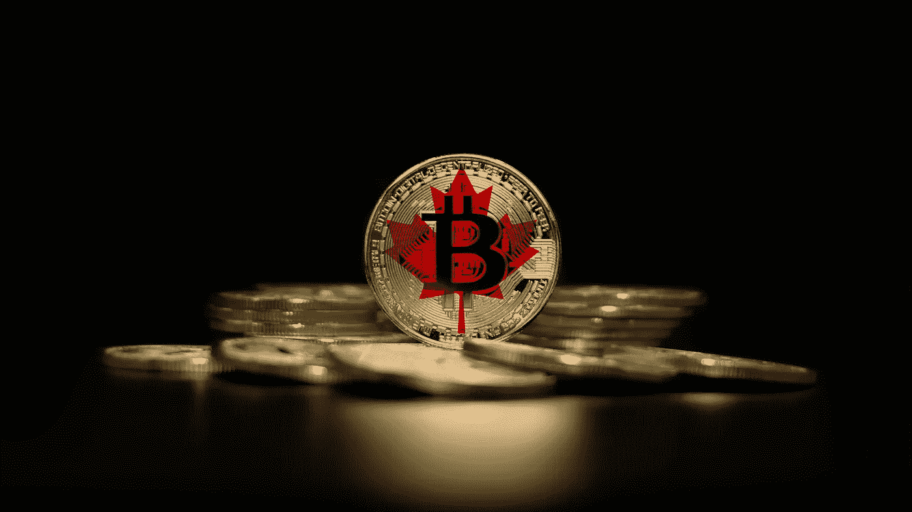
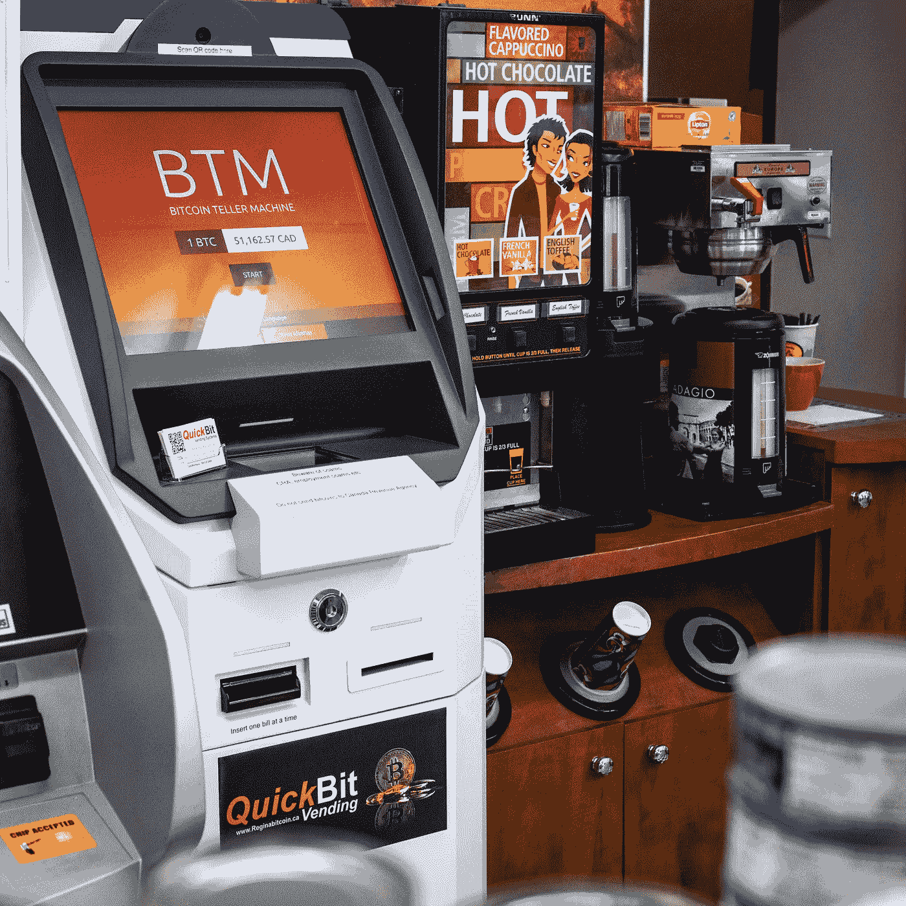

# 在加拿大购买加密的完全初学者指南:一个关于如何购买和有哪些比特币交易所的博客。

> 原文：<https://medium.com/coinmonks/the-complete-beginners-guide-to-buying-crypto-in-canada-a-blog-about-how-to-buy-and-what-bitcoin-ff7fa48c03d4?source=collection_archive---------45----------------------->

# 介绍

如果你是加密货币领域的新手，你可能会对如何开始感到好奇。好消息是，有许多不同的选项可供您选择。在这本初学者指南中，我们将探索在加拿大购买加密的一些最常见的方式，并讨论它们是如何工作的，以便您可以确定哪一种可能适合您！

# 加拿大哪里买比特币

在加拿大，购买比特币的过程相当简单。以下是您的选择:

*   点对点(P2P)交易所，如本地比特币，直接匹配买家和卖家，费用低于传统交易所。这些网站通常用于比特币的现金交易，但也可以用于其他加密货币的交易。
*   让你亲自购买比特币的自动取款机。根据 CoinATMRadar 的数据，加拿大有几千台比特币自动取款机。如果你想快速从投资中获得一些现金，或者只是开始购买加密货币，而不必先经历许多磨难，这些机器很方便——但它们的费用确实较高
*   传统的加密货币交易所，如 NDAX、北海巨妖、币安和 Gemini，允许您使用法定货币(加元、美元等)买卖数字资产。).这些平台通常比 ATM 收取更少的费用，但需要更多的个人信息，并且通常需要电子转账或银行电汇来转移资金。这可能导致更长的处理时间；然而，一旦建立并获得资金，它可以成为进出市场的快捷方式。

# 我如何使用比特币自动取款机？

比特币 ATM 是一种允许你买卖比特币的机器。比特币自动取款机的工作方式很像标准的现金分发自动取款机，只是你可以用加密货币的形式提取现金，而不是从你的银行账户中提取。

有许多不同类型的 btm，其中一些更像自动售货机，而另一些则更像传统的自动取款机。

使用 BTM 的过程通常包括:

*   输入您的电话号码或电子邮件，以便进行验证，并提供有关您交易的重要详细信息。
*   扫描你的比特币或加密钱包地址。需要注意的是，并非所有的地址都是相同的。核实你没有发送 BTC 到以太网地址等等。扫描完您的钱包后，请验证 BTM 上的地址是否正确。
*   插入现金；仅此而已，你的比特币应该在去你钱包的路上了！

[在此了解更多信息](https://www.thecryptoboutique.ca/quickbitvending)

# 我如何使用交换？

什么是交换？

交易所是一个你可以买卖硬币的地方。有两种主要的交换类型:集中的和分散的。

集中交易所是为你保管密码的公司，就像银行为你保管你的钱一样。你所有的硬币都将储存在他们的钱包里，所以这意味着如果交易所被黑或破产，你所有的资金都将随之丢失。分散式交易所(DEXes)没有任何中央权力机构来控制它们；相反，它们运行在区块链技术上，没有单点故障——如果一个节点出现故障，其他节点会保持正常运行，不会错过任何一个节拍！这意味着 DEXes 不像集中式 DEXes 那样容易使用，因为它们不提供与传统金融系统的任何直接集成——在将资金存入这些平台之前，您需要首先打开 MyEtherWallet 或 MetaMask。但是，一旦正确完成，将资金存入在此类平台上注册的现有帐户，然后确保一切顺利，当准备使用上述方法购买一些硬币时，只需单击“购买”——这就是全部！

# 点对点购买比特币

如果你想避免与交易所打交道的麻烦，还有另一种方法:点对点交易。

Localbitcoins.com 是一个想在当地亲自买卖比特币的人的市场。你可以搜索附近使用该网站出售比特币的人，或者如果你自己有一些想要出售的比特币，在该网站上发布广告，等待有人联系你，告诉你他们愿意为你列出的 BTC 支付的价格。Localbitcoins 有托管服务，这样双方可以得到他们同意的东西，如果一方没有兑现他们的承诺，也可以在事后保护他们免受任何纠纷。

这样做也有风险，所以要确保一切顺利，不要一个人去！

# 我如何移动和存储比特币？

如果你想安全地存储你的比特币，有一些选项，如[硬件钱包](https://www.thecryptoboutique.ca/shop#!/Hardware-Wallet/c/124221155)和纸质钱包，热钱包和保管钱包，让你可以存储你的加密货币。[冷钱包](https://www.thecryptoboutique.ca/shop#!/Hardware-Wallet/c/124221155)或纸质钱包可以让你在一个其他人无法进入的地方离线存储你的密码。这是保护自己免受网络攻击和黑客窃取的好方法。

在移动或存储比特币时，必须保证其安全性和私密性；否则，有人会从你这里偷走它们！

一旦您根据自己的需求选择了正确的钱包选项，您就可以在钱包中接收或发送比特币或其他加密货币。如果你想在钱包里装满比特币，请确保选择钱包里的接收选项。这将显示一个二维码或钱包地址，您可以将它发送到交易所，可以在比特币 ATM 机上使用，或者给一个同行以接收比特币(或其他加密货币到您的钱包中)。如果你想将比特币发送给朋友或交易所，你只需点击发送，并输入接收比特币的一方的地址。这就是全部了！

# 购买比特币需要注意什么？

购买比特币和其他加密货币是一项风险很高的业务。这不像买股票那么简单，也不像开银行账户。在你一头扎进去买一些密码之前，有一些事情要知道:

*   如果货币崩溃，你可能会血本无归。没有人知道比特币的价格会上涨还是下跌，所以不要投资超过你能承受的损失。
*   到时候可能很难兑现你的投资。一旦你从比特币基地或币安这样的交易所购买了密码，没有专业技能的人可能很难转移他们的硬币！解决这个问题的最好方法是使用加密货币自动取款机，比如 QuickBit Vending，但这并不是到处都有的。
*   在购买任何加密货币之前，您应该提前计划，因为在周末或节假日的高峰交易时段，由于高需求，交易所可能会出现延迟。

# 购买 crypto 需要哪些成本？

很难确切知道你支付了多少费用。这是因为金额根据交易所、你的交易方式和交易规模的不同而不同。例如，在交易所用银行电汇购买比特币，你需要支付交易金额 1%的费用，除了交易费用之外，提现可能还需要更高的费用。另一方面，通过比特币 ATM 机购买加密货币，每笔交易将收取 10–20%的费用(取决于运营商)。

# 购买比特币和其他加密货币很容易，只要确保你了解你的选项、费用和存储选择。

购买比特币和其他加密货币很容易(也很有趣)。只要确保你了解你的选择，费用和存储选择。

加密货币存储在钱包中，可以通过 Exodus 等平台轻松下载或访问。钱包包含用于从其他钱包或交易所接收资金的公共地址，以及用于授权与公共地址进行交易的私钥。储存密码有很多选择:纸质钱包、[硬件钱包](https://www.thecryptoboutique.ca/shop#!/Hardware-Wallet/c/124221155)和手机钱包都是可行的选择，这取决于你需要多大的安全性和你交易的频率。

# 结论

所有这些信息唾手可得，是时候开始您的加密之旅了！我们希望您喜欢了解比特币，它是如何工作的，以及如何开始购买。如果您有任何问题或意见，请通过[推特](https://twitter.com/quickbitcrypto)或[脸书联系我们。](https://www.facebook.com/quickbitcrypto)

*   这不是财务建议。自己做研究很重要。

> 交易新手？尝试[加密交易机器人](/coinmonks/crypto-trading-bot-c2ffce8acb2a)或[复制交易](/coinmonks/top-10-crypto-copy-trading-platforms-for-beginners-d0c37c7d698c)