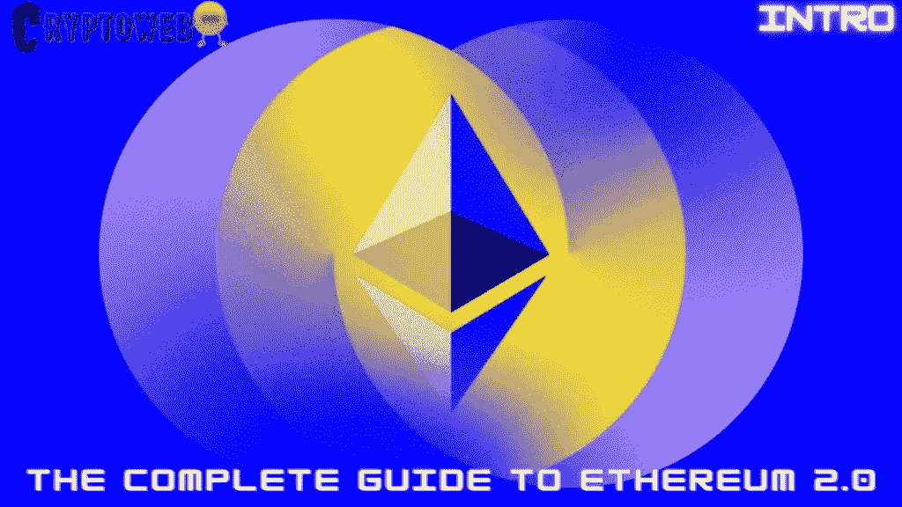

# 以太坊 2.0 完全指南|简介|为什么以太坊合并将永远改变加密

> 原文：<https://medium.com/coinmonks/the-complete-guide-to-ethereum-2-0-introduction-why-ethereum-merge-will-change-crypto-forever-b941c60b6a5c?source=collection_archive---------27----------------------->

众所周知 [**以太坊**](https://cryptoweb.wiki/why-ethereum-price-fall-below-1700-as-the-ethereal-merge-is-soon/) 是最知名的 altcoin。对于许多投资者和加密货币爱好者来说，它代表的不仅仅是另一种加密货币。此外，分析师预测其市场价值可能在 2022 年增长 400%。

**我想用这个以太坊 2.0 指南来回答所有问题，解释为什么** [**以太坊**](https://cryptoweb.wiki/shocking-news-ethereum-finally-overtakes-bitcoin-but-not-the-way-you-think%ef%bf%bc/) **2.0 会永远改变 Crypto:**

1.  [**了解合并—与以太坊 2.0**](https://cryptoweb.wiki/the-complete-guide-to-ethereum-2-0-part-1-understanding-the-merge-and-ethereum-2-0/)
2.  [**以太坊的机制是什么？**](https://cryptoweb.wiki/the-complete-guide-to-ethereum-2-0-part-2-the-mechanism-of-ethereum-2-0-and-ethereum-merge-countdown/)
3.  [**网页简介 3**](https://cryptoweb.wiki/ethereum-guide/)
4.  [**web 3 的重要性**](https://cryptoweb.wiki/the-complete-ethereum-2-0-guide-part-4-the-importance-of-web3/)
5.  [**为什么以太坊 2.0(合并)要永远改变 Crypto**](https://cryptoweb.wiki/the-complete-ethereum-2-0-guide-part-5-why-ethereum-2-0-and-the-merge-will-change-crypto-forever/)
6.  [**金融业和智能合约**](https://cryptoweb.wiki/the-complete-ethereum-2-0-guide-part-6-the-finance-industry-and-smart-contracts/)
7.  [**增加使用 NFTs**](https://cryptoweb.wiki/the-complete-ethereum-2-0-guide-part-7-the-ethereum-2-0-merge-and-the-increase-in-use-of-nfts/)
8.  [**创造难忘的以太坊地址**](https://cryptoweb.wiki/the-complete-ethereum-2-0-guide-part-8-creating-memorable-ethereum-addresses/)
9.  [**“元宇宙”出现在 2022 年不可避免|以太坊和元宇宙**](https://cryptoweb.wiki/ethereum-2-and-the-metaverse/)
10.  [**结论**](https://cryptoweb.wiki/ethereum-2-guide-conclusion/)

# 介绍

[**以太坊的**](https://cryptoweb.wiki/coinbase-will-freeze-eth-deposits-and-withdrawals-temporarily-during-ethereums-merge/) 原生货币以太(ETH)自构想以来，身价暴涨。Ether 是计算机工程师 Vitalik Buterin 于 2015 年推出的一种 [**加密货币**](https://cryptoweb.wiki/your-complete-investing-guide-to-safe-investing-in-bitcoin-or-ethereum/) 。自问世以来，乙醚的价格一路飙升，去年达到 4800 多美元的峰值，尽管一路上经历了巨大的价格波动。按年化率计算，以太的投资回报率接近 300 %。推而广之，这意味着自 2014 年夏季以来，早期投资者的投资几乎翻了三倍。

就市值而言，以太坊是第二大加密货币，仅次于比特币。虽然比特币是一种“数字黄金”，但以太坊是一种基于区块链的软件平台，可以创造价值。如果说比特币代表了对一种新货币资产的投资，那么以太坊则代表了对 Web 3.0 基础设施的投资。除了是一种备受推崇的货币之外，它还是一个开发平台，开发者可能会用它来制作 Metaverses。

在接下来的几年里， [**以太坊**](https://cryptoweb.wiki/all-you-need-to-know-about-ethereum-2-0-the-power-of-the-merge/) 有可能在受欢迎程度上超过比特币，并将被谷歌和脸书等大公司使用。ETH 主要归因于其更广泛的潜在用途。由于以太坊是当前资本市场基础设施的大部分的结算和发行层，它将继续是未来十年最有利可图的投资选择之一。

加密货币分析平台 Token Metrics 的首席技术分析师比尔·诺布尔(Bill Noble)解释说，“以太坊有两个目的:第一，它作为货币运行，也许是价值储存。”"然而，以太坊也是分散金融的高速公路."

> **NFT、比特币、Web3.0、DeFi 和面向初学者的加密货币**
> 
> 通过免费的初学者加密指南掌握 web3.0 世界的基础知识，我们将深入了解该领域的一些顶级 NFT、加密和元宇宙项目，以便您在投资前获得信息。

> 交易新手？试试[密码交易机器人](/coinmonks/crypto-trading-bot-c2ffce8acb2a)或者[复制交易](/coinmonks/top-10-crypto-copy-trading-platforms-for-beginners-d0c37c7d698c)