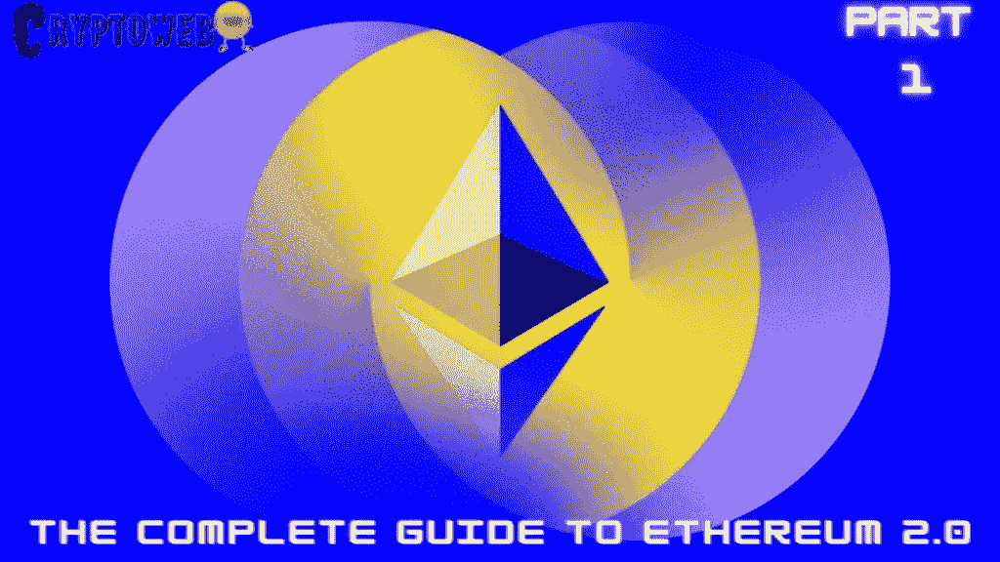

# 以太坊 2.0 完全指南|第 1 部分|了解合并和以太坊 2.0

> 原文：<https://medium.com/coinmonks/the-complete-guide-to-ethereum-2-0-part-1-understanding-the-merge-and-ethereum-2-0-27476f58f4ae?source=collection_archive---------28----------------------->

由于在 [**【以太坊】**](https://cryptoweb.wiki/complete-guide-to-crypto-for-beginners-everything-you-need-to-know/) 上可获得的商品和服务对任何有互联网连接的人都是可用的， [**以太坊**](https://cryptoweb.wiki/your-complete-investing-guide-to-safe-investing-in-bitcoin-or-ethereum/) 像许多其他著名的 [**cryptos**](https://cryptoweb.wiki/crypto-for-beginners-all-you-need-to-know/) 一样建立在分散金融的概念上，合并后的以太坊将看到巨大的更新，可以帮助它击败 [**比特币**](https://cryptoweb.wiki/bitcoin-price-drops-below-20000/) 。

**我想用这个以太坊 2.0 指南来回答所有问题，解释为什么** [**以太坊**](https://cryptoweb.wiki/shocking-news-ethereum-finally-overtakes-bitcoin-but-not-the-way-you-think%ef%bf%bc/) **2.0 会永远改变 Crypto:**

1.  [**了解合并—与以太坊 2.0**](https://cryptoweb.wiki/the-complete-guide-to-ethereum-2-0-part-1-understanding-the-merge-and-ethereum-2-0/)
2.  [**以太坊的机制是什么？**](https://cryptoweb.wiki/the-complete-guide-to-ethereum-2-0-part-2-the-mechanism-of-ethereum-2-0-and-ethereum-merge-countdown/)
3.  [**web 3 简介**](https://cryptoweb.wiki/ethereum-guide/)
4.  [**web 3 的重要性**](https://cryptoweb.wiki/the-complete-ethereum-2-0-guide-part-4-the-importance-of-web3/)
5.  [**为什么以太坊 2.0 ( The Merge)要永远改变 Crypto**](https://cryptoweb.wiki/the-complete-ethereum-2-0-guide-part-5-why-ethereum-2-0-and-the-merge-will-change-crypto-forever/)
6.  [**金融业和智能合约**](https://cryptoweb.wiki/the-complete-ethereum-2-0-guide-part-6-the-finance-industry-and-smart-contracts/)
7.  [**使用 NFTs 的增加**](https://cryptoweb.wiki/the-complete-ethereum-2-0-guide-part-7-the-ethereum-2-0-merge-and-the-increase-in-use-of-nfts/)
8.  [**创造难忘的以太坊地址**](https://cryptoweb.wiki/the-complete-ethereum-2-0-guide-part-8-creating-memorable-ethereum-addresses/)
9.  [**“元宇宙”在 2022 年不可避免地出现|以太坊与元宇宙**](https://cryptoweb.wiki/ethereum-2-and-the-metaverse/)
10.  [**结论**](https://cryptoweb.wiki/ethereum-2-guide-conclusion/)

# 为什么以太坊是首选货币？

法力和沙子是两个不使用区块链的 ERC20 令牌。对于交易的验证，他们利用以太坊的网络。即使法力或沙子可能被用来建造平台本身，其他一切都是基于以太坊。

关于世界上最大的 NFT 平台 OpenSea，以太坊是首选货币。此外，大多数 NFT 可以使用 ETH 从加密货币钱包中获取。以太坊也推动了像 DeFi 和 dApps 这样的新技术的出现。因此，这是为数不多的区块链之一，它使得元经文、NFT 和加密货币能够相互对话。以太坊控制了超过 90%的 NFT 市场。从某种意义上说，这将是以太坊成败的一年。

区块链技术正在全球范围内普及。根据德勤的研究，40%的受访组织打算在 2020 年在区块链项目上至少花费 500 万美元，而 86%的美国公司已经创建或正在建立区块链团队。55%的受访者表示区块链是五大战略重点之一。

这种采用和投资表明，区块链技术越来越受到希望改善企业运营或利用它进行交易的企业的信任。由于以太坊在去中心化和可扩展性方面的强大资质，它已经成为这些应用程序中最知名的加密货币。

其次，越来越多的机构正在采用加密的概念，这对需求有积极的影响。在当前的经济形势下，有些人可能会将加密视为防范通货膨胀的手段。拥有加密资产的机构需要一个值得信赖的场所来为透明度和流动性定价。芝加哥商品交易所以太期货合约为机构投资者提供了一个受监管的市场，使他们可以在不处理数字资产或担心钱包、托管人、保险或其他进入障碍的情况下获得价格敞口。

# 以太合约允许投资者进入加密货币市场，管理与加密相关的风险。

作为一个软件网络，开发者可以用来创建和支持新的工具、应用和 NFT，以太坊与现有的加密货币截然不同。这个位于区块链的软件网络在整个计算机行业有着各种各样的用途和应用，特别是在游戏、音乐、娱乐和分散金融(DeFi)领域。因此，在过去的一年里，它已经成为最受欢迎和使用最广泛的加密货币之一。

使用智能合约可以创建分散的应用程序，这可能有很多原因。这些金融工具是分散融资系统和数据服务的例子，如 Matcha(搜索各种加密货币交易所以获得最低利率)。但是也有买卖数字艺术品、游戏和开发者技术的 dApps。

以太坊通俗地说就是一个去中心化的引擎，运行的 app 也是去中心化的。开发人员可能会在以太坊的基础上构建全新的加密货币，如 Chainlink 和 XRP，因为它们的开源方法而被称为令牌。您可能熟悉一些加密货币形式的资产，如 Tether (USDT)、Uniswap (UNI)或 USD Coin (USDC)。

除了加密货币之外，不可伪造的代币或 NFT 是可以在以太坊上生成的其他数字资产。以太坊网站上已经说明，这些数字代币是用来代表独特商品的所有权。

基于区块链的智能合约，本质上是使用算法进行金融交易的书面指令，使以太坊闻名遐迩。

随着具有类似功能的新以太坊竞争对手进入市场，对以太网的需求正在发生积极和消极的变化。人们普遍有信心，最初的智能合同区块链将通过这一测试期，尽管存在竞争形式的**和其他变量导致其持续的不稳定性。以下是影响以太坊价格的几个因素:**

# **合并后以太坊采用新的基础设施更新**

**由于智能合同，艺术家和制造商能够铸造(创造)和销售被称为不可伪造代币(NFT)的数字艺术品。自从以太坊流行以来，它的礼物和诅咒都导致了区块链的“瓶颈”，这对加密货币来说既有好处也有坏处。想象一下黑色星期五的购物中心停车场，并将其转换到互联网领域。**

**这么多用户，以太坊交易成本很高。尽管建立这项新技术已经花了很多年，以太坊团队正在通过开发额外的基础设施更新做出回应。**

**许多新公司已经开发了在以太坊区块链上工作的“第二层”解决方案。新的区块链网络(被称为“第 1 层”)已被开发为以太坊的可能替代方案，将流量从以太坊区块链挤出，并产生新的竞争对手，这可能会增强或降低产品在市场上的吸引力。**

**如果越来越多的人在利用以太坊网络，那么你的投资价值就会得到更大的支持；但是，如果竞争对手成功地从以太坊吸引用户，以太坊的价值可能会随着时间的推移而下降。**

# **合并后的以太坊先发优势**

**尽管出现了新的、更环保的技术，但分析师认为以太坊的“先发优势”已经为其长期成功奠定了基础，尽管新的竞争对手不断涌现。然而，鉴于加密货币的价值完全取决于社区的参与，拥有一个专门的用户群比赢得竞争更重要。幸运的是，以太坊两者都有。**

**金融科技行业的投资者、区块链平台的发明者拉扎·汗(Raza Khan)表示，“如果以太坊愿意，它可以迅速扩大容量。”就目前而言，以太坊社区很乐意静观其变。**

# **合并后来自“以太坊杀手”的竞争**

**如果“加密货币”和“NFT”在 2021 年成为常见的家庭用语，那么“Web3”可能会在 2022 年成为冠军。术语“Web3”是指基于区块链技术的开放式互联网版本。在这个版本的互联网中，金融交易更加透明，人们对自己的数据有更多的控制权，用户通过使用加密货币拥有大部分基础设施。**

**以太坊等公司和其他具有类似功能的区块链，如 Solana、Cardano 和 Tezos，正试图建立基础设施，用于构建 Web3 的未来愿景。投资者将这些新进展与互联网泡沫相提并论，互联网泡沫发生在谷歌、脸书和苹果首次引起公众关注的时候。**

> *****NFT、比特币、Web3.0、DeFi、新手加密货币*****
> 
> ***使用*[*CryptoWeb*](https://cryptoweb.wiki/category/guides/ethereum-guide/)*免费的初学加密指南掌握 web3.0 世界的基础知识，在这里，我们将深入了解该领域中一些顶级的 NFT、加密和元宇宙项目，以便您在投资前得到通知。***

> **交易新手？尝试[加密交易机器人](/coinmonks/crypto-trading-bot-c2ffce8acb2a)或[复制交易](/coinmonks/top-10-crypto-copy-trading-platforms-for-beginners-d0c37c7d698c)**