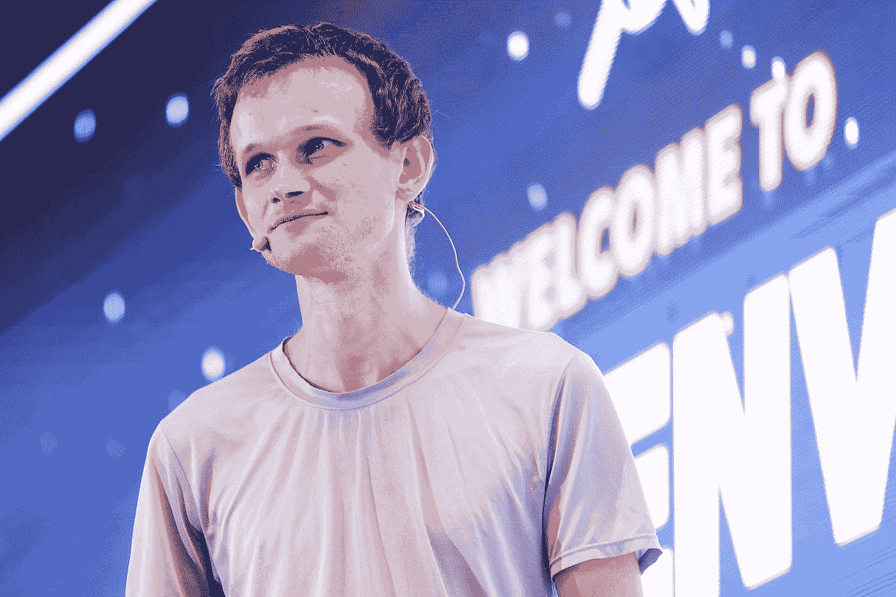

# 关于以太坊第二层的不完整和非技术性的指南

> 原文：<https://medium.com/coinmonks/the-complete-non-technical-guide-about-layers-2-on-ethereum-9c8a5a38bfa?source=collection_archive---------11----------------------->

乐观主义、阿比特鲁姆和 ZK-罗普斯解决方案是如何工作的，它们之间有什么区别

Vitalik giving a speech, 2022

**你连第二层都不知道吗？**

炒作列车差不多是这样的:
*ICO > DEFI > NFT >道>第二层*

第 2 层(L2)是热门话题，可以说是关键基础设施之一…