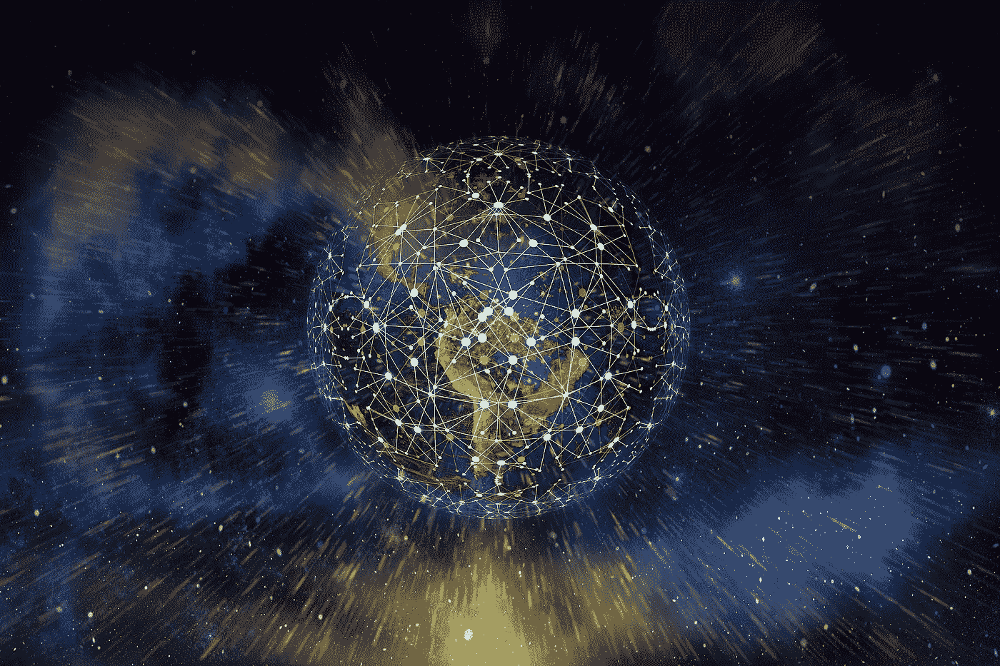
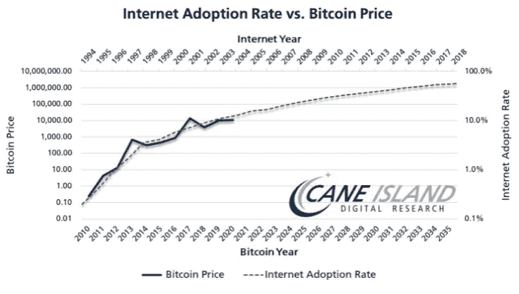

# 区块链的构成

> 原文：<https://medium.com/coinmonks/the-constitution-of-the-blockchain-f935ed3f8a7f?source=collection_archive---------60----------------------->

## 民有、民治、民享—区块链基础知识 2

金钱是价值的分类账；它记录和跟踪真实的生活价值。

我们解释说今天的分类账是集中的。

首先，货币本身是集中的，这意味着即使一张 10 美元的钞票证实了 5 年前的一个小时的就业，你也不一定能付给你现在的雇员 10 美元……因为联邦政府决定印刷更多，或者让银行加倍支出。

此外，跟踪[=所有权和转让]分类账也是集中的，这意味着你对现有金融巨头的法规、限制、错误及其对黑客攻击甚至内部腐败的脆弱性无能为力。

2008 年崩盘后，中本聪坐下来沉思；互联网彻底改变了我们生活中的每一项功能，为什么它不能改变金融业——150 年来唯一未被触及的领域？

Satoshi 发明的是去中心化的账本。[对于深海潜水者来说，这不是技术问题，[这里的](https://bitcoin.org/bitcoin.pdf)是白皮书]

简而言之，它的工作原理是:

世界上的每台计算机都可以连接到网络，并通过解决技术数学计算对任何比特币交易进行投票确认。验证数据会消耗大量电能，因此作为奖励，你会得到一小部分比特币。那叫采矿；就像金矿矿工花费精力竞相【希望】挖掘出一些黄金一样，比特币矿工贡献计算能力希望破解谜题，获得比特币，因此，矿工获得的比特币就是他们的“工作证明”，缩写:PoW。

页（page 的缩写）美国矿业并不真的适合你的家庭或办公室电脑。只有当你投资购买更强更高质量的硬件时，这才是值得的。

已批准的交易层层叠加，从第一次转账开始就创造了不可更改的追踪历史。他称之为区块链。每一段数据都是一个块，它们都被链接在一起。参与的计算机越多，记录越多，区块链就成为更真实的证据。

资金从哪里来，流向哪里？我们没有把密码存储在我们的谷歌账户中，我们需要一个密码“钱包”来存取我们的资产。当你生成一个新的钱包时，你会得到一个公共“地址”和一个*私人*代码{私人密钥，秘密恢复短语，等等。}追回钱包；这就像你账户的密码。如果你失去了你的代码，你就失去了你的钱，不开玩笑！

是的，这是*而不是*你习惯的典型标准，但要获得你必须忍受痛苦。

作为交换，你拥有的钱不是由国家发行的，也不需要当局的认可，只有在公共决策中。没有人能在 21，000，000 的限额上增加更多的比特币，你不能在两个钱包里放 1 个比特币，因为这是区块链——确认交易；要么在那里，要么在那里。除非一个骗子黑掉了 51%连接到区块链的电脑，这是不可能的，因为你需要比世界上任何地方都多的电力，而你只有一两分钟的时间来黑掉所有的电脑。只要我们有互联网基础设施，没有政府能够控制或禁止你的资产的交易。

亨利·福特说:“美国人民不了解我们的银行和货币体系，这很好，因为如果他们了解，我相信在明天早上之前就会有一场革命。”嗯，2008 年的金融危机搅动了一些人，而革命已经发生了…

在加密领域，你拥有你的钱，显示在整个区块链的所有电脑上，不会被破坏，除非有人发现你的代码，否则你的钱包不会发生任何事情。当然，创建钱包没有最低、最高、身份证、国籍或年龄要求，你可以随时随地使用你的资金，没有关闭时间，没有问题，没有时间限制。或者 max，因为你没有屈服于一个中央集权的机构来持有你的资本托管权。没有人能得到你的财务统计数据，因为你不相信一家公司会提供你的私人信息，这些信息在区块链上，除非有人把你和你的钱包地址联系起来。在 crypto 中有一个“隐私网络”部门正在发展以解决这个问题——请仔细阅读。

没有伪造比特币这种事情，如果你愿意，你可以创造一种不同的硬币。加密没有国家之分，你也不能把它放在钱包里。它可以在全球范围内被接受，[几个链接:[https://icoholder.com/blog/places-accept-bitcoin/](http://icoholder.com/blog/places-accept-bitcoin/)[https://dealhack.com/blog/stores-that-accept-bitcoin](http://dealhack.com/blog/stores-that-accept-bitcoin)[https://smallbiztrends.com/2021/12/who-accepts-bitcoin.html](http://smallbiztrends.com/2021/12/who-accepts-bitcoin.html)]你可以在任何 PC/手机上找回你的钱包，然后瞧，你的钱就在那里等着你！

交易以最低的成本消耗最少的时间[具体时间和费用因区块链而异]，无最小值。或者 24/7/365 的最大转账，没有边界，因为没有不必要的中间人处理你的钱，一切都在数学和密码学批准的区块链上执行。任何个人或政客都不能阻止或干涉你的转移。你的财富在它应该在的地方——在你的控制之下！比特币给经济带来了真正的民主。

我们意识到，比特币不是一种货币；这是一项颠覆性的技术创新——这是货币互联网。比特币对银行的影响就像电子邮件对邮局的影响一样。

你知道吗，微软首席执行官史蒂夫·鲍尔默说 iPhone 没有机会获得任何重要的市场份额…？

每一项创新都是逐渐被采纳的，尤其是这种震惊世界的想法；只是在比特币上，在价格图上可见。

适应这种高科技转变并承认其优势的最佳方式是“亲身”体验它；这需要时间。

【新手快速链接:新手最佳密码交换:[coin base](https://coinbase.com/join/ruttne_z)——使用此链接可获得 10 美元奖励， [Kucoin](https://www.kucoin.com/ucenter/signup?rcode=rJZ2FP6) ，[https://pro.coinbase.com/](https://pro.coinbase.com/)[https://www.gemini.com/](https://www.gemini.com/)[https://crypto.com/](https://crypto.com/)[https://www.kraken.com/](https://www.kraken.com/)[https://www.binance.com/](https://www.binance.com/)[https://www.binance.us/en/home](https://www.binance.us/en/home)新手最佳储钱包:[https://www.exodus.com/download](https://www.exodus.com/download)[https://www.ledger.com/](https://www.ledger.com/])

你可能会想，“好吧，我听说，很好，但对于简单的我来说，整个现代化并不是那么有益”。然而，虽然比特币是一种原始的存储和支付网络，但区块链可以，并且已经被用来重塑数十种日常交易，也为世界经济和娱乐增添了新的激烈概念。这个名单还在继续增长。由于自由是区块链存在的核心，每个开发者都受到启发，让他们的想象力探索无限的可能性，他们争先恐后地设计和建造新的作品。因此，虽然比特币和现金就像电子邮件和邮件，但比特币与区块链的潜力相比就像电子邮件和整个互联网。我们已经从中受益的机会太多了。

我们还应该拿区块链怎么办？

> 交易新手？试试[加密交易机器人](/coinmonks/crypto-trading-bot-c2ffce8acb2a)或者[复制交易](/coinmonks/top-10-crypto-copy-trading-platforms-for-beginners-d0c37c7d698c)