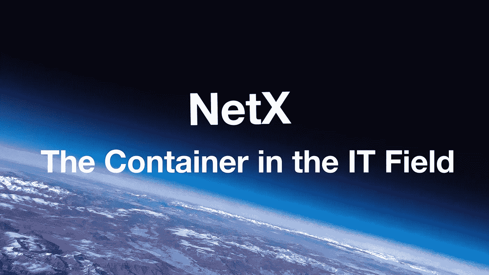
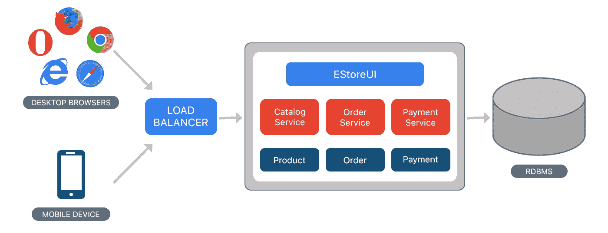

# IT 领域的容器

> 原文：<https://medium.com/coinmonks/the-container-in-the-it-field-21250e3e8b5?source=collection_archive---------12----------------------->

第一部分第三章**IT 领域的容器结构**

*TL；速度三角形定位法(dead reckoning)*

*   *整体架构的优点:开发更容易；适合简单和轻量级的应用。*
*   *整体架构的缺点:需要大量的手工测试；发现持续部署和与新技术集成的困难。*

**

> ****从本质上讲，没有集装箱化，全球化就不可能存在****

*《箱子:海运集装箱如何让世界变小，让世界经济变大》这本书，在全球化的背景下，再一次将这位曾经被忽视的杰出贡献搬上了舞台。这本书揭示了一个简单的发明如何对人类文明产生深远的影响。20 世纪以来，外表朴素的铁箱极大地改变了世界，推动了全球化和分工的前进。集装箱的出现和发展是对包装、运输和交付实物的挑战。*

*全球化建立在现代运输系统的基础上，集装箱是高度自动化、低成本和低复杂性的货运系统的支柱。这种容器最令人兴奋的成功在于它的标准化和完善的运输系统。这个巨大的东西(重达数吨)设法实现了标准化，并建立了一个由船只、港口、路线、高速公路、中转站、桥梁、隧道和多式联运组成的配套物流系统。这是人类最伟大的奇迹之一，超越了标准化和系统化的概念。世界不仅通过集装箱升级，还通过一整套全新的货物处理方法升级，包括港口、货船、起重机和卡车，以及托运人的运营方式。*

*容器结构也在 IT 领域萌芽。它不是塞满了实物，而是打包了二进制代码和软件。模块，如设计、开发、部署、运营、维护等。充当承载整个 IT 架构的容器。灾难和漏洞是存在的。它的利弊都值得注意。只有当通过优化的系统为正确的场景设置了正确的架构时，最佳解决方案才会出现和发展。*

# ***传统技术架构***

*企业应用由三大部分组成:客户端用户界面(包括 HTML 和 Javascript 通过浏览器访问)、数据库和服务器端程序。服务器端处理 HTTP 请求，执行业务逻辑，检索和更新数据库中的数据，选择和填充 HTML 视图，并将它们发送给客户端。对单一结构的服务器端程序进行更改需要重新编译和部署整个堆栈。*

**

*Monolithic Architecture*

*这样一个单一的应用程序很自然地被构建到一个系统中。基于编程语言的基本特性，可以将应用程序封装到类、函数和名称空间中，但是所有请求都必须在单个进程中处理。在某些情况下，您可以在开发人员的笔记本电脑上运行和测试应用程序，并通过部署通道将过程部署到生产环境中。您还可以水平扩展您的部署，并通过负载平衡将实例部署到多个服务器上。整体架构的优势如下:*

*   *易于开发。它使得项目开发在初始阶段更加容易。*
*   *易于测试，例如，通过使用 Selenium 启动应用程序和 UI 测试来执行端到端测试。*
*   *轻松部署。您必须将打包的应用程序复制到服务器。*
*   *通过在负载平衡器后面运行多个副本来进行水平扩展。*

*越来越多的担忧正在堆积。当应用程序被发布到云时，一个小的变化就要求重新编译和部署整个应用程序。随着它的发展，软件开发人员发现很难找到一个平衡的模块化体系结构，其中单个模块的修改不会引起其他模块的变化。此外，monolithic 只能作为一个整体进行扩展，而不能根据需要进行局部扩展。*

*传统的单片应用有许多局限性。随着业务需求的不断增长和功能的进一步扩展，这些模块变得越来越大。整体式应用程序的缺点包括:*

*   *高复杂度:模块耦合不好；代码很难理解；随着业务规模和团队规模的扩大，质量会下降。*
*   *交付速度低:单一应用程序构建和部署缓慢；难以定位；发展缓慢；全面部署需要很长时间，影响范围广，风险高；而它们的出版频率很低。*
*   *可伸缩性低:它们只能作为一个整体水平伸缩，而不能在模块中垂直伸缩。*
*   *低可靠性:一个错误可能会使整个应用程序崩溃。*
*   *创新挫折:受技术栈制约；团队成员共享相同的框架和语言。*

*整体架构更适合简单和轻量级的应用。有人说我们应该从整体架构开始；其他人认为目标应该是**微服务架构**。无论如何，我们必须首先了解整体架构的底部，它是微服务架构的基石。每个微服务都是通过单片架构实现的。微服务更适合复杂的、不断发展的应用。微服务方法只处理复杂的系统，为了达到这个目的，这些方法增加了它们自身的复杂性。*

```
****The Writer Says...*** *The NetX aims at building the Web 3 organism. We try to figure out solutions confronted by the present IT industry. To do that, we will look into every module of it to find out setbacks. Then we’ll focus on finding solutions through experiments. It’s a dynamic evolving process. To get the best solution, we have to be clear about the problems and this will be the main idea I’m going to write about in this Chapter. It makes me feel excited when thinking about sharing my thoughts and I do invite you to join me in this exploration and contribute to the evolvement of NetX.**
```

# *📚必读*

*[NetX 系列 1.1](/triaslab/rethinking-the-it-industry-d101384e801) | [NetX 系列 1.2](/coinmonks/a-letter-from-satoshi-nakamoto-345a45d012bb) | [NetX 系列 1.3](/coinmonks/out-of-control-the-post-it-evolution-dd64e05ff5bc) | [NetX 系列 2.1](/coinmonks/life-emerges-9ebf26304cd4) | [NetX 系列 2.2](/coinmonks/life-is-out-of-control-9f8e5b7b4b99) | [NetX 系列 2.3](/coinmonks/the-kite-flies-up-and-i-become-the-kite-40678b9dabda)*

****NetX，面向数字生活的可信可靠的智能自治系统链原生互联网(***[***Trias***](https://www.trias.one/)***)****

*[***铁人三项***](https://www.triathon.space/#/)***|***[***Ethanim***](https://www.ethanim.network/)***|***[***Tusima***](https://www.tusima.network/#/)***| behemo tum | Octavius | leviam | Divina****

> *交易新手？尝试[加密交易机器人](/coinmonks/crypto-trading-bot-c2ffce8acb2a)或[复制交易](/coinmonks/top-10-crypto-copy-trading-platforms-for-beginners-d0c37c7d698c)*