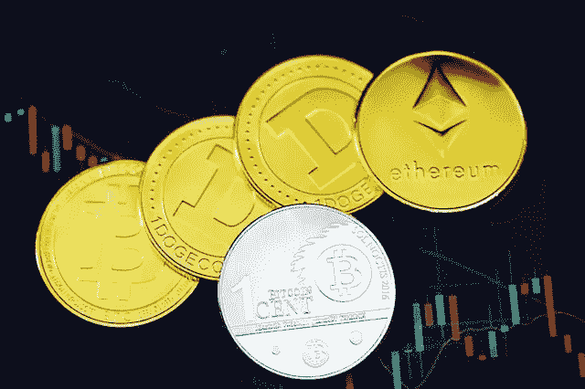
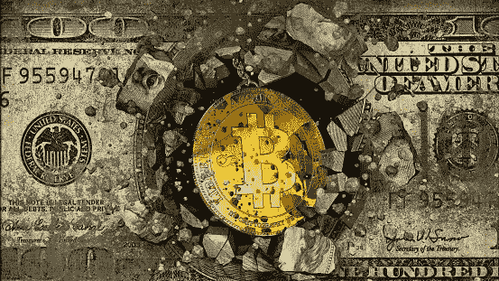
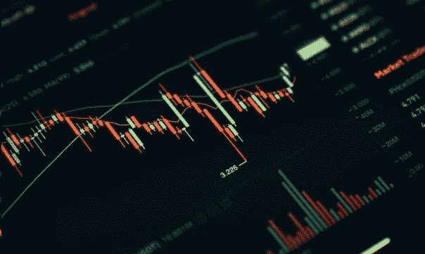

# 加密货币的持续增长。

> 原文：<https://medium.com/coinmonks/the-continued-growth-of-cryptocurrencies-9ef2a408b909?source=collection_archive---------51----------------------->

C 加密货币是一种数字资产，它使用加密技术来保证其所有权和交易的完整性，并控制额外单元的创建，即防止有人像我们一样复制文件或照片。这些货币不是以物理形式存在的，它们储存在一个数字钱包里。

这些数字货币对世界经济产生了影响，因此，本文探讨了这两个概念之间的关系，并提供了加密货币代表经济替代方案的例子。它还分析了它们最大的缺点，即它们的波动性，以获得加密货币所代表的更广泛的图像。

Foto by [Kanchanara](https://unsplash.com/@kanchanara?utm_source=unsplash&utm_medium=referral&utm_content=creditCopyText) on [Unsplash](https://unsplash.com/es/s/fotos/cryptocurrency?utm_source=unsplash&utm_medium=referral&utm_content=creditCopyText)

**加密货币是如何工作的？**

加密货币是一种高效、安全的操作方式，因为它们基于密码学原理，通过区块链，可以永久记录所进行的交易。

这个区块链是一个公共登记处，所有这些数字货币的操作都保存在这里。然而，尽管这个分类帐允许任何用户跟踪网络上所有计算机进行的所有交易，但相关人员的信息是受保护的。

类似地，这些货币的安全性不仅是由于加密，也是由于验证，因为其余的用户验证交易可以在区块链上正确地进行。

**加密货币的特征**

*   加密技术:他们使用加密技术进行安全的支付和收款。
*   去中心化:他们不需要被任何机构控制。
*   不可能伪造或复制:密码系统保护用户。
*   没有中间人:人与人之间的直接接触。
*   交易是不可逆的:一旦付款，就没有取消的可能。
*   可以兑换成其他货币。
*   使用隐私:做生意时无需暴露身份。

**加密货币的优势:**

*   由于没有中间人，交易成本低。
*   安全，因为每枚硬币只属于它的主人。
*   透明度，因为交易被纳入一个可自由访问的登记处。
*   它积聚在一个微小的空间，如 USB。

**加密货币的缺点:**

*   价格的波动。
*   一些公司目前缺乏接受度。
*   由于它们不需要政府或央行这样的监管机构，并且提供隐私保护，因此可以被用于非法交易。

加密货币被视为当前货币体系的一种可能的替代方案，主要是因为它们的技术和多重优势被视为改变全球交易方式的决定性因素。

加密货币的主要优势之一是它们不需要管理员，即它们不依赖于政府、银行或任何机构来运行。

为什么经济去中心化很重要？

因为它允许独立于衰退和经济危机，从而获得迄今为止最高的市场价格。与此同时，依赖银行和政府对社会来说成本很高，原因有两个:第一个原因是银行的交易系统非常昂贵，因此拥有加密货币可以减少佣金，并消除所执行操作的利息；第二，政府不能通过印更多的钱来扭曲账目，从而导致通货膨胀。

这种数字货币的另一个优势是，除了灵活的操作提供了巨大的流动性外，它们还为人们提供了“储蓄资本”并保持资本完整的机会。

正是由于上述原因，这些数字货币迅速流行起来，**“可以动摇世界经济的基础”**。

加密货币有很大的不稳定性，尤其是在去年。尽管近几个月来这些货币的价格有所回升，但油价下跌、战争、经济衰退和冠状病毒的到来是导致这些货币价值在大部分市场下跌的一些触发因素。这让我想到，这是不是表明在这个市场工作的人越来越多了？

这种不稳定性的产生是因为这种货币取决于它在市场上的价格；它基于需求，就像在任何股票交易所发生的那样:如果很多人想买你卖的东西，价格就会上涨，否则，价格就会下跌。

photo by [Dylan Calluy](https://unsplash.com/@dylancalluy?utm_source=unsplash&utm_medium=referral&utm_content=creditCopyText) on [Unsplash](https://unsplash.com/es/s/fotos/blockchain?utm_source=unsplash&utm_medium=referral&utm_content=creditCopyText)

最后，有人指出，加密货币是一种替代性、安全和高效的商品或服务交换方式，由于其分散性、巨大的流动性和灵活性，对世界经济产生了积极影响。然而，在进入这个市场之前，有必要了解这个市场，以便利用这种电子货币的好处。

同样重要的是要注意，正如我们已经提到的，这些虚拟货币的价值是不稳定的，与传统货币一样，有一些我们无法控制的外部因素，因此某一天你可能会赚得很多，而第二天你可能会亏损。

> 交易新手？试试[密码交易机器人](/coinmonks/crypto-trading-bot-c2ffce8acb2a)或[复制交易](/coinmonks/top-10-crypto-copy-trading-platforms-for-beginners-d0c37c7d698c)