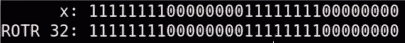
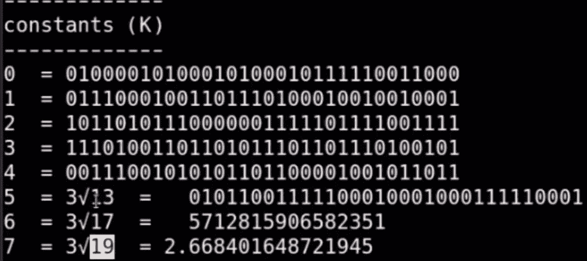

# 哈希背后的烹饪

> 原文：<https://medium.com/coinmonks/the-cooking-behind-hashes-431f430fc7d9?source=collection_archive---------49----------------------->

在上周解释了 ECDSA 和 SHA256 在区块链[中的用途之后——分别创建密钥对和创建数字指纹，让我们来谈谈如何实现。](/block-magnates/understanding-wallet-addresses-and-keys-6331bf40c6a8)

我们将专注于散列的创建，关于椭圆曲线的更多细节，你最好看看[这个视频](https://www.youtube.com/watch?v=NF1pwjL9-DE)或[这个给数学爱好者的视频](https://www.youtube.com/watch?v=gAtBM06xwaw)。

Alexandre Debiève — [https://unsplash.com/@alexkixa](https://unsplash.com/@alexkixa)

在区块链技术中，哈希用于 3 个主要操作:

*   总结并展示您的公钥
*   总结并代表前一个模块
*   通过找到满足某些条件的散列来挖掘块

可以使用不同的哈希算法，我们将重点关注比特币和其他加密货币中使用的算法:SHA256。为了理解它是如何工作的，让我们先回顾一下二进制代码。

> 交易新手？尝试[加密交易机器人](/coinmonks/crypto-trading-bot-c2ffce8acb2a)或[复制交易](/coinmonks/top-10-crypto-copy-trading-platforms-for-beginners-d0c37c7d698c)

## **位**

Bits 代表“二进制数字”，0 或 1。

这个想法是用电信号的形式来表示值，简单的是或不是。

计算机与所谓的“逻辑门”一起工作，它们就像电灯开关:要么开，要么关。

如果该位为 0 →不击穿，则为 1，小电阻会击穿。如果你把它们放在一起，你可以创造更复杂的信号。有点像莫尔斯电码，但只有点，什么也没有。

让我们从简单的 4 位语言开始:_ _ _ _ _

4 比特意味着我们有 4 个时隙，其中我们可以有 1 或 0。

提醒你一下早期的数学课，用 4 个槽和 2 个变量来计算你能做出的组合数:它是 2^4 = 16。

0000|0001|0010|0100|1000|0011|0101|1001|0110|0111|.…|1111

我们只需要 9 个这样的组合来代表宇宙中的任何数字，对吗？0 的十分之一。

所以我们还有 6 个空位，有些人决定用字母表的 6 个第一个字母来代表:a | b | c | d | e | f |(以防你有疑问)。

这个我的朋友是十六进制代码，你可以用 4 位来表示；a 到 f 的数字和字母。

[https://suchprogramming.com/beginning-logic-design-part-2/](https://suchprogramming.com/beginning-logic-design-part-2/)

## 指数生长

如你所知，在电脑中代表 16 个值很酷，但我们需要更多，否则你如何编码那个神秘的表情符号来丰富你的文本？

还记得我们的那个小"？"而不是表情符号或字符？这是因为您的计算机没有足够的空间来存储 16 位或 32 位处理器上的其他值。

因此，我们可以尝试用 4 位代替:

*   8 位→ 2^8 = 256 种组合或非常复古的游戏
*   16 位→2^16 = 65535 种组合
*   32 位→ 2^32 = 4 294 967 295 种组合
*   256 位→2^256 = 115 ' 792 ' 089 ' 237 ' 316 ' 195 ' 423 ' 570 ' 985 ' 008 ' 687 ' 907 ' 853 ' 269 ' 984 ' 665 ' 640 ' 564 ' 039 ' 457 ' 584 ' 007 ' 913 ' 129 ' 639 ' 936 组合

你会明白，当我们开始计算用 256 个 0 和 1 表示的数字时，我们会得到惊人的大量 0 和 1 的字符串。

## 解构

所以每个数字或文本都可以分解成二进制形式。

SHA256 是这样工作的:一旦它将数据分解成二进制形式，它就对其应用简单的数学运算，它应用不同的函数:一些函数向左或向右移动位，另一些函数比较位以输出另一位，另一个函数将位行相加，还有一些函数是所有这些函数的组合。

**将**值向右移动，例如 0011 变成 0001 (a 1 得到批次):

Here we see a shift of 32 on a 32 bits word, so all numbers are replaced by a 0

**向右旋转**值:0011 变成 1001(1 从左边回来)；

Here we see a rotation of 32 on a 32 bits word, so all numbers come back to their initial position

**XOR** 函数，是 2 行位之间的比较:如果比较的两个位中只有 1 个是 1，该函数的结果是 1，否则两个 0 或两个 1 输出 0:

Here we see a double XOR, the result between the first two rows is implicitly compared to the third one to get the end result

**在它们之间添加**行。二进制加法规则很简单:

*   0 + 0 = 0
*   0 + 1 = 1
*   1 + 1 = 10 |左栏取 1 相加

组合的移动可以看起来像下面的函数**∑(x)**:从输入 x，我们应用右旋转 7，加上另一个 18，右移位 3，以及最后两行上的两个 XOR 函数，以在底部获得最终结果。

另外两个条件函数是:

*   **选择** —比较 3 行 x，y，z 时:如果 x = 0，则取 z 中的值，如果 x = 1，则取 y 中的值作为输出
*   **多数** —比较 3 行时:如果 0 或 1 占多数，则输出。

为了增加一些随机性，创造了一系列常数:更准确地说是两组 64 个数字:素数的立方和平方根，从这些数字中你得到一个实数，从这个实数中你保持小数部分为整数，从这个整数中你保持它的二进制形式。

## 填料

SHA256 的一个非常酷的方面是，它可以接受任何大小的输入，并总是返回一个 256 位的块。

它通过两种方式做到这一点:如果消息小于 256 位，它会添加足够的零来填充块中的空闲空间。否则，它将消息分解成多个 256 比特的块，然后将算法一个接一个地应用于这些块。

## 压缩

在所有这些准备步骤(解构值、创建常数等)之后。)我们到了精彩的部分:信息的压缩。

从 H0 到 H1，或者从原始数据到散列，或者从第一个散列到第二个散列，等等。

你混合已经从 256 位初始块创建的 32 位字 W。其中 32 位常数 K 是从素数的根创建的。通过应用两个函数 T1 和 T2，这两个函数是我们之前看到的置换函数和加法选择/多数的组合。

256 位块被分成 8 个 32 位字，称为 a、b、c、d、e、f、g、h，因为 32 x 8 = 256。

在对所有的单词应用了所有的函数之后，你得到了一个 0 和 1 的快乐的混乱，它与你最初的信息尽可能的不同。

但最重要的是，**这个算法是确定性的，**意味着即使最终结果看起来是随机的，如果你输入相同的内容，它将总是呈现相同的输出。

## **最后一步**

一旦计算出最后的 8 个 32 位值，它们就被分解成 8 个 4 位字，并用十六进制代码表示——还记得前面的内容吗？

然后，你只需要把它们并排放在一起。这就是你如何从一个公钥到一个钱包地址，从一个完整的区块到一个有代表性的散列，或者从一个区块+一个随机数到一个散列，赢得你挖掘一个区块的权利。

希望这能帮助你更好地理解散列的概念。

感谢您的阅读，非常感谢视频[的创作者，截图来自该视频。](https://www.youtube.com/watch?v=f9EbD6iY9zI&t=492s)

保重。