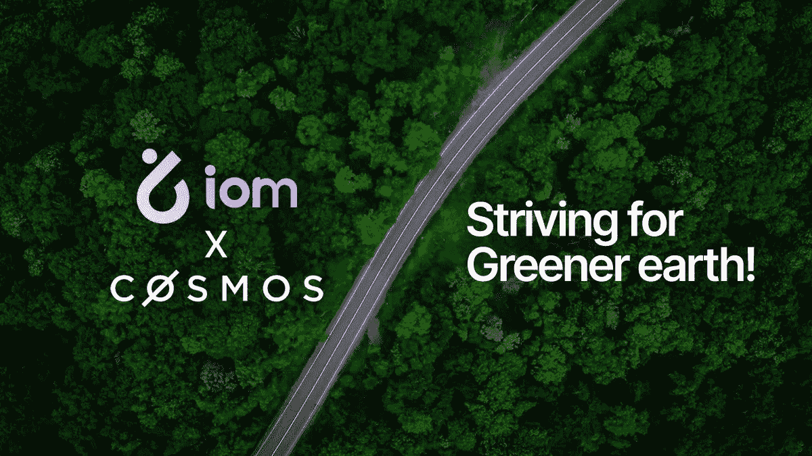

# 宇宙和 ETH Maxi 首席执行官

> 原文：<https://medium.com/coinmonks/the-cosmos-and-eth-maxi-ceo-a5bcc2ae8cba?source=collection_archive---------13----------------------->

我知道“马克西”背后的整个想法是，他们通常是宗教性的，坚定不移地致力于某个特定的象征，或者 L1/L2，或者只是一般意义上的分权。

我们在 2018 年启动了 Iomob，以建立一个全球分散、可互操作的移动互联网。我们的首席技术官、联合创始人 Josep Sanjuas(计算机科学博士，五年前第一届 ConsenSys 学院的校友！)完全致力于建造以太坊。我从他那里学到了很多东西，你可以说这些年来我成了一个有点 ETH maxi 的人(无银行的人可能也与此有关:)。

我们现在想说，我们在产品/市场适应性方面领先了 4 年，因为区块链理工大学没有准备好支持无缝的全球移动网络(当时没有第二层、ZK 和乐观汇总以及 DAO 工具)，投资者没有准备好，许多传统运营商也没有准备好。

因此，我们回到基础，建立了一个集中的移动平台，希望我们最终可以重新连接我们的 web 3 根源。幸运的是，在 2021 年底，我们意识到技术、投资者和移动社区现在已经为分散式移动网络做好了准备。重新做出承诺后的早期证据证实了我们的评估。

自从重申我们致力于分散我们的解决方案，我们已经假定我们将建立在 EVM L2。显然，自 2018 年以来，利用以太坊构建可扩展、去中心化网络的工具已经发生了巨大的变化。在过去的 6 个多月里，我们回顾了许多优秀的 L2。

我们最近与我们的社区进行了沟通，经过 Josep 和我的深入研究，我们决定利用 Cosmos SDK 构建我们自己的移动应用链。显然，宇宙有 EVM 能力，所以我们不会放弃我们的根，相信以太坊。

> 交易新手？试试[加密交易机器人](/coinmonks/crypto-trading-bot-c2ffce8acb2a)或者[复制交易](/coinmonks/top-10-crypto-copy-trading-platforms-for-beginners-d0c37c7d698c)

然而，作为一个利用 crypto rails 开发 IRL 全球移动网络的独特的区块链项目，并基于我们作为行业内集中式技术平台近 4 年的运营，我们得出结论，我们需要一个可互操作的应用链，将全球公共区块链与一系列本地和区域私有链相结合。

在过去的几年里，我们与生态系统的深度合作产生了对本地和区域私有连锁店的需求。我们从第一手资料中了解到，关于用户移动选择和旅程的数据必须保密。同样，许多私人车队运营商希望他们的业务数据保持私密。最后，需要 IoM(移动互联网)来支持适应当地的交通法规。

虽然我们认真审查了其他区块链选项(尤其是 Avalanche ),但我们得出的结论是，Cosmos 提供了最大的灵活性来实现我们务实和渐进的分权目标，并满足我们由移动用户、移动服务提供商和车主、公共交通机构以及 IoM 的一系列公共和私人需求合作伙伴组成的多方面生态系统的需求。

当我们把范围缩小到宇宙时，我继续研究宇宙生态系统。具有讽刺意味的是，无银行团队主持了几集，帮助我增加了对宇宙的兴趣。第一个是[我最喜欢的无银行播客](http://podcast.banklesshq.com/116-why-bankless-is-wrong-ethan-buchman-cosmos)之一，当时他们采访了 Ethan Buchman，这一集的标题是:“为什么无银行是错的”。如果你还没有听过，我建议你去听。

Ethan 为以太坊“帝国”的替代方案和更分散的互联应用链主权网络提供了一个非常令人信服的案例。但除此之外，伊桑展示了利用区块链大规模解决社会问题的坚定承诺。这让我产生了很大的共鸣，因为我们的目标是用 Iomob 做同样的事情，拥抱再生加密经济学的概念。伊森关于货币流通速度、当地货币、民主化和[气候领导力](https://earthstate.ixo.world/zero/)的想法与我自己在上一本书[中对创新和资本主义的思考](https://www.amazon.com/Post-Capitalist-Entrepreneurship-Startups-Boyd-Cohen/dp/1138713392) (2017 年)是如此一致。

最近，dYdX 从 L2 转向宇宙的决定在以太坊圈子里引发了大量激烈的辩论，同样，无银行团队[足够开放，邀请他们的首席执行官安东尼奥·尤利亚诺解释转换的理由](https://www.youtube.com/watch?v=ij7qt0lNQcM)。直接从一个已建立的、规模不断扩大的 DeFi 项目的首席执行官那里听到他们为什么从 EVM L2 迁移到 Cosmos 是令人着迷的。虽然 Antonio 诚实地承认风险，以及他们的团队为他们的应用链构建更多工具的额外负担，但他也令人信服地解释了为什么这对 dYdX 来说是正确的举动，并坚持说他不会放弃以太坊。

到目前为止，我们与 Cosmos 团队的互动进一步证实了我们的决定，因为他们非常欢迎我们。

虽然我们选择 Cosmos 的理性的更深层次的技术解释必须用 Josep 的话来解释，但希望这篇文章提供了我们从分散到集中再到分散的演变以及我自己从 ETH maxi 到 ETH 和 Cosmos maxi 的旅程的概述。这可能吗？我想在密码中任何事都是对的！

**关于作者**

*Boyd Cohen 是 Iomob 的首席执行官和联合创始人，Iomob 是一个分散的移动互联网(IoM)网络。自 2001 年在科罗拉多大学获得战略和创业博士学位以来，他在过去的二十年里致力于加速实现低碳可持续经济。这包括出版了 3 本书，多篇同行评审的文章，经常为 Fast Company 投稿，并在智能城市和可持续发展领域创办了一些企业。*