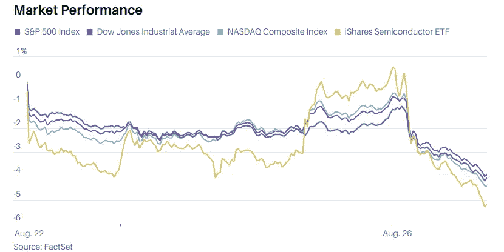
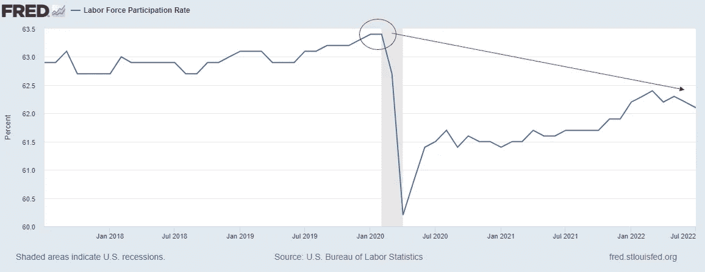
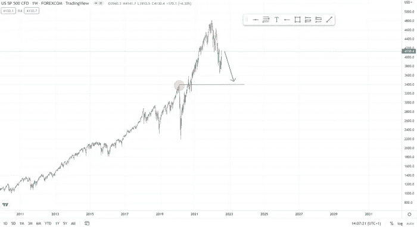
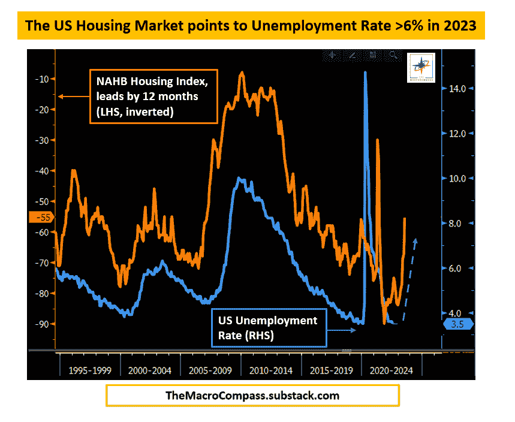
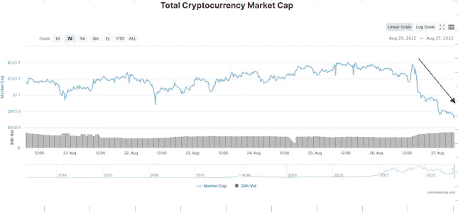
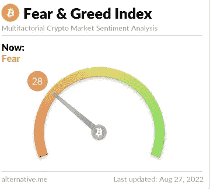

# 降低通货膨胀的成本。美联储破坏需求以恢复价格稳定。

> 原文：<https://medium.com/coinmonks/the-cost-of-reducing-inflation-fed-destroys-demand-to-restore-price-stability-6d9f696efa4e?source=collection_archive---------14----------------------->

欢迎大家！

正如我在上一篇文章中建议的那样，我建议保持谨慎，尽管市场出现了强劲而快速的反弹。

在长期下跌后，所谓的救援反弹在宏观熊市中很常见，如果你在某些行业增持，并且没有及时减持，这通常是出售部分配置的机会。

在 8 月 26 日的杰克逊霍尔研讨会之后，杰罗姆·鲍威尔迅速对交易者和投资者进行了现实检查。客观地看，继鲍威尔采取鹰派立场，通过进一步加息和持续时间比预期更长的紧缩性货币政策来打击通胀后，市场经历了非常糟糕的一天。

*   **标准普尔 500 指数收盘下跌 3.4%**
*   **道琼斯工业平均指数下跌约 1008 点，跌幅 3%**
*   **纳斯达克综合指数下跌 3.9%**

Major indices seen a sharp decline on Friday following Jerome Powell comments

**关于货币政策和恢复价格稳定的目标，杰克逊霍尔研讨会的主要观点如下:**

*   美联储致力于恢复价格稳定，将通胀率降至 2%的目标水平
*   通过强有力地使用他们的工具来减少需求，也就是制造一个“工程衰退”来达到更好的供需平衡，但是我不认为这是一个需求问题，而是一个供应问题。
*   要实现这一点，将需要长时间低于趋势水平的增长
*   软化劳动力市场条件，高利率和增长放缓理论上会降低通货膨胀，我担心供应问题的计划没有得到讨论，没有及时采取行动解决这些问题，特别是能源危机(尽管美国的情况不像欧洲那样糟糕)
*   杰罗姆·鲍威尔认为，采取必要的措施将会给家庭和企业带来“一些痛苦”。也许重要的是要问“一些痛苦”的程度，以及他愿意接受多少作为恢复价格稳定的交易。正如前一篇文章[中提到的那样](/coinmonks/crypto-entering-the-first-recession-366f7426e774)从技术上来说，我们已经处于衰退之中，金融环境和流动性的真正收紧才刚刚开始。
*   劳动力市场可能没有看起来那么紧张，劳动力参与率甚至比疫情之前的水平还要低，即使是现在，当非宽松的货币政策刚刚开始的时候。

Labor force participation rate decline

*   没有迹象表明美联储转向扩张性货币政策，未来加息可能会放缓，但我们远未像一些人可能认为的那样停止或逆转利率，我也给出了这一结果的小概率。
*   它们必须持续到任务完成，历史表明，为了成功地对抗通货膨胀，需要长期的非常严格的货币政策。我特意强调了“非常”这个词，因为市场对这种方法并不熟悉，至少在过去十年里是如此。因此，我坚持我之前的分析，标准普尔 500 指数将至少回撤至 Covid 之前的高点，如果不是更低的话。

Most likely target for S&P 500, 3400–3500 range

*   不同寻常的大幅加息可能适合 9 月份的会议。根据他们将收到的数据，这可能意味着 0.75 个基点，甚至整整一个百分点。
*   最后，这显然是给市场的一个严厉信息，完全符合“不要试图对抗美联储”的说法。

正如[Alfonso Peccatiello](https://substack.com/profile/39086638-alfonso-peccatiello-alf)所说，伟大的宏观分析师认为**软着陆**的结果不太可能实现。房地产是商业周期的一个关键因素，当经济周期发生变化时，商业周期往往会做出激烈的反应。

他强调的一个图表是，美国 **NAHB 住房指数**(橙色，LHS 倒置)与**失业率**(蓝色，RHS)。全国住宅建筑商协会指数的快速变化导致失业率上升约 12 个月。

美国房屋销售指数今年下降了 30 多点，标志着单户房屋销售的快速下降。下降的韧性值得关注，因为下降速度比 2007 年更快。从历史上看，如此大幅度的下降预示着未来 12 个月美国失业率将上升 3%。这可能会让美国失业率至少超过 6%。

这不是普通美国人想要的结果，然而正如杰罗姆·鲍威尔所强调的，为了对抗通货膨胀，有些痛苦是必须的。对吗？

**数字资产**

演讲后不久，加密货币紧随其后进入股票市场，在短短几个小时内，总市值下降了 800 亿美元。

如前所述，尽管一些替代硬币上涨，恐惧和贪婪指数缓慢而犹豫地跟随价格，表明市场参与者不相信多头回归，反弹很可能是短暂的，因为事实证明确实如此。在 8 月份短暂触及中性水平后，我们又回到了恐惧水平。我相信在未来 3-6 个月内，所有项目的价格都会下降，但这并不能阻止我继续投资比特币、以太坊、Solana 或 Fantom 等项目。

总之，我确实认为，当美国官员警告经济状况变弱时，这是值得认真考虑的事情，因为他们通常倾向于向公众隐瞒一些事情，并专注于好的方面，以避免悲观情绪蔓延，这可能会产生循环效应，进一步诱发经济疲软。这一次，他们似乎直接警告我们即将到来的衰退相关事件！

对抗通货膨胀的代价对我们每个人来说还有待观察，因为情况总是这样，穷人将为此付出更高的负担。随着避险情绪回归市场，我预计未来 3-6 个月将是一个波动和痛苦的时期，比特币和主要替代货币将有巨大的机会。

我想引用一句我喜欢的话来结束我的演讲，并让你们思考一下。

“如果你真的知道发生了什么，你甚至不需要知道发生了什么就能知道发生了什么。”

沉默。建造。学习。积累。

今天到此为止。祝大家周末愉快。

免责声明:我必须警告你，有些观点可能是我个人的偏见，但是，我会尽我所能为你提供关于特定主题的客观观点。我不是理财顾问，所有文章只会有严格的教育目的。

> 交易新手？试试[密码交易机器人](/coinmonks/crypto-trading-bot-c2ffce8acb2a)或者[复制交易](/coinmonks/top-10-crypto-copy-trading-platforms-for-beginners-d0c37c7d698c)