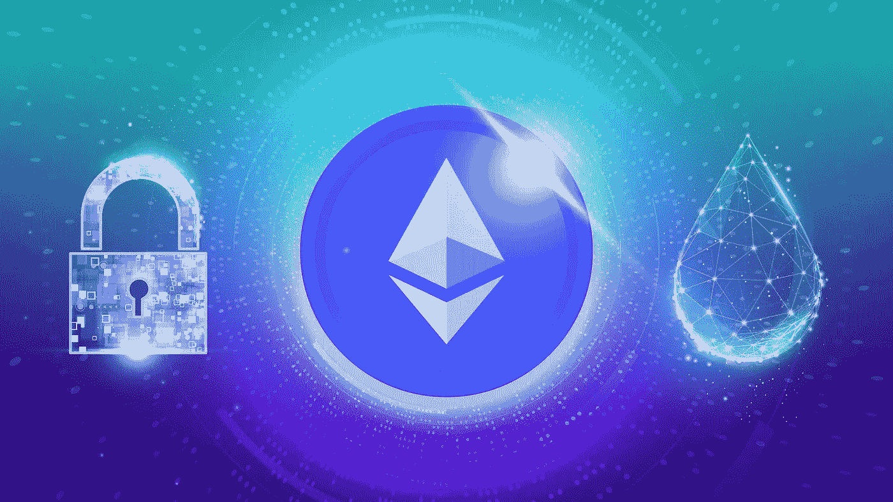
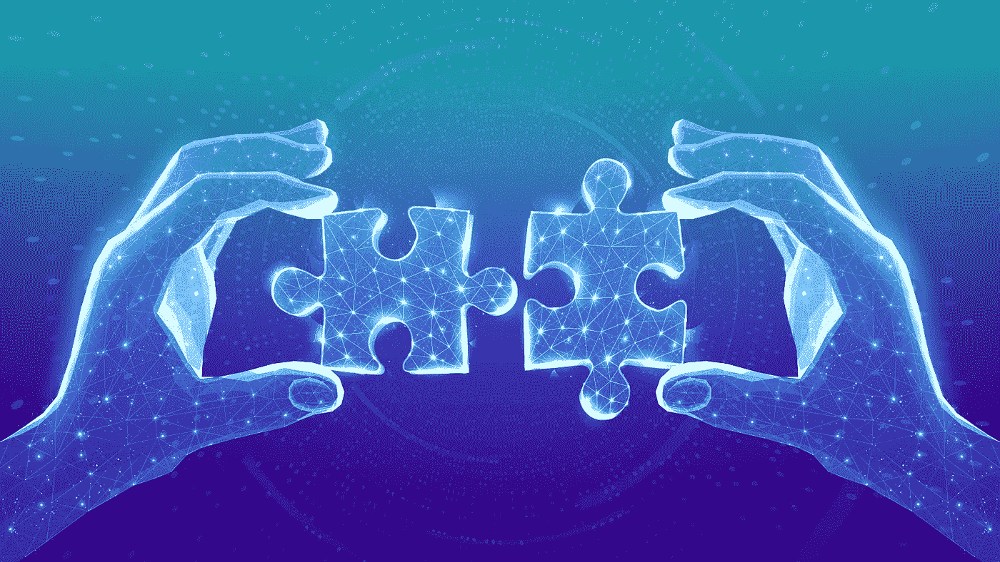

# 倒计时开始了:理解以太坊合并及其对你的意义

> 原文：<https://medium.com/coinmonks/the-countdown-is-on-understanding-the-ethereum-merge-and-what-it-means-for-you-7f42f145bd63?source=collection_archive---------25----------------------->

以太坊是目前区块链和数字代币世界中最令人兴奋的技术之一。给你一点背景知识，以太坊提供了智能合约功能和通用区块链的独特组合。该网络是一个基于区块链的开源计算平台。它通常用于构建去中心化的应用程序和智能合同。这使得开发人员能够构建在生态系统上运行的去中心化应用程序，在该生态系统中，智能合约是与其他用户和整个网络进行交互的主要手段。以太坊网络内正在发生一个重大事件，这将对整个区块链生态系统产生巨大的影响。合并是最近几个月 crypto 中谈论最多的事件，它比任何趋势 NFT，token 或[元宇宙](/block-magnates/where-does-the-metaverse-end-and-web3-begin-e00084af824e)剧加起来都大。原因如下…

# 以太坊合并是什么？

协调以太坊发展的基金会正在准备重大升级。这被称为以太坊合并。网络合并是将两个或多个不同的区块链网络拼接成一个组合网络的过程。密码社区认为这是一个巨大的机会来改善技术，并作出一些重大的改进。简单来说，合并本质上是一个软件更新，就像你对 MacBook、手机或 PC 所做的一样。为什么这次升级是必要的？就像当今社会的许多创新一样，它与环境有关。区块链需要花费大量的精力来验证交易，尽管以太坊比比特币有更好的记录，但它仍然使用相同的工作证明共识机制。这意味着网络是开放的，任何人都可以参与进来，利用他们的计算能力成为一个节点。所有这些计算机一起工作会消耗大量的能量，从而产生大量的碳足迹。

更新的目标是以太坊转移到一个利益一致机制的证明。这意味着用户不再使用计算能力在网络上进行验证，而是通过将以太网锁定在网络上来押注他们的资产。这有可能降低以太坊高达 99%的能耗！另一个优势是，它还将加快网络内的交易，减少瓶颈，这将使高峰时段的交易更便宜，因为费用会更低。

# 导致合并

合并已经酝酿了好几年。这是一项巨大的技术壮举，虽然一再推迟，但工程师们已经在名为“测试网”的小规模试运行中对该交换机进行了测试。这些测试网络让工程师们寻找合并后可能出现的错误，并在将解决方案应用到更广泛的网络之前进行调整。这些测试中的最后一项，称为 [Goerli testnet](https://www.cnbc.com/2022/08/10/ethereum-goerli-testnet-merge-goes-live-before-move-to-proof-of-stake.html) ，刚刚在一个多月前成功完成，然而在合并完成之前还需要完成两次升级。第一个是贝拉特里克斯升级，这是最近[勾选的](https://cointelegraph.com/news/ethereum-s-bellatrix-upgrade-hiccups-jangle-nerves-but-it-ll-be-right-on-the-night)，本质上只是涉及激活信标链上的合并，以启动利益机制的证明。第二个是巴黎升级，将淘汰以前使用的工作证明挖掘。之后，合并就完成了，宝贝！

# 什么会出错？

尽管有测试网和试验，事情总有可能不按预期进行。区块链与安全的关系一直很脆弱。尽管区块链应该使网上交易更加安全，以至于你不需要一个中介来确保一切顺利进行，但还是有无数的重大安全漏洞。合并也不例外。众所周知，工作证明要安全得多，因为在网络上实施攻击需要大量的能量，因此转向利益证明机制可能会为恶意行为者提供可乘之机。为了实现 51%的攻击(控制 51%的网络以改变区块链的进程)，攻击者可以使用金融资源来增加他们的控股权，而不是计算能力。鉴于在写这篇文章的时候以太坊网络的价值已经超过 2000 亿美元，这将是一个相当困难的壮举。即使这是可能的，也有办法对抗它。该网络有一个内置的“削减”过程，在这个过程中，如果验证者试图劫持网络，他们的股份就会被削减。

# 成功的合并是什么样的？

如果合并顺利进行，以太坊网络将成为最强大、最高效、最快的区块链网络之一。鉴于以太坊拥有许多其他应用令牌和 NFT 的事实，这将是朝着构建网络和[元宇宙](/@baxe_app/the-metaverse-cannot-exist-without-blockchain-and-cryptocurrency-c675d0fd4084)的[未来的正确方向迈出的一大步。绝大多数用户不会注意到任何不同。以太坊网络上的所有资产和代币都将继续正常运行。](/block-magnates/where-does-the-metaverse-end-and-web3-begin-e00084af824e)

# 我该怎么准备？

合并可能会在本周的某个时候发生，就在这篇文章发表后的几天内。这个预测是基于当前的难度和散列率。如果你正在读这篇文章，并且认为现在是把你一生的积蓄投入到加密系统的最佳时机，请三思。以太坊的开发者已经明确表示，至少在短期内，这不会对数字资产的价格产生直接影响。从长远来看，以太坊很有可能成为对开发者更有吸引力的网络，这最终将支持更多的投资者进入这个领域。不过，现在最好是坐下来看看互联网的其他人是如何反应的。

以太坊合并是 crypto 中每个人都会感到兴奋的事件之一。它不像一些古怪的 NFT 的推出或元宇宙土地的蓬勃销售那样是一个轻浮的宣传噱头。这将在未来数年对区块链行业产生持久影响。很难准确预测合并将如何展开，会给区块链带来什么变化。就像 Apple II 的发布开创了个人计算的新时代一样，这可能是区块链和加密新时代的开始。这是一个跨越 21 世纪 20 年代早期疯狂炒作的年代，进入真正可用的应用程序，让世界变得更好的机会。

如果你喜欢这篇文章，并想留在了解所有事情的网站 3，请确保你关注 BAXE 博客并注册我们的邮件列表。

你也可以在[推特](https://twitter.com/BaxeApp)上关注我们，加入我们的[电报组](https://t.me/BaxeCommunity)。

我们承诺让您了解最新信息，尽情娱乐😏

> 交易新手？尝试[加密交易机器人](/coinmonks/crypto-trading-bot-c2ffce8acb2a)或[复制交易](/coinmonks/top-10-crypto-copy-trading-platforms-for-beginners-d0c37c7d698c)