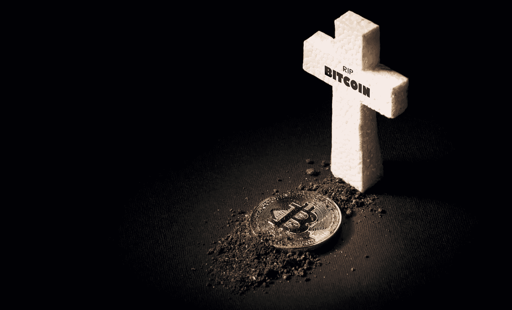
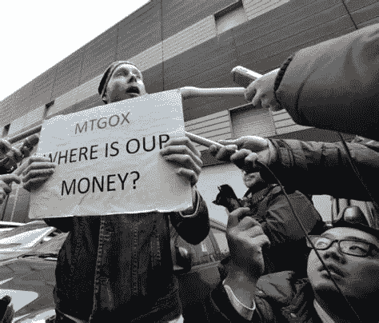
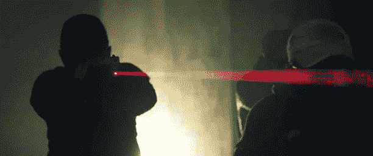
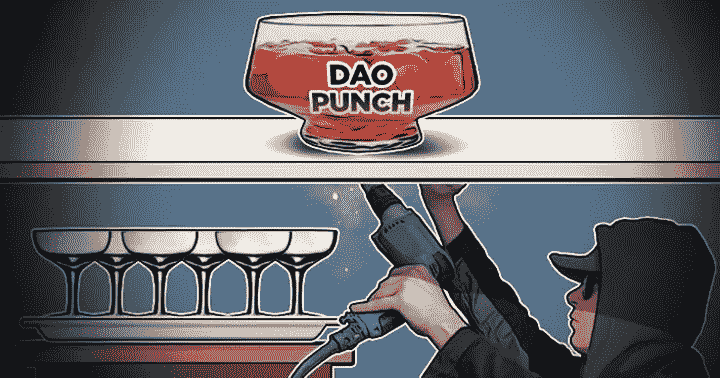

# 这些平台的崩溃可能导致了比特币的终结

> 原文：<https://medium.com/coinmonks/the-crash-of-these-platforms-could-have-caused-the-end-of-bitcoin-52b017e593fe?source=collection_archive---------7----------------------->

随着世界第二大中央加密交易所的突然崩溃，一些分析师已经判断 2022 年是加密世界有史以来最糟糕的一年。FTX 客户的损失估计超过 30 亿美元**。这是这个生态系统中的一个记录。**

然而，这并不是生态系统第一次面临如此严重的危机。事实上，这些数字是惊人的，从来没有相等过。但仔细观察一下，FTX 在过去 12 个月中占全球交易量的**约 13%** ，相比之下，Mt Gox 平台在 2013 年崩溃前一年占 46% 。换句话说，如果在占比特币交易量近一半的交易所倒闭后，比特币能够反弹，幸存于 FTX 是显而易见的。

因此，让我们深入了解我们最喜爱的数字货币的短暂历史，看看平台的崩溃可能导致加密货币最终灭亡的三次情况。

## GOX 山，历史上第一次坠机

第一个故事，让我们和全球第一个比特币交易平台 Mt. Gox 一起回到 2011 年。虽然在 2009 年创建时，它被用于在互联网上交易收藏品卡，但其创始人杰德·麦卡勒(也是 Ripple 的创始人)通过在平台上添加购买和交易比特币的功能彻底改变了它的轨迹。第一家加密货币银行诞生了。

当时 **1 比特币还不到一美元**；比特币的采用与今天相去甚远，购买这种虚拟货币的很大一部分被用来在暗网上购买非法商品。

然而，就是在 2011 年 2 月 3 日，现在被称为比特币大亨的马克·卡尔佩莱斯**从杰德手中买下了 Mt Gox 平台**88%的股份。他认为自己正在做一笔世纪交易，但很快意识到自己做错了投资。事实上，在出售时，该平台的储备中已经少了 8 万个比特币。当时，它“仅”值 62，000 美元，但几个月后，随着比特币价格的爆炸式增长，这些同样的 80，000 比特币现在价值 800，000 美元。

如果客户要求从 Mt Gox 提取所有资产，那么大的漏洞将意味着该平台的终结，这种现象被称为“**银行挤兑**”，在传统金融界很常见。因此，正是凭借这把达摩克利斯之剑，在当局不断攻击和施压的背景下，Karpelès 试图稳定 Mt Gox，直到 2013 年全球 70%到 80%的 BTC 交易所都在 Mt Gox 进行。这意味着每天的交易量在 500 万到 2000 万之间。

但该发生的还是发生了，在 2014 年 2 月 7 日，该平台决定**冻结所有用户的提现**，而没有给他们任何理由。三周后，马克将承认他的用户的 750，000 个比特币在一次平台黑客攻击中消失了。Mt. Gox 现在**有 850，000 比特币**的赤字，占流通中比特币的 7%。

这一消息公布后，比特币**的价格下跌了 50%** 。这是第一次熊市的导火索，比特币在 2015 年 1 月跌至不到 160 美元(低于 2013 年末的 1100 美元)。这位“比特币男爵”于 2015 年 8 月被捕，在日本监狱服刑一段时间后被释放，随后于 2019 年被判处两年有期徒刑，缓刑。

目前，日本司法系统正在将交易所司法清算后 BTC 追回的 **14 万**部分，分配给 Mt Gox 的前客户。即使受害者只能拿回他们最初在 Mt Gox 上购买的 BTC 的 10%到 15%,他们也能因此获得最低 20 英镑的赔偿。这足以让他们微笑。

## Bitfinex，难以接近的宝藏

现在是 2016 年 8 月，比特币的价格是 600 美元，世界上只有不到 0.5%的人拥有这种虚拟货币。然而，一名黑客即将完成他一生中最大的举动。2012 年 12 月创建的 Bitfinex 平台在本月早些时候发布的一份声明中宣布，它刚刚被抢走了近 12 万枚比特币，占该平台资金的 30%。黑客已经渗透进交易所的系统，完成了超过 2000 笔交易，向外部地址发送比特币。
对市场的影响是直接的:**在黑客攻击后的几天里，比特币的价格下跌了 20%以上。不幸的是，对于黑客来说，并不是一切都按计划进行。当局很快掌握了情况，该地址很快受到监控，并被列入所有交易所的黑名单，没有为小偷提供任何逃跑路线，只要稍有动静就会被抓住。就好像他被狙击手的激光固定住了，准备射击。**

> 到 2021 年，这位黑客的财富估计超过 70 亿美元。

在 2016 年至 2022 年期间，他试图通过快速互换到其他加密货币或通过混合器来清洗这笔钱，并能够隐藏近 2.5 万 BTC，但仅此而已。其余的仍被封锁在失窃的地址。到 2021 年，他持有的财富估计超过 70 亿美元，他无法触及，这有点令人沮丧。

与此同时，Bitfinex 找到了补偿客户的解决方案，堪称典范。创建一个“替换”令牌，用于支付退款时间。“BFX”以每损失 1 美元分配 1 BFX 的比率分配。该代币被重新命名为“利奥”，价值约 4 T3 美元的**。按大写金额计算，它是排名前 20 的加密货币。**

回到黑客身上，调查人员在 2022 年发现了 25，000 英镑 BTC 的**主人的踪迹，这让他们直接找到了包含剩余 90，000 英镑 BTC**的地址的私钥。罪魁祸首是伊利亚·利希滕斯坦和希瑟·摩根，他们是一对“连续创业家”,只是把这个私钥存在了他们自己的驱动器上。当你知道 Lichtenstein 是区块链创业公司“Endpass”的创始人时，这是相当讽刺的，这是一个跨平台的离线密码管理应用程序，其目标是“安全地存储密码”，以“阻止欺诈和恐怖主义”摩根在为《福布斯》撰写的一篇文章中，就如何在日益增长的网络犯罪面前保持网络安全给了企业一些建议。

## 刀，德菲的艰难起步

当然，我们已经脱离了集中交易的框架。但是作为*道*黑客的知识对于理解什么是以太和 DeFi 是必不可少的**，我不得不谈论它。*道*是第一个道(去中心化关联)。
现在是 2016 年 4 月，**以太坊 1 岁了**，以太交易价格**不到 15 美元**。一群开发人员决定为他们的最新项目发起众筹活动，通过加密货币创建一个任何人都可以访问的风险投资基金。他们还不知道，但这将是世界上最大的众筹活动之一。
风险投资，顾名思义，是一种专门从事风险投资的投资基金，比如创业公司:**风险很高**，因为如果创业公司破产，有可能失去一切；但是如果投资结果是好的，收益会非常高。**

因此，DAO 是在以太坊网络上创建的一个去中心化平台，其目标是使金融产品通常对任何人的访问都非常受限。它在当时极具创新性，在 2022 年仍然是一个非常热门的话题。然而，这个有点超前的项目只持续了几个月，因为黑客很快发现了一个漏洞。在 DAO 的智能合同中，黑客们已经找到了一种每秒恢复超过 100 个以太网的方法**。一份持有超过**1000 万醚**的智能合约，也就是说，当时 14%的可用代币。**

2016 年 6 月 17 日，350 多万乙醚被抽走，总计**约 5000 万美元。许多分析家认为，这一事件可能会导致现在世界第二大区块链的终结。为了解决这个问题，有人提议取消这些交易，简单地取消区块链。它被大多数人接受了。只有一小部分人对这一决定提出异议，认为它违背了区块链的价值观。的确，后者应该是**不可改变的**，也就是说，一个人不应该能够回到过去。从那里，两种对立的观点产生了分歧，区块链被一分为二:我们今天知道的以太坊区块链和它的象征 ETH，以及最初的区块链，现在被称为以太坊经典，和它的象征 ETC。这就是我们所说的**区块链的一个岔口。****

你认为它比 FTX 更糟糕吗？

> 交易新手？尝试[加密交易机器人](/coinmonks/crypto-trading-bot-c2ffce8acb2a)或[复制交易](/coinmonks/top-10-crypto-copy-trading-platforms-for-beginners-d0c37c7d698c)