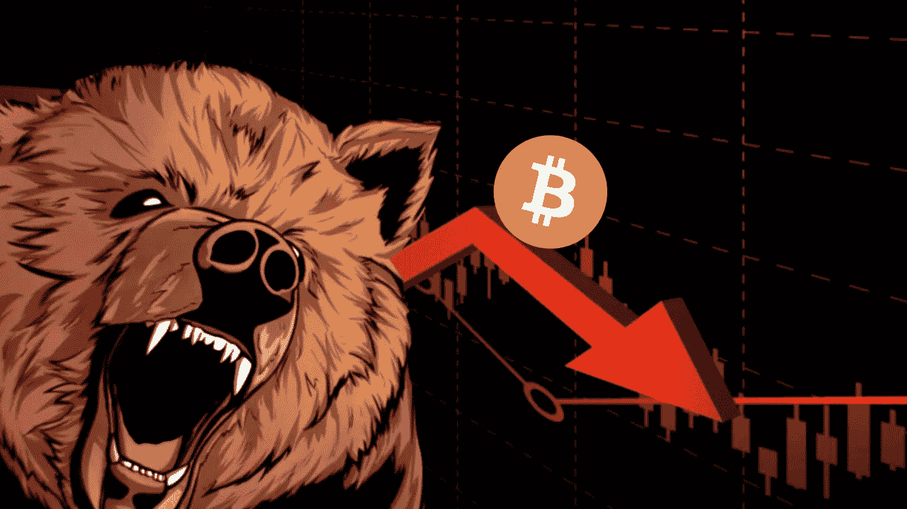
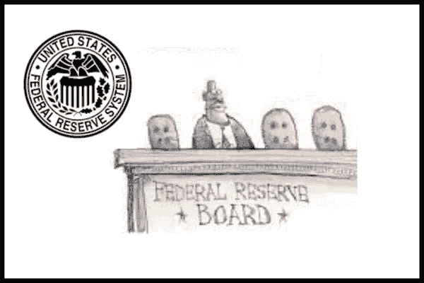
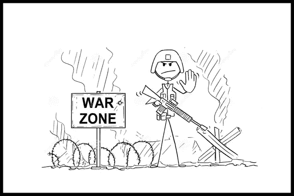
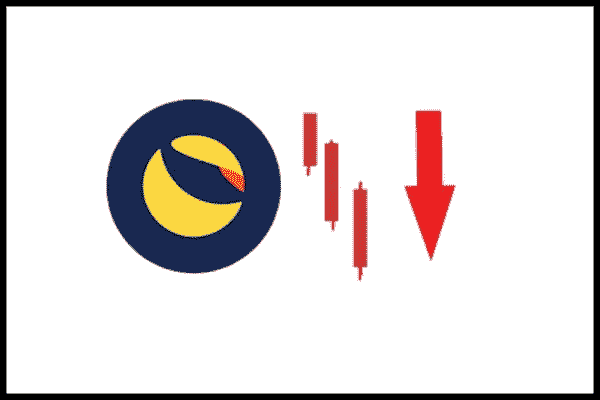
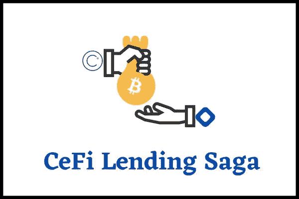
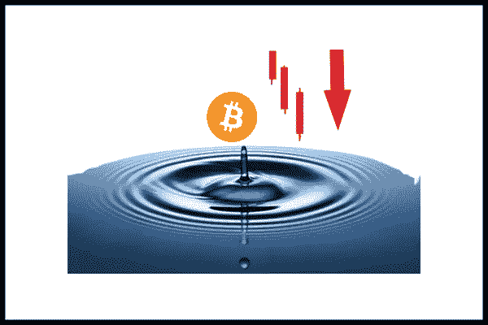
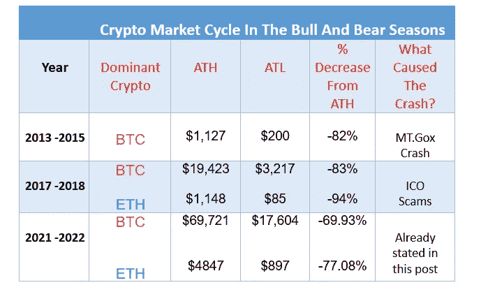

# 秘密血洗:秘密熊市何时结束？

> 原文：<https://medium.com/coinmonks/the-crypto-blood-bath-when-will-the-crypto-bear-market-end-6bf02d6975c7?source=collection_archive---------24----------------------->

Bear Market

你在 crypto 里看到的任何地方都在下红色的雨！

随着几乎所有加密货币的崩溃，全球[加密市场](https://www.nigeriabitcoincommunity.com/crypto-market-drop/)的市值首次跌破 1 万亿美元。

在 7 个月内，仅 BTC 一个国家就下跌了 60%以上，跌至 17K 美元。专家甚至预测它可能会下降到 14k 美元。

投资者现在开始慌张了；是什么导致了崩盘，我们预计什么时候会出现另一轮牛市？

我将在今天的帖子中回答所有这些问题。所以，一定要看完！

# 帖子摘要

这是我将要讲述的内容:

1.  [是什么导致了最近的秘密熊市？](#110a)
2.  [隐秘的熊市何时结束？](#90f2)
3.  [如何在熊市中保持盈利](#677e)
4.  [结论](#4b9b)

振作精神，我们开始吧！

# 1.是什么导致了最近的秘密熊市？

我们可以确定 4 个因素:

# 联邦政府

The Feds

我知道你在想什么:联邦调查局是什么？

Feds，是**联邦** **储备** **系统的简称，**是美国的中央银行。

美联储可以实施几项政策来确保美国的金融稳定。

其中一项政策与银行收取的利率有关。

现在，除非你一直躲在岩石下，否则你一定知道新冠肺炎封锁是如何困扰全球经济的。

为了度过这次事件并确保经济继续繁荣，美联储采取了两项措施:

*   **印更多的钱**:它印了超过3 万亿美元，其中高达 600 美元每月空投给人们，而其余的则用于购买证券和债券以增强流动性。
*   **降低利率**:将银行利率从 1%-1.25%降至 [0%-0.25%。](https://www.brookings.edu/research/fed-response-to-covid19/)

这一新的发展向系统注入了资金，人们很容易借钱消费。

> 交易新手？尝试[加密交易机器人](/coinmonks/crypto-trading-bot-c2ffce8acb2a)或[复制交易](/coinmonks/top-10-crypto-copy-trading-platforms-for-beginners-d0c37c7d698c)

此外，投资者开始担心将他们的资金对冲到加密货币等高收益和高风险的资产，从而飙升其价格。

然而，需要注意的是，涌入经济的资金导致了通货膨胀。

为了抑制通货膨胀，美联储在 2021 年末[暗示将提高利率。](https://www.cnbc.com/2021/11/24/federal-reserve-releases-minutes-from-its-november-meeting.html)

*高利率导致借款减少，银行储蓄账户利率上升，用于消费或投资的现金流减少。*

作为回应，许多投资者开始从 crypto 等高风险资产中撤出资金，从而导致其价格暴跌。

# 战争

War In Ukraine and Russia

当俄罗斯在 2022 年 2 月 24 日袭击乌克兰时，全球加密市场市值下降了[2000 亿美元](https://decrypt.co/93697/crypto-market-cap-falls-11-following-russias-invasion-of-ukraine)，在短短 24 小时内下降了 12%。

具体来说，BTC 下跌了 9%，ETH 下跌了 12%，SOL 下跌了 10%，其他 cryptos 也是如此。

这可能是因为俄罗斯和乌克兰都是采用加密和加密采矿的顶级国家。

不出所料，实力较弱的加密投资者也抛售了他们在 FUD 的股份。

同样，俄罗斯和乌克兰分别占全球小麦和葵花籽油供应量的 29%和 62%。

其他主要产品包括石油和天然气、化肥、玉米和大麦。

例如，埃及、埃塞俄比亚、巴基斯坦、纳米比亚和许多其他国家依赖俄罗斯和乌克兰的小麦。

然而，由于他们持续的冲突，俄罗斯和乌克兰无法向这些国家出口这些货物。

这意味着这些产品的成本将飙升，投资者不得不清算他们的资产，包括支付得起的密码。

最终，抛售将导致下跌趋势或熊市。

# Terra 网络

Terra Dump

Terra 网络经历了历史上世界上最大的加密崩溃。

这件事发生在 2022 年 5 月 7 日，当时泰拉的稳定货币 UST 失去了与 1 美元的挂钩。

网络原生令牌 LUNA 暴跌 99.99%，网络总市值暴跌 500 多亿美元。

在这次活动中，UST、露娜和用于支持 UST 的 BTC 也遭到了大规模抛售。

准确地说，价值超过 30 亿美元的 50，000 BTC 被出售，以拯救 Terra 网络。然而，一切都是徒劳的。

令人沮丧的是，BTC 的大规模抛售导致整个加密市场呈螺旋式下降趋势。

不幸的是，一些主要的加密公司，包括 3AC，Voyager，Babel Finance 等。受到了 Terra 崩塌的影响。下面你会学到更多。

# (d)加密贷款平台的崩溃

Cefi Lending Saga

大多数密码借贷平台的崩溃导致了密码市场的下滑趋势。

这一切都始于 Celsius，一个拥有数百万用户、管理着高达 250 亿美元资产的平台。

Celsius 允许用户出借、借用、购买和交换他们的密码。

然而，在经历了基金挤兑和突然破产后，它于 2022 年 6 月 13 日冻结了提款。

不只是 Celsius 有这种经历；其他加密贷款平台，包括 Voyager，Babel Finance 等，都在这条线上。

此外，与这些平台相关的加密货币价格大幅下跌。

我在这篇[帖子](https://www.nigeriabitcoincommunity.com/crypto-lending-platforms/)中揭露了你需要知道的关于这次崩溃的一切。

# (五)连锁反应

Btc Ripple Effect

如你所知，代用币和 BTC 有很大的关联。

因此，BTC 价格的下跌最终会影响整个加密货币市场。

例如，如果 BTC 因为 Terra LUNA 崩溃下跌了 20%,这意味着替代硬币也将大幅贬值。

可悲的是，一些替代硬币可能会因此下跌 40%以上。

此外，假设资产价格开始下跌。

包括小额投资者、散户投资者和弱势投资者在内的投资者有一种强烈的倾向，他们会立即开始抛售自己的大量资产。

一个例子是 ETH 股价下跌后的[抛售](https://www.coindesk.com/markets/2022/06/14/staked-ether-becomes-focus-of-crypto-stress-from-celsius-to-three-arrows/)。

这种抛售最终会拉低加密市场的价格。

但是，当然，大多数投资者不会为了放弃一个项目而抛售。

相反，他们有购买底部以获取巨额利润的意图。

继续下一节！

# 2.加密熊市何时结束？

虽然还不清楚，让我们检查密码市场周期得到一个结论。

将其视为加密市场的前一个趋势。

在牛市和熊市中，有三个主要的秘密市场周期。见下表！

Crypto Market Cycle

假设 BTC 和联邦储蓄银行的 ATL 分别降至前一周期的-83%和 94%。

这意味着 BTC 和 ETH 的价格将低至 11，400 美元和 280 美元，然后我们预计将出现另一轮牛市。

***嘿！这只是我的推测。***

从好的方面来看，一些专家推测加密市场已经跌到了谷底。

如果这种说法是准确的，那么我们应该期待很快看到加密资产价格的上升趋势。

去下一区！

# 3.如何在熊市中保持盈利

我将与你分享我的 5 大策略:

## –创造被动收入

用你的硬币赚取一些额外的硬币，而不是让它们在你的钱包里失去价值。

这个想法是，当市场复苏时，你会有更多的硬币从中获利。很酷，对吧？

有很多方法可以做到这一点，其中包括赌注，产量农业，贷款，流动性挖掘等。

比如像 [Tenset](https://www.youtube.com/watch?v=XiTOFvRNj9A) 这样的加密货币 ETF 2.0 项目。

通过锁定 Tenset Infinity 空投中的 10 枚硬币，您可以获得超过 20 枚硬币作为空投。

## –投资于发射台

[Launchpads](https://www.nigeriabitcoincommunity.com/binance-launchpad/) 是新推出的代币在交易所上市交易前以折扣价出售给早期投资者的平台。

launchpad 投资者比公开发售投资者更有可能从代币中赚取更多利润。

但是，在投资任何 launchpad 令牌之前，需要进行明确的研究。

## –DCA

DCA 代表—美元成本平均法。

这是一种投资策略，投资者以固定的时间间隔购买一种资产，比如说 BTC，而不考虑硬币的价格。

通过这种策略，你可以在尽可能低的价格买入，当市场最终复苏时，你可以获得丰厚的回报。

## –找到一个加密作业

社区经理、作家、视频编辑、程序员、营销人员等服务。在加密货币行业需求量很大。

好消息是，许多加密公司仍在雇佣员工远程工作。

你从哪里找到这些工作机会？可以用谷歌搜索或者 Linkedin。

## –像专业人士一样交易

最大限度利用熊市的最好方法之一就是像专业人士一样进行战略性交易。

但你会问，如何做到这一点呢？看看 CTMastery.com。您可以在下面找到更多信息。

# 抬头！

Ctmastery

**如果你想学习如何交易加密货币获利，我们开发了一个完美的课程来帮助你掌握加密货币交易。**

**前往**[**www.ctmastery.com**](https://www.ctmastery.com/)**报名。**

**您也可以通过**[**https://t.me/ctmastery**](https://t.me/ctmastery)**加入我们的电报社区了解更多信息**。

# 4.结论

您已经到达这篇文章的结尾。我希望你一定做了详细的笔记。

现在是时候得到你的想法了。

你对这个熊市有什么看法？

你认为我们已经到达底部了吗？

你认为市场什么时候可能恢复？

请在提供的框中留下您的意见。

记得分享帖子。干杯！

# 另请参阅:

*   什么是产量农业？—它是什么以及它是如何工作的
*   [2022 年 7 个最佳加密发射台——早点进入，赚大钱！](https://www.nigeriabitcoincommunity.com/best-crypto-launchpads/)
*   [如何投资密码获取巨大收益——9 种最简单的方法](https://www.nigeriabitcoincommunity.com/how-to-invest-crypto/)
*   [加密货币五大专业安全提示！](https://www.nigeriabitcoincommunity.com/safety-tips-for-cryptocurrency/)

*最初发表于*[*https://www.nigeriabitcoincommunity.com*](https://www.nigeriabitcoincommunity.com/crypto-bear-market/)