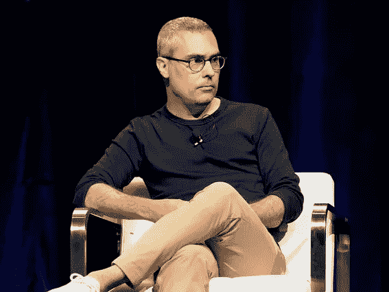
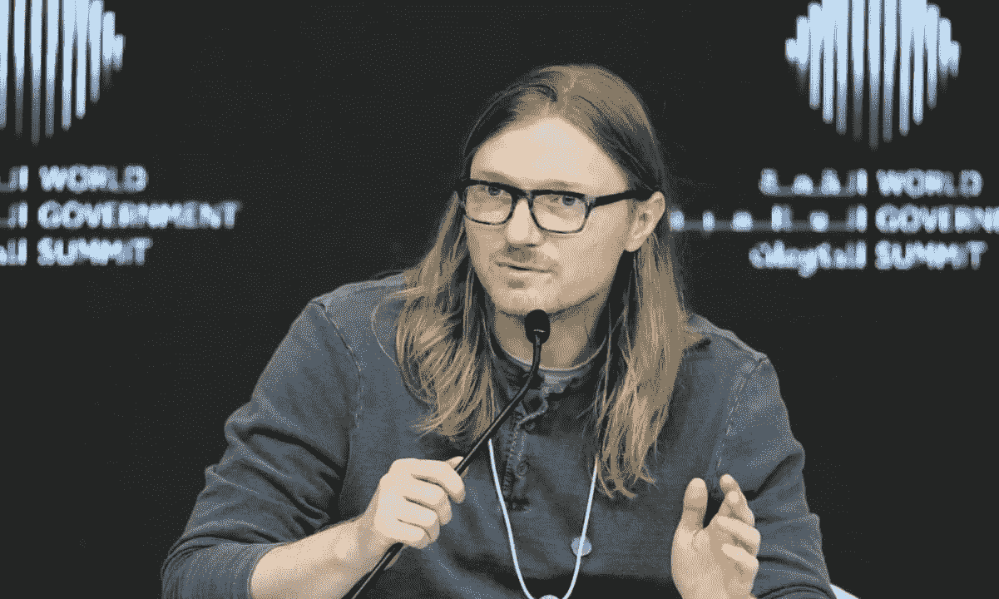
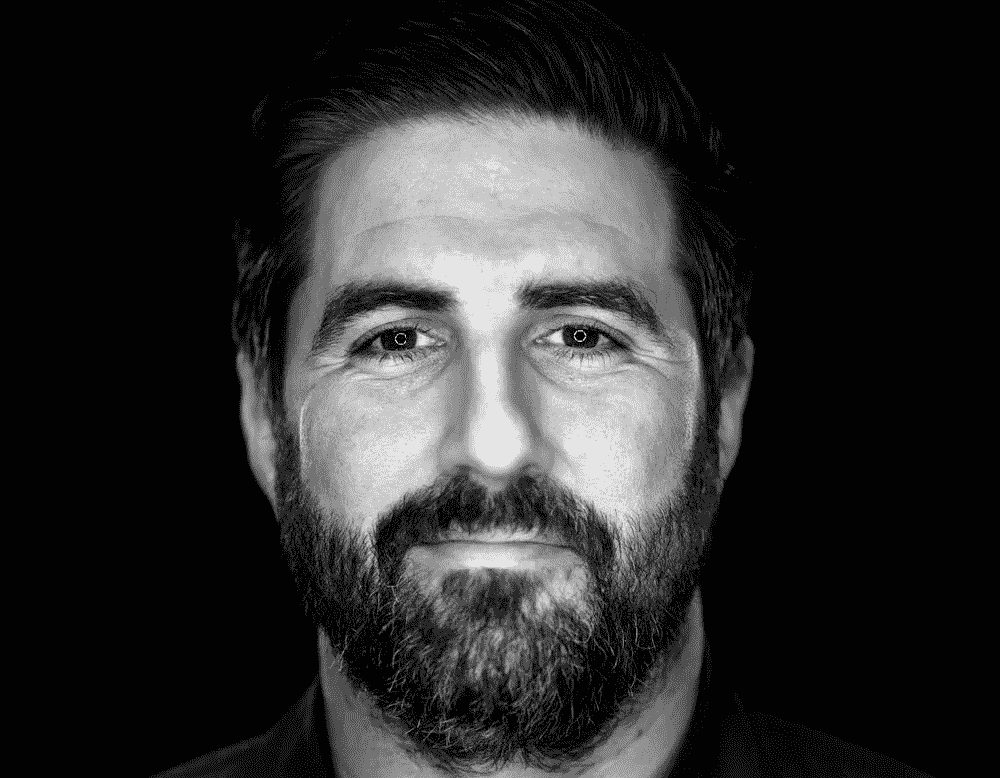

# 2022 年的密码英雄:那些活跃了密码行业的人

> 原文：<https://medium.com/coinmonks/the-crypto-heroes-in-2022-those-who-have-livened-up-the-crypto-industry-a5deb8bc4cb1?source=collection_archive---------19----------------------->

继 2022 年的密码英雄名单之后，本文增加了三位以不同方式为密码市场做出贡献的人物。然而，结果和影响是积极的，为[加密货币](/@libraryoftrader/trading-psychology-you-might-not-know-a5288f05c1cd)建立一个更可持续的未来。

 [## 2022 年的密码英雄:那些给密码行业带来清晰的人

### 看起来今年的加密市场不景气。在余波中有许多戏剧…

medium.com](/@libraryoftrader/the-crypto-heros-in-2022-those-who-bring-clarity-to-the-crypto-industry-de76c5b54277) 

**杰里·布里托**

*Jerry Brito stands against the Tornado Cash ban. — Source: CoinDesk*

Jerry Brito 默默的做了很多重要的工作来拯救 crypto 免于崩溃。具体来说，作为硬币中心的执行董事，他做出了起诉政府办公室的决定，作为对财政部外国资产控制办公室禁止龙卷风现金的回应。

布里托澄清了如果制裁通过，整个区块链议定书被禁止的可能性。这意味着禁止龙卷风现金可能只是未来阻止比特币或以太坊的第一步。

当然，Coin Center 并不是唯一一家抨击制裁的公司。然而，布里托对保护密码行业的贡献仍然值得高度赞扬。因为它支持加密和隐私权利，并建立一个更加可持续的未来。

 [## 在加密的不确定性中塞翁失马，焉知非福&比特币的替代品

### FTX 的余波不仅仅是报纸上点击诱饵标题背后的灵感。它产生了…

medium.com](/coinmonks/blessings-in-disguise-amid-the-crypto-uncertainty-altcoins-backing-up-for-bitcoin-9db3d825a478) 

杰西·鲍威尔

*Jesse Powell, a former Kraken CEO, is one of the discerning voices for the crypto industry in 2022\. — Source: Financial Times*

尽管从执掌北海巨妖的首席执行官位置上退了下来，杰西·鲍威尔在加密界仍然是一个有洞察力的声音。他花时间和精力谈论许多有争议和值得讨论的话题，如经济自由、隐私权和加密精神。

鲍威尔警告像 FTX 这样的集中交易的加密用户，并敦促他们在担心冻结资产以应对加拿大政府威胁的情况下取出资金。当乌克兰接受秘密捐款时，他仍然继续北海巨妖普通俄罗斯人的帐户，没有法律要求。他也是龙卷风现金制裁的主要批评者。

 [## FTX 灾难:为什么它会深刻影响加密市场？

### FTX 的惨败严重影响了许多公司，甚至整个加密行业。因此，许多人把……

medium.com](/coinmonks/the-ftx-disaster-why-does-it-profoundly-impact-the-crypto-market-f738a1cc7735) 

彼得·麦科马克

*Peter McCormack was outspoken about his opinion of Craig S. Wright. — Source: Bitcoinist*

彼得·麦科马克因其专注于比特币的播客《比特币做了什么》而闻名。然而，这并没有使他进入这个名单，但他在法庭上反对克雷格·s·赖特的立场值得注意。对于那些不熟悉 Craig S. Wright 的人来说，他自称是比特币的创造者，也被称为中本聪。

麦科马克声明“克雷格·赖特是一个他妈的骗子，他是一个骗子，他是一个白痴；他不是聪，”在 2019 年的一次采访中。赖特也求助于法院来反对麦科马克，然而，它照亮了赖特的索赔和麦科马克的批评。有趣的是，彼得·麦科马克不得不支付 1 英镑的赔偿费。

 [## 加密期货和期权:交易者容易犯的 3 个错误

### 错误就像甜蜜的陷阱或有着良好伪装的无害事物。然而，一旦你犯了错误，你…

medium.com](/coinmonks/crypto-futures-and-options-3-mistakes-traders-are-succumb-to-2866c2a03f75) 

**你也能找到我们👇**

*   [库的交易员](http://bit.ly/3GQsIiY)
*   [脸书](http://bit.ly/3XyoeTY)
*   [推特](http://bit.ly/3XHQRhK)
*   [领英](http://bit.ly/3ihv3cu)
*   [Reddit](http://bit.ly/3imq76f)
*   [Quora](http://bit.ly/3VcaEUK)
*   [Tiktok](http://bit.ly/3VibUpx)

> 交易新手？试试[加密交易机器人](/coinmonks/crypto-trading-bot-c2ffce8acb2a)或者[复制交易](/coinmonks/top-10-crypto-copy-trading-platforms-for-beginners-d0c37c7d698c)