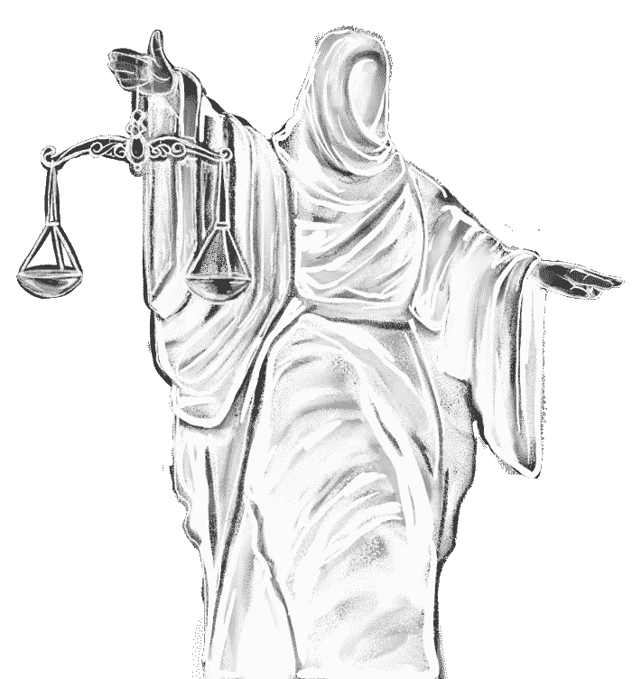

# 密码继承的困境

> 原文：<https://medium.com/coinmonks/the-crypto-inheritance-dilemma-646d91dd9590?source=collection_archive---------9----------------------->

## 维护安全性和隐私，同时仍然有一个计划！

加密领域仍然存在的一个大问题是如何在最坏的情况下管理数字资产。很容易理解为什么这通常不是一个更大的问题，因为区块链和加密货币技术才出现了十多年。许多早期的开发者仍然…