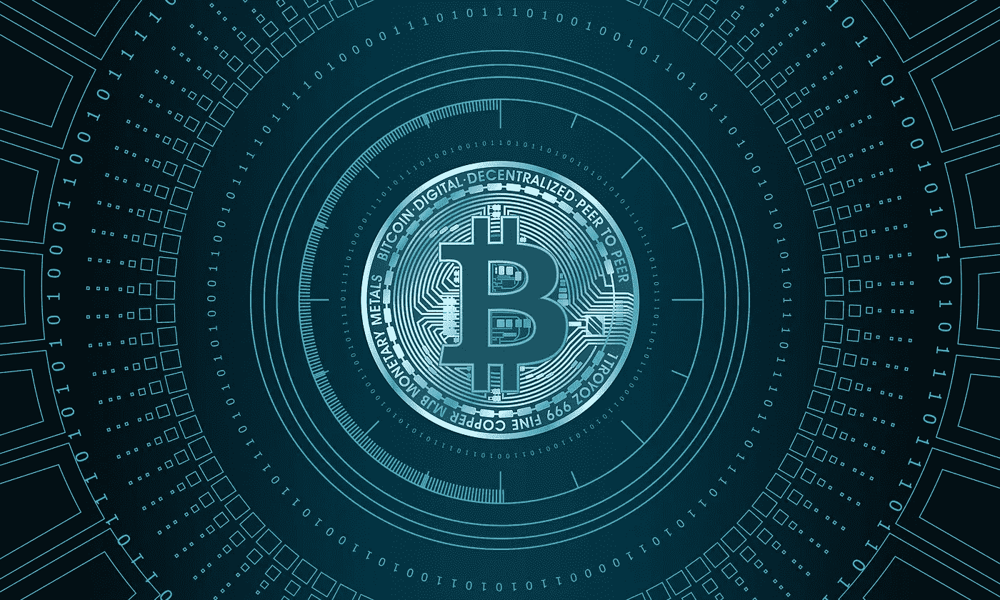

# 一种新的意识！

> 原文：<https://medium.com/coinmonks/the-crypto-paradigm-a-new-consciousness-857179c673d0?source=collection_archive---------18----------------------->

当我理解了区块链的概念及其固有的振动性质时，我突然意识到我已经进入了一个新的范式。钱不再是一个物理单位(如硬币、纸币)，而是一个动态的能量网络，随着我的每一个想法和情感而移动。

Image Courtesy of [Pete Linforth (Pixabay)](https://pixabay.com/users/thedigitalartist-202249/?utm_source=link-attribution&utm_medium=referral&utm_campaign=image&utm_content=3374479)

加密投资者此时犯的错误是认为他/她必须说服传统的…