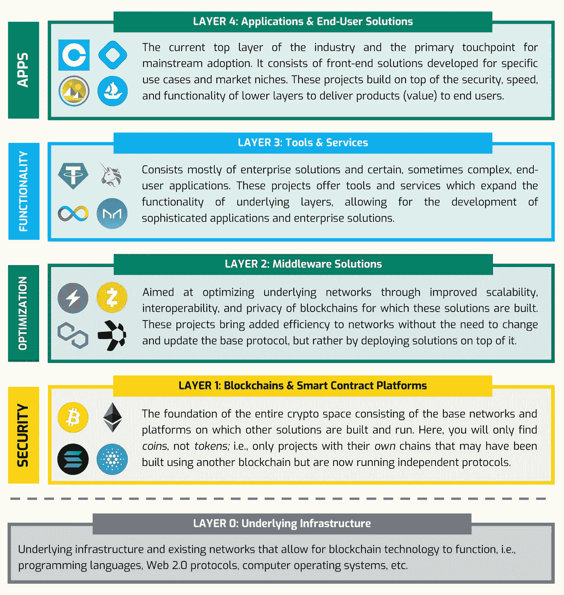
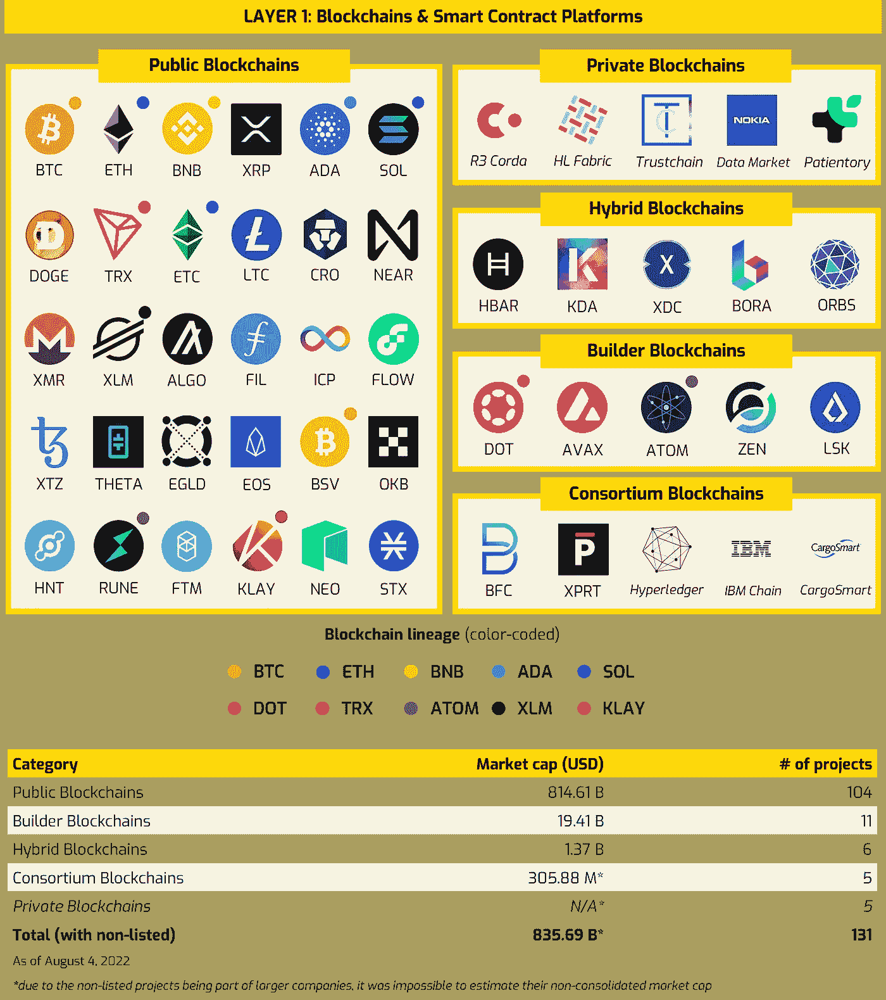
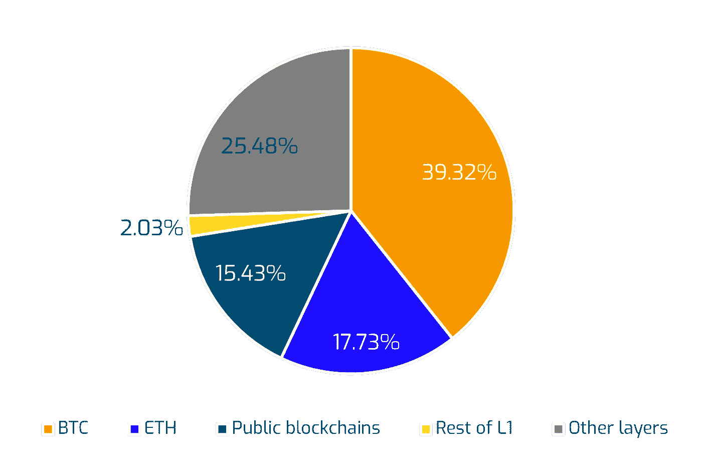
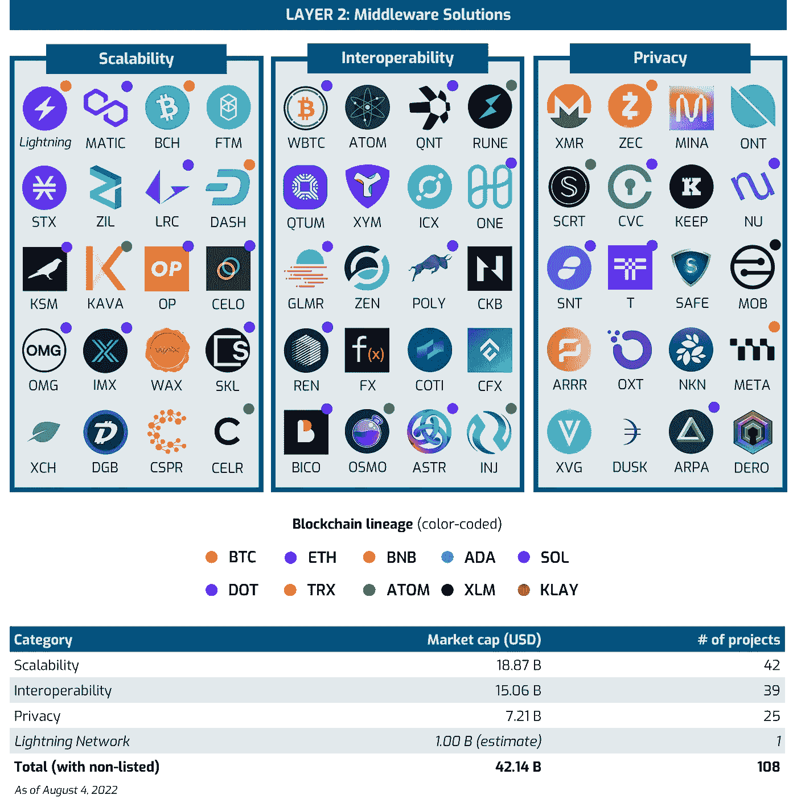
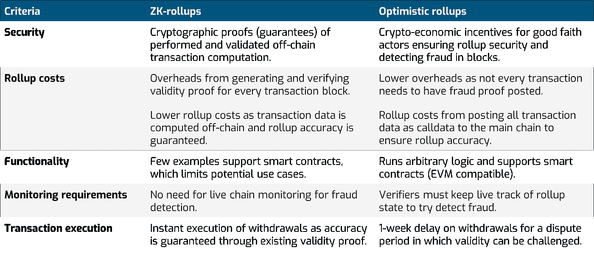
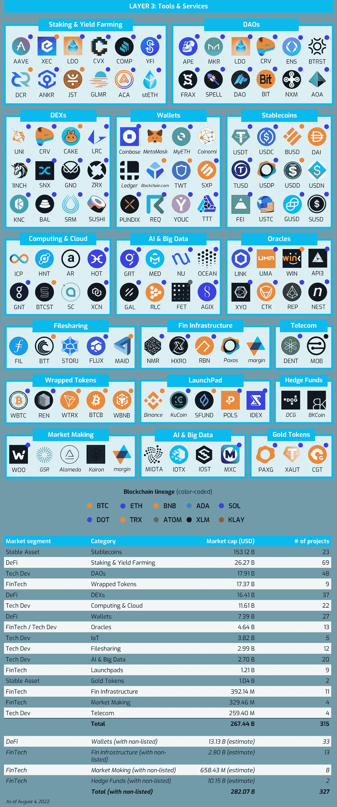
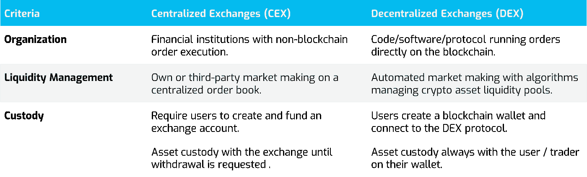
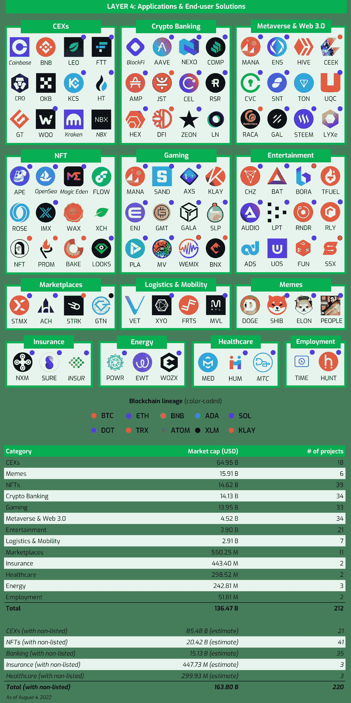
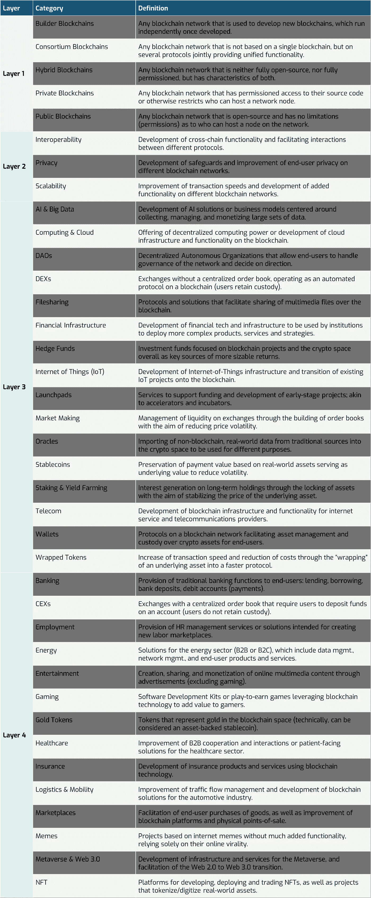

# 加密空间

> 原文：<https://medium.com/coinmonks/the-crypto-space-d8b801901d5b?source=collection_archive---------1----------------------->

## 区块链产业综合指南

***Figure 1:*** *Overview of the various layers in the crypto space*

加密空间变得越来越受欢迎。它最初是一项地下技术，由一个化名为 Satoshi Nakomoto 的匿名人物创建，在早期只有少数人测试和使用。现在，有 9，657 个项目在 CoinMarketCap (CMC)上市，超过 10，000 个项目未上市(因为它们缺乏本地令牌，但全部或部分活跃在加密领域)，我们可以自信地说，加密已经成为一个强大的经济部门，吸引着越来越多的投资者和聪明的头脑。然而，对于外行人，甚至是在这个领域工作的人来说，对于整体情况以及不同实体在市场中的定位和项目之间的关系仍然存在困惑。

我们努力描绘出加密空间和其中最大的项目，目的是使不同的层次和市场部分更加清晰，同时解释底层技术的某些方面。我们希望这将作为新手和老手的指南，并有助于统一我们谈论和理解加密的方式。

我们根据以下几点确定了四个主要层(L1 到 L4):(a)它们是否是区块链本地技术；(b)从技术角度看，它们是否以及如何允许在其基础上建立进一步的解决方案和功能；(c)它们是否面向企业而不是零售终端用户；以及(d)最终用户利用给定解决方案所需的技术熟练程度(参见**图 1** )。在这四个层次中，我们还确定了 38 个不同的项目类别，它们代表了项目所处的特定行业或市场。在本文的最后，我们将更详细地阐述这些类别，并解释我们的总体研究和分类方法。

## **第一层:区块链&智能合约平台**

这是整个加密空间的基础，这里代表的项目是*区块链*(链)，它们按照自己的协议运行并支持自己的专有网络。然而，它们可能仍然与其他区块链(例如，ETC、BSV、RUNE)相关(建立在其他的基础上，从其他派生，受到其他的启发)，但是它们独立运行并支持自己的生态系统。此外，在这一层你只会发现[硬币而不是](https://crypto.com/university/crypto-tokens-vs-coins-difference) *。这也许是观察的关键区别。即，*硬币* 有:*

1.  给定区块链(网络)的本地加密货币；
2.  价值储存和交换媒介(它们代表货币)；
3.  mineable(该术语源于工作证明，但也适用于利益证明)，即它们被用作节点验证交易和运行底层协议的货币激励。

*令牌，*另一方面:

1.  在另一个硬币的区块链上操作(非原生)；
2.  他们代表对独特资产的所有权*；*
3.  *它们的货币价值来源于区块链以外的某项业务。*

*因此，我们可以说，硬币代表对给定网络促进安全和公平交易的能力的信任的货币估价。令牌代表对有形或无形资产的可验证所有权，通过底层网络保护和强制执行。虽然在许多情况下不准确，但一个有用的类比可以是将硬币视为美元(或另一种法定货币)，将代币视为股票(或合同或所有权证书)。*

**

****Figure 2:*** *Layer 1 category and key project overview (legend order based on market cap)**

*目前，区块链上用于处理块(交易)的主要共识机制(协议)有两种:工作证明(PoW，起源于比特币)；和利害关系证明(PoS，起源于 Peercoin，最近被以太坊采用)。每种方法都会影响速度和网络安全之间的平衡，它们的重要性值得进一步研究。*

*[PoW](https://www.asynclabs.co/blog/blockchain-development/proof-of-work-what-it-is-and-how-does-it-work/) 牺牲吞吐量(每秒交易数或 TPS)来提高安全性和隐私性，让网络中的所有节点通过第一个验证一组交易来竞争补偿(一枚开采的硬币)。这是通过解决一个复杂的数学问题来实现的，从本质上来说，这需要计算机反复猜测随机数(nonces ),以输入到一个哈希函数中，该函数为一个新的交易块计算字符串，直到猜出正确的字符串。计算机需要时间不断猜测数字并检查其结果，直到生成正确的字符串——这项工作保证了提交给该链的所有交易的安全性和准确性。困难而缓慢的猜测的结果可以被网络中的其他节点即时检查和验证，这进一步确保了任何欺诈企图难以执行并且易于检测。首先提交正确字符串的节点确认网络中的所有余额都是正确的，并且到那时为止所有交易都已被正确处理，充当确认在跟踪系统中所有账户的资产负债表的创建中没有违规行为的审计员。因此，节点独立地为它们自己的利益而行动，并且谁在网络中具有最大的处理能力(对网络的投资最大),谁就最有可能获得块奖励。我们注意到，如果一个参与者控制了所有节点(总处理能力)的 51%,那么从理论上讲，他们可能会危及系统，但是随着节点数量的增加，这种情况变得非常不可能。最重要的是，由于开采新区块的难度，单独开采不再有利可图，矿商通常会整合成矿池，其中一些矿池在总开采量中所占的比例达到两位数。这些都有具体的货币激励，以确保系统保持公平和正确的运作。*

*[PoS](https://ethereum.org/en/developers/docs/consensus-mechanisms/pos/) 通过不要求所有节点*挖掘*每个新块，以网络对恶意行为者的弹性为代价增加 TPS。相反，它会将每个新块随机分配给任何一个在本地加密货币中持有赌注(锁定)利益的验证器节点(您可以在第 3 层:工具&服务中了解更多关于赌注的信息)。为了成为验证者，节点需要投入给定数量的网络本地硬币(例如，对于以太坊，最低要求是 32 ETH ),这充当安全保证金。然后，该节点被随机分配多个事务以创建一个块(或带有以太坊的块的碎片)，该节点验证其中包含的所有事务的准确性，并将该块提交给链。然后，其他验证器节点检查提交并确认提交的块(或碎片)的准确性，然后将奖励分发给提交块的验证器节点和确认其准确性的所有其他节点。因此，单个节点因完成两个增值动作而获得奖励:1)确认交易，创建并向区块链提交块或碎片；以及 2)确认(证明)其他节点提交的块的准确性。如果一个节点被发现蓄意欺诈，该节点的股份将被削减(例如以太坊股份的 1/32 ),并且该节点将逐渐从网络中移除。与 power 非常相似，如果单个节点整合了网络中 51%的股份，该节点将有效地控制网络，并可能向链中添加欺诈块。然而，获得一个网络的总股份价值的 51%是有风险的，虽然在小项目上可行，但对于以太坊这样的硬币来说，它变得非常昂贵，使这种风险成为可能，但可能性极小。*

*在第 1 层中，区块链可以在简单的无许可(公共)或有许可(私有)的基础上进行划分，这取决于是否存在对在网络中托管节点或访问其源代码的限制。当考虑该链是在单个协议上运行还是在多个协议上运行，以及是否有可能将该链用作进一步区块链的开发工具包时，会出现更多的类别。就市值而言，很明显，占主导地位的区块链类型是开源、无许可的区块链，截至 2022 年 8 月 4 日，它们占 CMC 前 400 个项目总加密市值的 70%以上(不包括比特币的 33%)(见**图 3** )。这些公共区块链占据了网站上列出的前 400 个项目中的 104 个。*

**

****Figure 3:*** *Top 400 listed projects’ total market capitalization share in %**

*就市值和其中包含的项目数量而言，第二大类别是**建筑商区块链**(有时也被称为“0 层”区块链)。这些协议配备了软件开发工具包(SDK ),允许在其上开发和部署新的区块链，从而从本质上解决了区块链技术的可扩展性和互操作性问题。这些新链可以是完全独立的 L1 链，也可以起到侧链的作用(请注意，我们将侧链归类为 L2 解决方案，尽管它们大多独立运行)。建设者区块链的主要好处是，他们简化了新区块链项目的创建，并努力使它们更加兼容和互操作。*

*第 1 层不太常见的类别是私有、混合和联合区块链。虽然这些仅占加密市场总市值的一小部分，但就其技术和治理结构而言，以及它们通常由大型传统公司实施这一事实而言，它们是非常重要的。**私有或许可区块链**允许对区块链网络及其源代码进行更高级别的安全、隐私和集中控制。对于希望确保商业秘密安全或受到严格监管和监督压力的大公司来说，这可能是一个更好的组合。对于某些使用案例，集中控制网络以及谁有权访问网络至关重要。*

***混合区块链**实施两全其美的方法，保持部分网络开源和无许可，以鼓励开发、采用和分散，同时对网络的其他部分(通常是治理)实施许可访问，以确保增加安全性和合规性。这使得它们成为一个有趣的中间地带，甚至传统公司也可以探索并考虑作为完全私有网络的替代方案。*

*最后，**区块链财团**为其众多的连锁店采用单一的用户界面和工具套件，同时仍然允许通过其底层协议的不同实现来满足个别市场的需求。这些主要用于开发和部署企业解决方案，因为底层(通常是许可的)网络确保了安全性、稳定性和易用性，而模块化链结构允许根据特定的业务需求定制最终产品。*

## *第 2 层:中间件解决方案*

*一般来说，区块链的速度和效率受到两个因素的限制:块大小和块处理速度。两者都是由给定区块链用来处理事务的共识机制(协议)决定的。速度和效率可以通过探索和部署现有协议的新配置来解决(例如，使用[分片](https://ethereum.org/en/upgrades/sharding/#main-content) ) *或*，在现有协议的基础上构建解决方案，找到提高 TPS 的方法，同时保持甚至提高网络安全性。*

*第二层正是因为这个原因而存在:解决底层技术的具体缺点，并在不改变区块链的基础安全性和结构的情况下扩展其改进潜力。因此，这一层中的类别为区块链发展的三个支柱提供了解决方案:(a) **可扩展性**:提高底层网络的交易吞吐量和处理能力；(b) **互操作性**:增加不同网络之间的连接，允许跨链功能；以及(c) **隐私**:提高对在线身份和用户生成数据的控制和安全性。*

**

****Figure 4:*** *Layer 2 category and key project overview**

*可以对第 2 层进行一些观察。以太坊是用作开发平台的主要区块链，这可以从这一层的所有三个类别中基于以太网的项目的数量中看出(用蓝点表示)。毫不奇怪，对于比特币来说，大多数努力都是通过开发侧链和/或分叉链(用橙色圆点表示)来实现可扩展性(增加 TPS)和隐私性(确保安全性和匿名性)。源自区块链构建者的令牌集中在其两个优势领域——可扩展性和互操作性。*

*看看整个层 420 亿美元的市值和其中的 107 个项目，它对更广阔的加密空间的重要性立即变得显而易见。该层允许在不牺牲安全性和隐私的情况下提高速度和效率，并且不需要对基础协议进行任何更改。[扩展和互操作性解决方案](https://ethereum.org/en/developers/docs/scaling/)可以进一步细分为子类别:侧链、副链、桥和汇总。*

**侧链* 是链接到主(父)链的链外协议(独立区块链)，有助于数据(数据块)在主链上和主链外的移动，从而提高 TPS。这些区块链通过双向 peg 与母链通信，确保两条链上的数据同步。例如，闪电网络是一种支付协议，作为 BTC 区块链的侧链运行，在降低 BTC 网络小额支付成本的同时提高了速度。实质上，交易双方在闪电网络上锁定了一定数量的 BTC，并使用锁定的数量以更高的速度和更低的成本进行交易。一旦在闪电网络上处理了所有交易，单个交易被发送到 BTC 网络，该网络确认来自闪电网络交易的余额。另一个例子是 MATIC，它是一个与以太坊兼容的侧链，运行在完全不同的协议上，但仍然与以太坊挂钩。这个过程是类似的，因为 MATIC 网络在链外处理大量的事务，并且只返回要存储在 ETH 母链上的处理过的数据。由于侧链与母链的联系和依赖，我们没有将这些独立的区块链归类为第 1 层解决方案。*

**副链* 是密码领域相对较新的事物，DOT 和 KSM 引领了这一发展。从本质上讲，副链是主链的碎片，代表更小的半独立片段，它们都处理不同的计算需求，同时在相同(或几乎相同)的基础协议上运行。因此，副链通过独立处理事务来增加 TPS，但是(与侧链不同)它们依赖于父链挖掘/标桩节点来获得安全性。有些与主链几乎无法区分(如 DOT 的核心副链)，而其他的则是运行在公共协议上的不同实体(如 GLMR 和 ACA)。*

**网桥* 是被设计来促进不同区块链网络之间的交互以及适应各种协议和块组成之间的差异的协议。它们包含大多数互操作性项目，因为它们旨在实现协议间或协议内的连接(即，促进不同网络之间的交互，以及给定网络内的项目)。ETH 的等离子协议是 MATIC 使用的网桥的一个例子，MATIC 是一个侧链，为基础 ETH 网络提供额外的可扩展性和互操作性。网桥协议与前两个子类别有着内在的联系，并且依赖于前两个子类别，因为这些技术只有通过联合操作才能提供价值。桥有一个关键问题——信任和安全的差异。这个问题是双重的，因为两个不同的区块链可能有不同的采矿/标桩基地，这可能会使较少开采/标桩的链暴露于恶意行为；并且该桥将其安全性建立在自己的协议上，而不是它们所连接的区块链的协议上，这使得它们成为易受攻击的薄弱环节(例如，对 Harmony 的 Horizon 桥的成功攻击)。*

*[*Rollups*](https://vitalik.ca/general/2021/01/05/rollup.html) 是扩展解决方案，它从主链接管部分数据处理，并在与主链并行运行时离线处理。本质上，几个事务被移出链外，一起处理、批处理(*卷起*)，并作为压缩数据返回到主链。这减少了主链上的事务负载，并打开了额外的存储和处理能力池。在将事务数据作为压缩的一批事务发送回主链之前，Rollups 在某种意义上类似于侧链。这两种可伸缩性解决方案的主要区别在于处理后的数据存储在哪里。汇总将已处理的数据存储在主链上，而不是保存在它们的汇总链上，而侧链便于在它们自己的链上存储数据。此外，当侧链运行它们自己的安全协议时，汇总依赖于主链的安全性和数据完整性。有两个汇总子类别:零知识(ZK)汇总和乐观汇总。*

**ZK 汇总*是智能合约，它在链外验证一批交易，并将其返回到主链，其中包含一个名为 ZK-斯纳克的加密有效性证明。每个提交的数据批次都经过网络检查，如果验证成功，就会添加到主链中。顾名思义，在这个设置中，主链“不知道”汇总中处理的所有事务。相反，它依赖有效性证明来确保所有离线处理的交易及其产生的余额是有效和一致的。*

*[*乐观汇总*](https://www.alchemy.com/overviews/optimistic-rollups#:~:text=The%20major%20difference%20between%20optimistic,cryptoeconomic%20incentives%2C%20and%20security%20properties.&text=Uses%20fraud%20proofs%20to%20prove,proofs%20to%20prove%20transaction%20validity.) (OR)以类似的方式运行，但与 ZK 汇总不同，它依靠加密经济激励和基于验证器(欺诈侦探)的争议解决系统来确保提交给主链的交易的有效性。向主链提交汇总的一方必须提供抵押品(本地加密货币债券)才能执行提交。任何时候，发现欺诈交易的任何节点都可以提交欺诈证据，此时验证器节点也提出自己的担保品，争议解决过程开始。网络收回当时的状态(余额)并再次执行交易。如果这种重复交易的结果是无效的，提交汇总的节点将受到惩罚，其抵押品的一部分被烧掉，剩余部分按比例分配给所有帮助欺诈检测过程的节点。同样，如果验证器节点提交了无效的欺诈证据，该方也会受到惩罚。理论上，只要网络中存在单个诚实节点，提交批次的完整性将始终保持不变。*

**

****Table 1:*** [*Comparison*](https://101blockchains.com/optimistic-rollups-vs-zk-rollups/) *of ZK-rollups and ORs on key characteristics (curated and summarized)**

## *第 3 层:工具和服务*

*在第 3 层，我们开始看到更多面向最终用户的解决方案，与区块链的复杂交互的便利化，以及旨在支持日益复杂的技术基础增长的产品和服务的开发。第 2 层项目主要关注优化区块链效率，而第 3 层则开放了底层技术更广泛的用例功能。在很大程度上，这一层由令牌组成，除了正在开发的具有特定用例(主要在分散计算和人工智能领域)的偶尔硬币，其整个价值主张和功能都围绕着它(例如，ICP、HNT、MED、IOTX)。*

*我们将第 3 层划分为包含以下内容的解决方案:面向商业、企业，并为最终用户应用程序的运行开发基础设施；比零售终端用户应用程序更复杂，通常要求至少对要使用的区块链技术有基本的了解；和/或促进对区块链本身的访问和操作。*

**

****Figure 5:*** *Layer 3 category and key project overview**

*整个层的市值约为 2670 亿美元(仅次于层 1，几乎是层 4 的两倍)。 **Stablecoins** 构成了这一资本化的大部分(截至 2022 年 8 月 4 日超过 57%)，这是由于它们在促进交易、交易和稳定持有价值方面的效用。有趣的是，稳定的 USDT 币拥有最大的每日交易量，甚至超过了 BTC 和瑞士联邦理工学院。在这个类别中，我们区分了*资产支持*和*算法*稳定积分。资产支持的 stablecoins 通过保留挂钩货币或资产的储备来维持其挂钩，并通常保证每个数字实例都有现实世界中的等价物，而算法 stablecoins 则利用全新机制来维持流动性池中加密资产的动态比率，以支持挂钩。理论上，算法稳定资本允许一种真正分散的方法来管理货币供应的稳定性，但大型项目的依赖暴露了这种方法的内在风险。最重要的是，监管者已经开始提倡满足更多的资本和流动性要求。虽然**黄金代币**可以被视为资产支持的稳定货币(黄金是一种传统的保值资产)，但我们将它们归为一个专门的类别，以展示利基本身，因为黄金代币属于市场(黄金买卖)和稳定货币的中间区域。*

*就市值而言，第二大类别是**赌注&收益农业**，它代表了分散金融(DeFi)行业的一部分(其他包括加密银行、分散交易所和钱包)。我们将 DeFi 定义为提供金融服务(支付、借贷、借贷、交易、筹资等)的任何项目。)以分散的方式。自成立以来，这一领域发展迅速，因为它吸引了寻求通过定期存款的固定收益率实现高于平均水平回报的投资者(和许多投机者)的兴趣。在零利率时代，这是一个对投资者极具吸引力的选择。赌注是 PoS 协议运行的基本需要，因为它涉及投资者对其加密资产进行时间锁定，以充当底层 PoS 网络上的节点/验证器，并在二级市场上提供价格稳定性。Yield Farming 具有相同的技术和概念基础，两个关键区别是投资者的时间跨度和用例。虽然赌注是一项支持业务发展和区块链运营的长期投资(类似于收购和持有公司股权并期待股息)，但收益农业是一项短期战略，旨在通过向流动性池(如 dex)提供资本以允许在所述池中交换代币，从而在不同项目和赌注渠道(类似于技术交易或衍生品交易)中实现收益最大化。*

***分散式交易所(dex)**是 DeFi 细分市场的另一部分，是第三层中第五大类别。本质上，dex 是直接在区块链上运行的协议，充当点对点(P2P)市场，允许在没有中央机构结算交易的情况下交换硬币和代币。用户每次交易都要支付区块链天然气费和联营费。天然气费用可能因互换时的网络负荷而异，有时可能远远高于交易所的固定交易费用。构建指数有不同的方法，但最常用的方法是自动做市商(AMM)模型。本质上，AMM 是一种智能合约，它消除了传统做市的需要。这是通过建立流动性池来实现的，用户可以在池中投入代币，以换取产生的池费的相对部分。价格发现是使用一个简单的公式来实现的，该公式计算池中令牌的比率，当令牌被出售时，价格降低，反之亦然。dex 的主要卖点是这样一个事实，即(与集中式交易所不同)用户保留对其资金的托管权，因为他们使用个人钱包进行掉期交易。*

**

****Table 2:*** *Comparison of Centralized and Decentralized Exchanges on three key dimensions**

***钱包**是运行在区块链上的加密货币资产管理软件。这些可以是保管钱包(交易所账户或 ETF 中的持有物)或非保管钱包(直接在区块链上运行)，这取决于用户是保留其账户的私钥还是将其委托给第三方。澄清一下:每个加密钱包都有一个公钥(公开可用的地址，用于识别资金的接收方/发送方)和一个私钥(随机生成的大密码，用于访问和管理钱包上的资金)。因此，我们认为非保管型钱包是 DeFi 细分市场的另一部分，而保管型钱包代表了由中央实体提供的服务的延伸。这是因为非托管钱包提供了一种金融服务(资产管理和支付处理)，并以分散的方式运行，不需要单一的中央机构来处理交易。请注意，目前一些最广泛使用的钱包(比特币基地、Metamask、MyEtherWallet、Coinomi)没有 CMC 列出的硬币或令牌，但在以太坊区块链上(或在 Coinomi 等多链环境中)用作协议，而其他钱包则提供基于硬件的冷存储(如分类账)，以方便私钥的离线存储和对持有物的离线访问。*

*我们将剩下的 12 个类别分为两组:技术开发(图 5，市值表:TechDev)和金融科技(图 5，市值表:FinTech)。顾名思义，TechDev 项目是那些将工具、服务和基础设施推向市场，以允许在区块链上开发和运行更复杂的功能的项目。**分散的自治组织**(Dao)是该群体中市值最大的类别，随着围绕元宇宙和 Web 3.0 的宣传越来越多，它们在 2021 年末受到了极大的关注。这些项目代表了在微观(企业/项目管理)和宏观(发展“未来互联网”)层面上对加密空间(元宇宙/ Web 3.0)进行分散治理的解决方案，因为它们允许社区依靠其在给定项目中的股份/参与来管理自己。**计算&云**解决方案与**文件共享**解决方案紧密相连，因为两者可以利用相互的协同效应。这些类别中的项目正在开发利用分散处理能力和云存储的方法，以促进更安全和更有效的在线文件管理，同时还为开发需要更多计算能力和存储的其他应用程序和工具提供关键基础设施。**物联网**项目以类似的方式受益于与**人工智能&大数据**类别的相互协同作用。也就是说，人工智能需要大型数据集来学习和开发，但一旦经过“训练”，它就可以显著提高数据分析、管理和使用的效率。物联网类别产生大量最终用户数据，同时也需要人工智能功能的元素来提供最佳的最终用户体验。在这个集团中，我们还有**电信**项目，为区块链的移动和互联网通信建设基础设施。*

*FinTech 项目组将更复杂的产品(金融工具)和服务推向市场。**包装代币**通过将代币(例如 ETH 网络上的 wBTC)、代币和非加密资产(例如房地产、艺术品、股票)放入保管数字金库并发行(铸造)与基础资产挂钩的新代币，为它们提供互操作性和更快的交易速度。该流程允许在给定的区块链上交易非本地资产，并允许使用具有较高 TPS 的网络交易低吞吐量和高交易成本的资产(如 BTC 和 ETH)。**发射台**充当加密孵化器、加速器和众筹平台。启动平台的范围从交易所提供的额外服务到专注于为早期硬币和代币创造融资和开发机会的专门项目(例如，POLS 是 DOT 生态系统的一部分，但也接受不是建立在 DOT 协议基础上的项目)。**金融基础设施**类别包括部署受传统金融启发的金融产品和服务的项目。这些业务创造了软件解决方案，如交易机器人、终端和订单聚合器(仅举几例),促进了加密金融部门更有效的运作，并为投资者和机构等提供了增值。**做市**公司在金融市场汇总订单，在集中交易所建立订单簿(DEX 做市不同，因为它利用 AMM 和流动性池，而不是集中管理的订单簿)。这通过为交易资产提供更大的流动性来支持价格稳定。虽然**对冲基金**没有在 CMC 上市，因为它们通常不发行代币，但它们是加密金融行业的重要组成部分，因为它们通过直接投资于项目或通过交易所的硬币和代币算法交易，为整个行业提供额外的流动性，以努力利用高频交易和其他算法获取持续的利润(alpha)。*

*最后，我们将**神谕**归类为既不符合 TechDev 也不符合 FinTech 标签的项目。这些解决方案允许收集真实世界的非加密数据并将其导入区块链，而无需使用链上数据存储容量。这些数据被用于区块链的服务和产品中，不会降低底层网络的速度，也不需要手动输入数据。目前，oracles 的主要用例是在金融领域——从传统金融市场导入数据(行情、价格、交易量等)。)并使其可被加密金融机构、平台和终端使用。然而，这项技术有可能影响更多的行业，因为随着区块链的不断采用和更多用户开始生成数据，连接现实世界和加密数据将变得越来越重要。*

## *第 4 层:应用程序和最终用户解决方案*

*第 4 层是最接近零售终端用户的一层，这里的项目主要关注以应用程序(产品和服务)的形式提供增值，旨在激励主流零售采用区块链技术。这创造了一种动态，其中这一层完全依赖于所有先前层的技术基础，然而这对于吸引付费客户来加密和使整个空间能够进一步发展是至关重要的。我们还注意到在这一层发生的四项重大技术发展为整个加密领域带来了新的机遇:*

1.  *以元宇宙和 Web 3.0 形式出现的区块链驱动的互联网的雏形；*
2.  *娱乐、游戏、艺术和商业中不可替代代币(NFT)的激增；*
3.  *通过集中交易所(以及场外交易商和大宗经纪商等其他机构)的进一步发展，以及基于区块链的银行解决方案(无银行账户者的银行业务、借贷)的发展，推动加密金融部门的发展；和*
4.  *通过区块链供电的公用事业、公共服务和专业服务，颠覆传统服务提供商。*

*这四项发展有可能扰乱传统市场，因为这里提供的服务从其区块链基地获得特别的优势。它通过以下方式为最终用户创造价值:(a)利用区块链技术提高数据和资金安全性，抵御单方攻击(例如在医疗保健、保险和能源行业)；(b)为最终用户的忠诚度和使用提供金钱奖励(例如，非功能性交易、游戏和娱乐)；(c)将权力下放和民主化引入传统行业(如银行业和在线景观的开发)。对于外行来说，这也是最容易理解的一层(这证实了它对于更广泛地采用区块链的重要性)，因为它为前三层中构建的技术提供了真实的日常使用案例。*

**

****Figure 6:*** *Layer 4 category and key project overview**

*很明显，就市值而言，集中交易所( **CEXs** )是最重要的第 4 层类别(甚至比整个第 2 层更具资本化)。事实上，交易所是最先部署的专用加密应用之一，它们促进了加密硬币和代币的买卖。交易所已经成为加密新来者和散户交易者的门户，这是因为它们的可见性来自大量的[广告支出](https://www.reuters.com/technology/how-cryptocom-is-betting-big-sports-partnerships-reach-billion-users-2022-02-14/)，也因为它们是传统金融机构的关键合作伙伴。2021 年初，[比特币基地](https://www.nytimes.com/2021/04/14/business/coinbase-ipo-stock.html)(未在 CMC 上市)成为第一家在美国传统交易所(纳斯达克股票代码:COIN)公开上市的加密交易所，这进一步加强了这一类别的重要性，这标志着监管机构和传统金融机构对整个加密领域的认可。*

*在**加密银行**类别中，我们对所有允许在区块链上进行传统银行活动的项目进行了分组，包括贷款、借款和创建借记账户(即方便存款、取款和储蓄)。这些项目是独一无二的，因为它们利用智能合约技术来跟踪机构客户信贷产生的债务，以及它们如何促进延迟付款(债务年金)。就像传统的投资银行一样，客户的存款被用来向加密机构和项目提供贷款。然而，与传统银行不同的是，小额储户没有进入门槛，客户可以获得信贷产生的更大份额的利息。此外，巨大的价值在于这些项目促进了低成本的账户创建和维护。这使得加密银行成为一个非常有吸引力的选择，特别是对于新兴经济体中没有银行账户的人群。我们注意到，通过向做市商、其他金融机构或 DeFi 协议(如 BlockFi 和 NEXO)分配存款的集中托管实体来模仿传统银行业务的项目，与通过在多个区块链网络(如 AAVE、COMP 和 AMP)之间进行赌注和流动性聚合来产生回报的完全分散的非托管协议之间存在差异。从本质上讲，与交易所非常相似，加密银行可以从集中到分散，并可以利用 TradFi 和 DeFi 功能来提供服务。*

*meme 项目(或 Meme 币)虽然在 CMC 400 强中数量很少，但分量很重(仅 6 个项目就有大约 160 亿美元的市值)。这主要是由于多吉和 SHIB 的市值，这是一个有趣的现象。有人声称，这些项目的可扩展性证明了它们的创建和估价是合理的，它们周围的高度参与的社区也有价值。然而，我们需要注意的是，投机倾向在这些社区中普遍存在，而且迷因项目已经证明自己容易受到抽取和转储方案的影响。*

***NFT**是这一层第三大资本化类别(第二，如果考虑非上市平台的价值的话)。这项技术为开发人员、企业和最终用户提供了机会，使其能够在众多行业(类别)中部署，并成为 Web 3.0 的基础支柱之一。从概念的角度来看，NFT 是数字环境中资产的唯一性、真实性和所有权的证书。这种保证源自分配给每一个资产实例的唯一代码(哈希码),该代码用作真实性证明，以及由区块链公开分类账跟踪的公开交易历史。NFTs 创造的可能性已经被游戏项目和在线内容创建和共享的加密平台所利用。对于 NFT 类别，我们只考虑了允许开发、铸造和交易非森林产品的项目；而不是那些将非功能性技术用于游戏、娱乐平台或构建元宇宙环境的项目——这些项目被归入各自的类别，因为非功能性技术不是项目的主要附加值。*

*自 2021 年末以来，游戏项目受到了极大的关注。这些项目正在围绕代币和非功能性交易构建经济，以增加游戏内活动的货币激励，并促进游戏内资产(皮肤、mod、增强、角色等)的交易。).这种专注于为游戏玩家创造超越基础视频游戏娱乐的价值，通过允许玩家“边玩边赚”并有效地将游戏转化为潜在的收入来源，在视频游戏行业创造了一种新的范式。**娱乐**解决方案也在拥抱 NFTs——在在线内容创作和分享领域，将金钱收益从企业转向用户。与游戏项目非常相似，这些解决方案利用 NFTs 来保证在线发布的任何内容的知识产权，并为内容创作者开辟新的潜在收入来源，同时还让最终用户能够更直接地控制他们的支出。从本质上讲，这些项目创造了微交易经济，用户不必订阅特定平台的服务(如网飞、YouTube、HBOMax 等)。)具有非常广泛的内部制作和许可的内容(其中大部分用户甚至从未消费过)。相反，最终用户直接从内容创建者或工作室购买内容，并以更专注的方式花钱。这刺激了用户支出，同时也允许创作者保留更多收入，而不是平台本身，从而为内容创作者带来整体上更有利可图的商业模式。此外，去货币化的风险几乎完全消除，内容参与度得到提高，因为最终用户积极投资于创作者。*

*前面提到的三个类别(NFTs、游戏、娱乐)都有助于元宇宙& Web 3.0 的创建和过渡。我们将间接构建一个假定的元宇宙(即前面提到的三个类别)的项目与主要价值主张在于促进未来互联网发展的项目区分开来。这些项目要么专注于将 Web 2.0 产品和服务迁移到 Web 3.0 环境，要么专注于构建基于区块链的工具、服务和应用程序，以迎接元宇宙的到来。因此，这里我们看到:(a)构建虚拟现实环境和填充这些环境的资产的解决方案(或为两者提供开发工具包)；(b)在区块链建立社交网络和社区的项目，使用户能够创建和管理他们的在线身份和个人网络；以及(c)将现有 Web 2.0 产品和服务引入元宇宙环境的解决方案。所有这些项目都类似于现实世界中的建筑公司:它们正在创造一种环境(地块、基础设施、住宅和商业建筑)，在这种环境中，人类活动将在虚拟环境中进行。从理论上讲，基础设施建设这一方面可以证明将这一类别归入第 3 层是合理的。然而，缺乏面向企业的解决方案，专注于吸引和吸引最终用户，以及通过易于理解的用户界面和功能来促进区块链上的最终用户活动的目标，将这一类别明确地置于第 4 层。*

*市值最小的六个类别(从物流和移动性开始，到就业结束)属于一组传统公用事业、公共和专业服务提供商的颠覆者。也就是说，该组中包含的所有类别都在努力利用区块链技术，以更便宜、更安全、更透明的方式提供服务。因此， **Logistics & Mobility** 项目的中心是通过更清晰的数据跟踪改善供应链管理，通过利用自动化系统优化交通流量，改善拼车平台，并为司机(零售和专业司机)提供更复杂的 GPS 和交通监控功能。**市场**正在寻求将电子商务迁移到区块链，并通过加密支持的平台促进现实世界或数字商品的交易。通过这样做，他们正在积极削减中间商和分销商的成本，为客户提供更大的透明度，创建更简化的协议，并实现使用加密货币进行采购结算。**保险**项目旨在将保险行业引入区块链，以利用区块链技术固有的安全性和透明度，同时使用智能合同来提供担保结算和履行合同保险单产生的所有义务。这有可能使最终用户更容易获得保险，同时也使他们能够控制与哪些公司共享其高度个人化的数据以及如何共享(对于保险，这包括关于健康、收入、资产所有权等的数据点。).****医疗保健**类别旨在优化医疗保健数据的管理方式并提高其安全性，同时还提供面向患者的解决方案，以改善医疗专家与其患者之间的沟通，从而提高治疗效果。与保险项目非常相似，数据安全性和匿名性对于医疗保健行业至关重要，而访问大量经过验证的患者数据对于制药公司改进现有药物或开发新药至关重要。**能源**项目为用户生成的数据带来了更高的安全性，同时也构建了一些功能来促进微能源生成和在本地网络中的分配。这些项目允许更精确和透明地跟踪个人能源消耗，同时也允许实时分配和出售多余的家庭发电能源(例如通过太阳能电池板),以换取象征性的激励。**就业** solutions 希望通过向最终用户提供简化的平台来改变求职的方式，通过这些平台，他们可以申请他们所寻找的任何工作。这不仅简化了求职者的流程，为行业建立了一个标准和一个单一的在线档案，求职者可以用它申请任何公司，而且还允许求职者将职位空缺从他们的网站转移到一个标准化的平台，在这个平台上，他们还可以访问潜在候选人的经核实的先前就业信息。我们注意到，许多向区块链的过渡仍处于早期发展阶段，不能保证成功。***

***我们已经结束了对加密空间的广泛概述，毫无疑问，对于我们在其中选择的层和类别会有相反的意见。我们期待着听到来自加密社区的反馈，并注意到随着事情以闪电般的速度发展，前景将继续发展和变化。接下来是对我们用来决定哪些项目晋级，哪些项目出局的方法的描述。***

## ***我们的方法***

***我们首先根据 CMC 上列出的市值创建了 400 个顶级加密项目的数据库。然后，我们开始手动确定项目可能运行的类别，以及每个项目运行的区块链(它自己的或第三方协议)。***

***根据我们确定的独特细分市场或子行业，使用现有的 CMC 类别标签并辅以我们定义的其他类别来确定各个类别。在初步检查后，我们排除了只包含一个项目的类别，并整合了紧密一致和重叠的类别，我们认为没有必要区分其中包含的项目(例如，计算和云、人工智能和大数据)。**表 3** 提供了使用这种方法生成的类别的词汇表。***

******

******Table 3:*** *Crypto project categories (layered, in alphabetical order)****

***每个类别中的单个项目根据其市值降序排列，如 CMC 上所示。为了更好地展示加密领域的深度，我们补充了某些类别，包括没有在 CMC 上列出本机令牌的项目或在 CMC 上列出但不在市值前 400 名的项目。这些项目被包括在内是因为它们在市值、活跃用户数量或为整个行业树立的先例方面的重要性。此类未上市或非 400 强项目标有*斜体*名称/代号(例子包括*比特币基地、阿拉米达和帕克斯*)。***

***此外，我们用彩色圆圈标记每个项目，以指示项目运行在哪个区块链上(基于哪个，从哪个分叉，或者作为哪个的伙伴链)。为了视觉上的简单和清晰，某些区块链碱基(如 ONT、QTUM、XRP 和其他天然链)没有包括在彩色编码的图例中，因为它们在 400 强名单中只出现过一次或两次。***

***在给定层和类别的每个视觉表示下，我们还提供了一个基于 CMC 数据的每个类别中所有项目的总市值的表格概览。在这些表格中，我们根据在线数据估算了非上市项目的公司估值(*斜体*行):***

1.  ***已发行股份 x 每股价格；***
2.  ***收到的最后一轮融资已根据年初至今的总体价格下跌进行调整；或者***
3.  ***行业基准收入倍数 x 可用的最新收入数据。***

***最后，我们的研究中涵盖的绝大多数项目出现在多个类别甚至多个层面，因为它们的商业模式或技术需要价值链的垂直整合。由于这一点，加上没有在 CMC 上上市的公司，所有类别的市值总和(以及每个类别中包含的项目总数)将大于 CMC 上所有 400 个项目的总和。例如，一个构建社交平台的元宇宙和 Web 3.0 项目将有一个面向患者的 L4 应用程序，可能运行在其专有的以 L2 隐私为中心的侧链上，同时使用 L3 大数据解决方案管理和处理用户数据。从相互排斥的角度来看，业务的每个部分都增加了不同的价值，同时作为一个集体解决方案提供了更大的价值。***