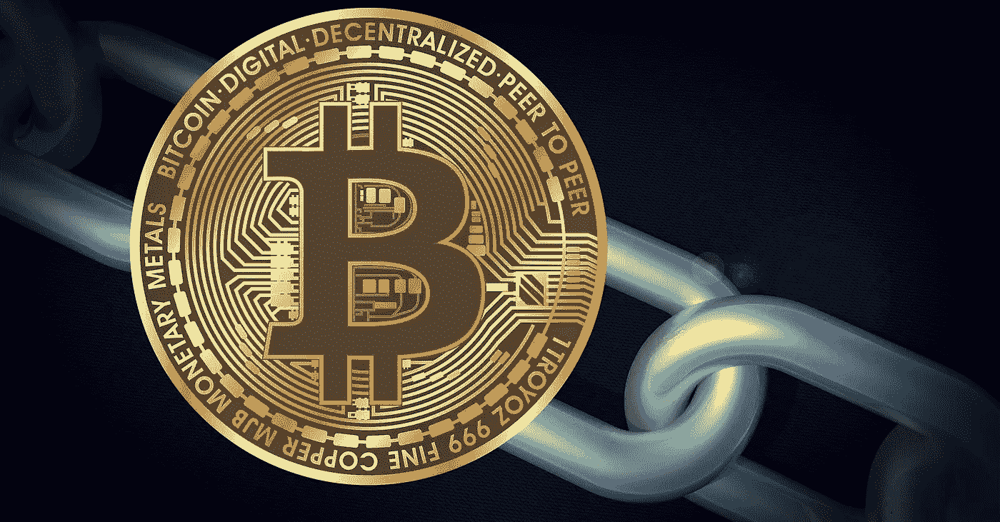

# 加密货币骗局流行:如何保持安全？

> 原文：<https://medium.com/coinmonks/the-cryptocurrency-scam-epidemic-how-to-stay-safe-df5f99f942af?source=collection_archive---------39----------------------->

我们都至少被这些方法骗过一次..

> 近年来，加密货币作为一种数字资产越来越受欢迎，可以用作交换或价值储存的媒介。然而，匿名性和缺乏监管在互联网上…