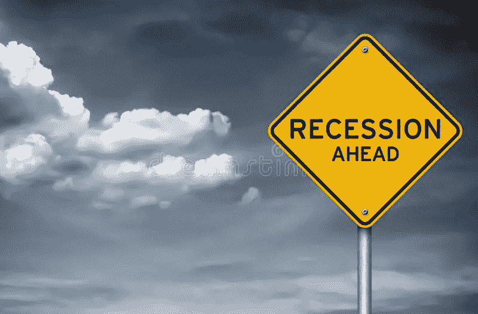

# 隐密体和衰退。以下是一些事实。

> 原文：<https://medium.com/coinmonks/the-cryptoverse-and-recession-here-are-some-facts-6941f1d6dd85?source=collection_archive---------46----------------------->

dreamstime

“如果你能指出食品价格上涨，这表明政府与被统治者之间的隐性契约出现了问题。”丹佛大学约瑟夫·科贝尔国际研究学院教授 Cullen Hendrix，彼得森国际经济研究所非常驻高级研究员。