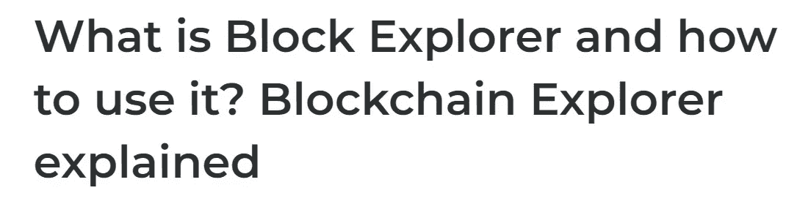
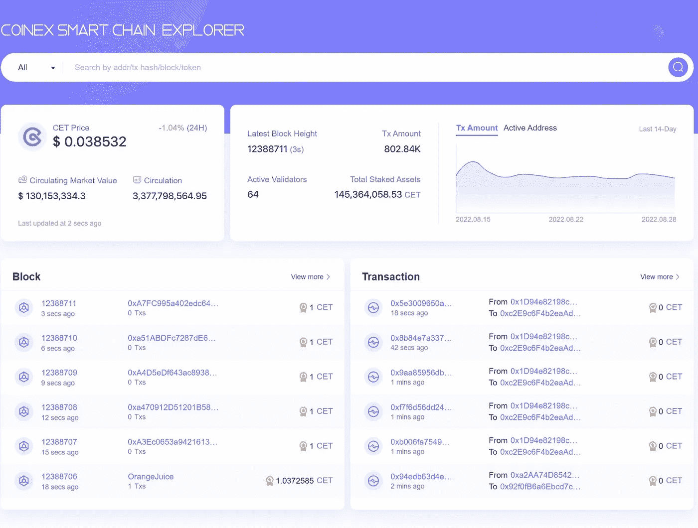

# CSC 浏览器

> 原文：<https://medium.com/coinmonks/the-csc-explorer-ce9dcb61f572?source=collection_archive---------40----------------------->

## 块浏览器

如果你是加密货币的新手，那么现在你可能已经听说过“Block Explorer”这个术语。区块链探索者及其数据在开始时可能看起来令人困惑，但一旦你掌握了这个工具，你就会知道它在加密货币生态系统中有多有效

块探索者是密码爱好者武库中最重要的工具之一。它们为搜索区块链提供了一个在线界面，使您能够检索有关交易、地址、区块、费用等数据。每个块浏览器都提供有关特定区块链的数据，所包含的信息类型会因其所服务的区块链的架构而异。在这里，我们将熟悉 CSC 浏览器。

在我们了解区块链浏览器之前，这里有一些关于加密货币和区块链的知识。几乎所有的加密货币都依赖区块链进行交易。区块链是一种加密技术，是一组不断增长的记录交易数据的区块。区块链是不可变的、分布式的、去中心化的，是一个安全的数字账本。由于互联网上的任何人都可以访问这些数字信息，因此这些信息变得透明且不易被腐蚀。任何人都可以查看任何公共地址的余额，任何人都可以在区块链上查看任何交易细节。怎么会？通过使用块管理器。

## 什么是块浏览器

块管理器使您能够搜索特定区块链的信息。Block explorer 是一个网站或工具，允许用户浏览 Block，查看钱包地址、网络散列、交易数据和区块链上的其他关键信息。块资源管理器只是一个搜索工具。就像你用网络浏览器浏览互联网一样；区块探索者允许浏览区块链。它们是专门用来搜索区块链街区的搜索引擎。每一种依赖自己的区块链的加密货币都将拥有自己的 block explorer。因此，您必须使用特定于该加密货币的块浏览器

区块链技术经常因其透明性而受到称赞，而区块探索者是这一价值主张的关键部分。块浏览器是一种在线工具，可让您搜索有关区块链的实时和历史信息，包括与块、事务、地址等相关的数据。每个块资源管理器都包含一个特定区块链的信息

## 为什么要使用块浏览器

块探索者对商人、矿工、验证者、企业和爱好者都有潜在的效用。如果您正在购买或出售 crypto，您可以使用 block explorer 来检查交易的状态。您还可以获取与您的区块链地址相关的信息，包括您的交易历史、该地址持有的资产总值、该地址收到的加密总量以及该地址发出的加密总量等数据点。

矿工可以使用区块探索者来检查他们是否成功开采了一个区块，企业可以分析与他们的项目相关的交易数据。同样，任何人都可以使用区块探索者来监控已知区块链地址的鲸鱼和个人的活动。例如，监控已知属于中本聪的地址是最受欢迎的社区消遣。

区块探索者还使爱好者能够找到有关区块链内部工作的技术信息，如最新的交易和区块、区块难度、哈希速率、区块高度、交易费用、交易量等。同样，block explorer 可以提供市场数据，如加密货币的流通供应量、最大供应量和市值。

## 如何使用块浏览器

这里，我们使用的是一个特定的数据块浏览器，即 CSC 浏览器。当您访问 block explorer 站点时，您可能会看到一个主搜索栏，使您能够检索特定类型的信息，通常是钱包地址、交易散列和块号，尽管这因浏览器和区块链而异。同样，大多数 block explorers 的主页经常显示有关最新事务和 block 的数据。

要查看与特定交易相关的数据，请在搜索栏中键入交易哈希或 ID，这将在您启动交易时由您的钱包软件提供给您。块浏览器将显示您的交易是否已被确认或是否仍在处理中。您也可以通过搜索发送交易的钱包地址来查看交易。请确保在搜索时输入您的公钥地址，而不是您的私钥地址。不建议按包含您的事务的块来搜索您的事务，因为该块可能包含许多其他事务。将块浏览器概念化为区块链的搜索引擎可能会有所帮助。这些有用的工具提供了对区块链运行的各个方面的洞察——从共识机制到交易历史——并且是导航区块链生态系统的必要工具。

[***CSC 块资源管理器可以在这里访问***](https://www.coinex.net/)

## 探索创世纪街区

块资源管理器允许你搜索你想要的任何块的信息。你甚至可以导航到第一个被开采的区块。你可以查看创世纪的难度，挖掘它的钱包地址和奖励。要找到 genesis 块，只需在块浏览器的搜索栏中键入 1，它将显示块高度#1 的信息

**CSC 创世纪文件**

Genesis 文件定义了 CoinEx 智能链(CSC)的初始状态，可在块高度 0 处查看。CSC 的第一个块从 1 开始，它的父块是 Genesis 块。

为了方便用户操作，CSC 直接将 Genesis Block 集成到二进制包 cetd 中，设置节点时不需要下载。如果你对 Genesis Block 感兴趣，可以通过 [GitHub](https://github.com/coinex-smart-chain/csc) 下载查看详情。对于那些想用 CSC 构建自己的链的人来说，Genesis 文件也是可以定制和编辑的。参见[私人连锁](https://docs.coinex.org/#/en-us/node_private_chain)。

> 交易新手？尝试[加密交易机器人](/coinmonks/crypto-trading-bot-c2ffce8acb2a)或[复制交易](/coinmonks/top-10-crypto-copy-trading-platforms-for-beginners-d0c37c7d698c)