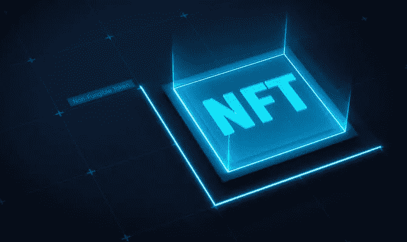

# 网络 2 品牌在非功能性交易中失败的解决方案

> 原文：<https://medium.com/coinmonks/the-cure-for-web2-brands-failure-in-nfts-66057e0c4e45?source=collection_archive---------8----------------------->

这可能会让你震惊，你知道吗，尽管克瑞丝·布朗有 1.14 亿搞笑粉丝，但他的 1 万张 NFT 收藏只卖出了 246 张？
在 web2 品牌理解这些事实之前，我们将继续失败的发布

一个 web2 音乐艺术家可以很容易地在 O2 舞台上销售一空，因为粉丝可以感受到他的激情，与他联系并分享他的故事。

在元宇宙，没有有形的音乐会来传达这一点，所以要想成功，必须找到一种方法来弥合差距。

web3 的运作有一套不同的规则，我们为什么不通过克瑞丝·布朗的发射作为案例研究来检查一下 NFT 成功的清单。

那很酷，对吧？

# 市场战略

你可能会说，“哦，但这是克瑞丝·布朗，他会雇佣那些能给出最佳营销策略的人，”你是对的

同样错误的是，你看，他可能雇佣了最好的 web2 营销策略师，而他需要的是 web3 策略师。

web2 战略家将把他的 web2 知识应用到 web3 和 BOOM 上！！失败的发射

这是为什么呢？

在网络 2 中，战略家专注于建立名人(或品牌)的形象，这总是有效的

他举办一些音乐会，做一些引人注目的事情，引领社会潮流…一系列其他的事情来改善他的形象

让我来问你，那些卖光了的 NFT 项目，在他们创建这个项目之前，你认识(或听说过)多少他们的创始人？

不多吧？
我也是这么想的，那就是告诉你，web3 不仅仅关注一个人，而是一个社区。

这就是这些售罄项目所利用的——他们建立了一个强大的社区。

> 交易新手？试试[加密交易机器人](/coinmonks/crypto-trading-bot-c2ffce8acb2a)或者[复制交易](/coinmonks/top-10-crypto-copy-trading-platforms-for-beginners-d0c37c7d698c)

所以在网络中建立一个社区而不是一个人是如此重要

# 坚实的路线图

真正的收藏品不一定需要路线图，人们购买是基于情感的依恋，它的稀缺性，独特性和需求的增加。

还记得我们谈到交流激情和寻找弥合差距的方法吗？

真的吗？太好了！
一个可靠的路线图是在基于项目的 NFT 的 web3 中传达这些内容的方式。

一个好的路线图应该向人们展示“你为什么这样做”，“你带来了一个新的机会”，“它如何为他们增加价值”，“为什么他们应该创造它”，诸如此类

人们希望从关心他们的人那里得到能增加价值并给他们带来新机会的东西

因此，一个好的工具和故事(他进入 web3 的原因)会有帮助。

想象一下，如果他放弃一家公用事业公司，就像所有 1/1 的 NFT 持有者都会和他一起度过一个专属的搬家之夜，一场私人音乐会，一场私人草地网球赛，甚至一次野餐。

你不想铸造它吗？
完美！NFT 也可以成为他所有演唱会的终身专属 VIP 通行证

这将是繁荣，铸币厂将感觉像超级球迷，因为 NFT 使他们更接近他。

# 建立工作关系网

这是 web3 的命脉，无论你在 web2 中有多大，你都需要合适的网络在 web3 中奋斗

发展你的 Twitter，联系你在 NFT 的利基市场的大人物(在他的情况下，音乐 NFTs)，参与并发布与 web3 相关的内容——让人们知道你关心他们。

人际关系网非常关键，因为要达到一定的高度，你需要已经在那里的人拉你一把

如果他出现在流行的播客上，并与 garyvee 和其他 web3 影响者(特别是那些进入音乐 NFT 的人)联系，这将会使他免于犯某些错误，并让很多人关注他

# 伙伴关系和协作

这两兄弟可以一飞冲天任何项目。

你有没有注意到，一些项目被称为阿尔法，是因为他们刚刚获得了一笔合作交易，或者与知名人士进行了多次合作？

这并不是说任何合作协议都会推动一个项目，不，不。它必须是一种目标明确的合作关系，能够为项目增加明显的价值，还必须是与知名品牌或社区的合作关系。

你会发现一个稳固的网络可以为你带来惊人的伙伴关系和合作交易。

# 信息和知识

让我们假设他做了我们已经指出的所有事情，他仍然没有得到预期的结果(这几乎是不可能的)

那么他很可能忽略了这两个在这个领域里既重要又昂贵的家伙。信息和知识。

他的大部分粉丝还没有过渡到 web3，所以即使他们看到了这些令人兴奋的工具、伙伴关系和网络，他们仍然不会创造，因为他们不知道如何创造。

像这样的人应该被考虑在内，因为那里是他的流量负载所在。

让他们加入 web3 只需要 3-6 个视频。

人们喜欢被宠爱，他们不会特意去学习所有关于 NFTs 的知识，因为克里斯正在推出一个系列——压力太大了

如果他的页面上有 6 个视频谈论 NFTs 的好处，如何造币，在哪里买密码，如何打开钱包，转移 eth，以及其他有用的提示

球迷将不再有借口不造币，因为他们需要导航 NFT 的所有解释

> “好像有什么东西我没碰过”

啊是的！

# 参与和宣传

他的团队必须在 Twitter(我们谈到过)和其他社交网站上大量参与，帮助粉丝进入 web3，并在那里回答他们的许多问题。

如果没有人谈论它，任何项目都不可能走得很远。他们还需要围绕他们正在建设的东西大肆宣传，仅仅是通过托管 twitter 空间、制作线程、让有影响力的人谈论它们、获得大型合作交易和一系列其他东西。

我见过许多网络名人和品牌的 NFT 发布会失败，但是有了这些清单，任何人都可以打破这个循环。希望对你有帮助。

让我知道你最喜欢清单的哪一部分。

哦，你看到了这个拍手图标，是的，就是下面的那个，请点击它多次，关注更多 NFT 的更新。