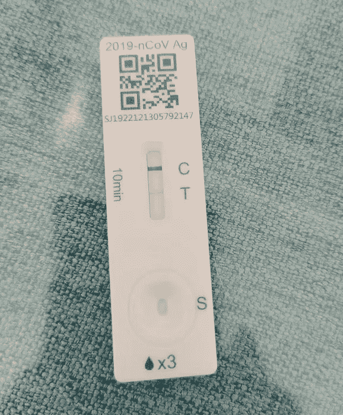

# 比特币目前的价格是 16800 美元，如何在熊市中获得空投机会？

> 原文：<https://medium.com/coinmonks/the-current-price-of-bitcoin-is-16-800-how-to-get-airdrop-opportunities-in-a-bear-market-e0b49b373140?source=collection_archive---------8----------------------->

最近加密市场没什么市场。BTC 在 11 月初跌破 2 万美元后，一个多月来价格一直在 15k-18k 之间波动，似乎涨不起来，跌不下去。

> 从顶级交易者那里复制交易机器人。免费试用。

当然也可能有一天突然暴跌，跌到人的心理预期，比如 12k？

或者现在是底价，市场不再大幅波动，慢慢消磨掉用户的耐心，等到大部分不看市场，沮丧地离开市场，再慢慢拉起，进入下一个牛市。

Bitcoin daily fluctuations Current price is $16,800

2023 年圣诞节和即将到来的新年，这个节点的市场很安静，很少有新项目出圈。

中国玩家是以家庭为单位来体验的。他们正经历着新冠肺炎带来的感冒和发烧。在社交媒体上，都是狂热而积极的。过去活跃的团体都在讨论新冠肺炎的症状和影响。

每个人都在煎熬，熬过身体最初的不适，然后是漫长的恢复期，就像等待漫长的牛市回归。

COVID-19 positive

没有市场也没有 10 倍的新项目，也许可以关注空投机会。一边了解热门项目一边互动，说不定以后还有空投呢！

楚小莲这两天一直在学习 Starknet 网，它的生态里有很多项目。

这段时间，L2 赛道上的项目非常热闹，比如乐观、Arbitrum、ZK-Rollup、Zksync 等。用户持续互动，希望未来上市时能收到空投。

Ecological projects of Starknet network

**Starknet 生态系统中有哪些项目？**

Starknet 生态系统中目前有数百个项目，包括 Bridge、DAO、DeFi、Digital ID、GameFi、NFT 等赛道。

例如，钱包项目 ArgentX 可以访问多个项目和大量用户。玩家可以直接查看钱包中持有的 NFT，操作起来似乎比 metamask 更方便。

目前可以直接在谷歌 Chrome 中安装插件来体验 ArgentX 钱包。

ArgentX wallet page

gamefi 类目下也有很多项目，很多都是新游戏，社区规模还是比较小的。不知道最后哪一款游戏可以做到。

比如这款基于构造的像素游戏 Phi，定位为社交游戏，通过钱包打造 web3 世界。在这个元宇宙游戏中，有各种项目组件，通过一个游戏链接各种 web3 项目。

当然，web3 游戏要想走出圈子，长期发展，必须要有完整的经济生态和良好的经济模式，让用户愿意花时间沉浸其中，边玩边赚钱。

Pixel Game Phi

**如何与 Starknet 网络互动？**

Starknet 网络互动项目也不少，比如最近热门的 DeFi 项目 zkLend testnet 推出。

用户通过 metamask 接收 goerli 网络测试币，然后通过 starkgate 交叉链到 Starknet 网络，再使用 ArgentX 钱包登录 zkLend 测试网络。

提供流动资金供应，并借出借入和其他功能的经验是进行项目互动。

在 testnet 上互动后，就看后面有没有机会拿到项目空投了。

Defi project zkLend

还有 DID 赛道项目 starknetID。

从最初 ETH 链上的 ENS，到 BSC 链上的 spaceID，再到 Aptos，Cosmos，Solana 等生态都有自己的域名入口，starknet。ID 也可能是生态的重要组成部分。

Starknet ID 第一期活动已经结束，官网即将上线。用户可以通过 ArgentX 钱包体验 Starknet.id 注册。

Starknet.id domain name

而且 L2 网上有很多互动，网上也有很多互动教程，大部分都是在测试网上进行的，不收油费。

如果不知道该关注哪些热点，不妨都找来操作看看。互动的过程也是学习和理解。

熊市漫长，如果不知道短期市场走势，不如做时间的朋友，无论你付出哪个方向，都会有收获。

以上只是我个人观点，没有投资建议。我是楚小莲，我正在关注元宇宙和 web3。

> 加入 Coinmonks [电报频道](https://t.me/coincodecap)和 [Youtube 频道](https://www.youtube.com/c/coinmonks/videos)了解加密交易和投资

# 另外，阅读

*   [氹欞侊贸易评论](https://coincodecap.com/anny-trade-review) | [霍比保证金交易](/coinmonks/huobi-margin-trading-b3b06cdc1519)
*   [分散交易所](https://coincodecap.com/what-are-decentralized-exchanges) | [比特 FIP](https://coincodecap.com/bitbns-fip) | [Pionex 评论](https://coincodecap.com/pionex-review-exchange-with-crypto-trading-bot)
*   [用信用卡购买密码的 10 个最佳地点](https://coincodecap.com/buy-crypto-with-credit-card)
*   [百佳卡达诺钱包](https://coincodecap.com/best-cardano-wallets) | [Bingbon 副本交易](https://coincodecap.com/bingbon-copy-trading)
*   [如何给 MetaMask 钱包添加 Arbitrum？](https://coincodecap.com/how-to-add-arbitrum-to-metamask-wallet)