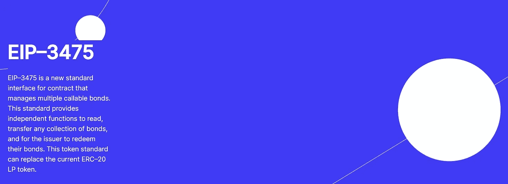

# D/Bond 的 EIP-3475 流程解释

> 原文：<https://medium.com/coinmonks/the-d-bonds-eip-3475-process-explained-4d03442cbab?source=collection_archive---------2----------------------->

*这篇文章旨在解释 D/Bond 的 ERC-3475 及其将债券带到区块链的独特解决方案，并邀请您参加 7 月 19 日*由 D/Bond 首席执行官刘玉**向以太坊基金会观众进行的令牌标准的本质介绍**

*在不断增长的去中心化金融(DeFi)领域，随着越来越多的资本流入这一建立在区块链基础上的金融技术发展概念，债券是尚未在去中心化领域复制的关键传统金融(TradFi)产品之一。*

*尽管 DeFi 平台具有智能合约可编程性，但有几个因素阻止其开发这种主要用于筹集资金投资新项目或支持现有项目或任何其他有益事业的金融工具。*

*这场斗争的一个常见原因是通过机构获得债券的排他性。大多数个人依靠机构和中介机构来获得债券。感兴趣的个人不得不经历寻找方法来获得债券的麻烦，并在此过程中向第三方支付巨额佣金。*

*在区块链重建这一资产类别需要利用该技术的点对点和其他功能，让尽可能多的人在没有任何中介的情况下交易、投资、借贷债券。*

*这是已知的，但还有更多，这是许多 DeFi 平台陷入困境的原因。*

**

***对 DeFi 平台为何没有发行债券的独特回应***

*通过购买债券，发行者——可以是公司或政府——得到了一笔贷款，这笔贷款必须在约定的日期偿还本金，同时定期支付利息。*

*尽管很简单，但将这种安排移植到区块链环境中需要将协议编程为智能合同，具有管理此类交易的适当令牌标准功能。*

*至今不存在。*

*由于现有的 ERC-20 令牌标准(ERC-721 标准也是如此)在处理这种复杂性方面受到限制，因此需要一种改进的标准，如 D/Bond 的 ERC-3475(T11)。*

*ERC-20 令牌标准只能存储从地址到余额的映射，并存储整数数组，如赎回条件和不同的利率。它不具备构建更复杂的奖励和兑换逻辑所需的数据结构。*

*它需要为每种令牌类型部署单独的工厂和令牌合同。简而言之，发行具有多种赎回数据的债券的需求是现有代币标准无法实现的。*

*通过在早期版本的 ERC 20 流动性池(LP)令牌(简单的可替换贷款证明或存入智能合同的资产数量的表示)的基础上创建一个结构层，EIP 3475 有助于改善他们的数据结构，并使发行和赎回债券更容易。*

***ERC-3475 是例外***

*债券代表了买方对发行方的贷款，在特定的时间偿还，通常有固定的利率。**用现有的 ERC-20 令牌结构来夯实所有必要的数据以执行该协议是不可能的。***

> *我们的 ERC-3475 标准是独一无二的，其明确的特点，以确定还款日期和规定的利率，已在 DeFi 中失踪。关于债券发行，新的[以太坊改进方案(EIP)](https://eips.ethereum.org/) 带来的创新有太多可说的了。*

*它能够为开发者存储更多的信息，从而为兑换和奖励系统建立更复杂的逻辑。*

*与典型的 ERC-20 或 ERC-721 令牌标准不同，ERC-3475 是半可替换的和多维的。它使每个债券类 ID 代表一个新的可配置的令牌类型，并为每个债券 nonce 代表一个发行日期或任何其他形式的数据。*

*EIP 附带了核心协议规范、API 和合同标准，有助于将 LP 分成无数小的子类别，每个部分代表一个衍生合同。*

*其 API 允许在单个合同中创建任意数量的债券类型，即其合同管理多个可赎回债券，因为 LP 用于在双方之间就某些还款条件和利率签署衍生产品协议。*

*该接口允许 Solidity 兼容区块链上的任何代币创建其债券，这些债券可以打包到单独的包中，分割，并在二级市场上交换，因为第三方钱包应用程序或交易所能够读取这些代币的余额和兑换条件。*

*与包含任何给定数量的债券类别、债券现时值和某个地址的债券余额的单一合同不同，EIP-3475 提供了独立的功能来读取、转移任何债券集合，并在满足特定条件后让债券从发行人处赎回。*

*目前现有的 LP 或 NFT 的分段使用 ERC-20 令牌标准。它需要每次部署新的智能合同，这产生了不必要的气体费用，并限制了为多个片段产生的类和子类的数量。*

*而 ERC-3475 是高效的，因为它可以生成几乎无数的类和子类，而无需发布新的智能合同。*

*我们的 ERC–3475 标准将在 7 月 19 日接受以太坊基金会的最终审查，之后该标准将在两周内最终确定。如果你想参加我们的演示，这里有一个邀请:*

*主题:PEEPanEIP-3475*

*日期/时间:2022 年 7 月 19 日星期二下午 2:30-3:30(东部时间-纽约)*

*加入缩放会议[https://us02web.zoom.us/j/83991396952?pwd = iiXklHcCsMqvj _-dfatp3 smwgxii _ . 1](https://us02web.zoom.us/j/83991396952?pwd=iiXklHcCsMqvj_-dfatP3SsmWGxII_.1)*

*总的来说，D/Bond 的 EIP 3475 流程主要面向引入分散式证券解决方案来创建债券。*

*我们认为，它是一个更好的 LP 令牌标准，用于管理多种债券，存储更多的数据，并且非常有效地建立一个更复杂的奖励和赎回逻辑；一种标准，使得一个债券类别的每个 nonce 都有自己的元数据、供应和其他赎回条件。*

***债券***

*B2B 推介平台:【https://bit.ly/3NR27SP *

*技术球场甲板:[https://bit.ly/3anSUDH](https://bit.ly/3anSUDH)*

*白皮书:[https://shorturl.at/yWZ03](https://shorturl.at/yWZ03)*

# *另外，阅读*

*   *[加密套利](/coinmonks/crypto-arbitrage-guide-how-to-make-money-as-a-beginner-62bfe5c868f6)指南| [如何做空比特币](/coinmonks/how-to-short-bitcoin-568a2d0b4ae5)*
*   *[加密交易机器人](/coinmonks/crypto-trading-bot-c2ffce8acb2a)|[P2E NFT 15 大游戏](https://coincodecap.com/p2e-nft-games)*
*   *[币安期货交易](https://coincodecap.com/binance-futures-trading)|[3 comas vs Mudrex vs eToro](https://coincodecap.com/mudrex-3commas-etoro)*
*   *[如何购买 Monero](https://coincodecap.com/buy-monero) | [IDEX 评论](https://coincodecap.com/idex-review) | [BitKan 交易机器人](https://coincodecap.com/bitkan-trading-bot)*
*   *[YouHodler vs CoinLoan vs Hodlnaut](/coinmonks/youhodler-vs-coinloan-vs-hodlnaut-b1050acde55a) |[Cryptohopper vs HaasBot](https://coincodecap.com/cryptohopper-vs-haasbot)*