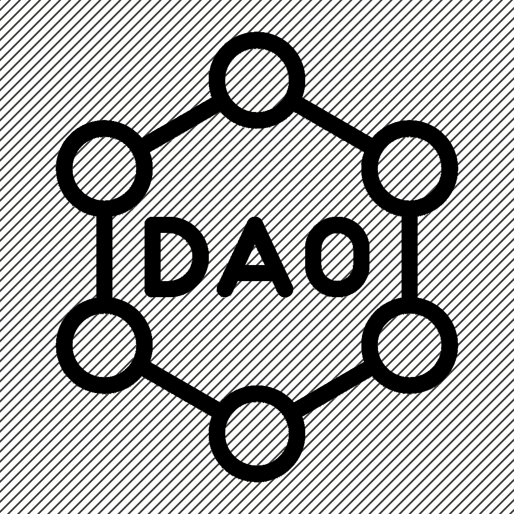

# 道及其挑战。

> 原文：<https://medium.com/coinmonks/the-dao-and-its-challenges-3f65b57611f0?source=collection_archive---------13----------------------->

**前言**

对我的老读者来说，我在 Web3 中的冒险经历似乎一直被搁置在一边。

就记日志而言，这是正确的。然而，索拉纳比以往任何时候都占据了我更多的精力。

我将总结一下我所做的工作(除了离开英国去亚洲的大学/城市定居)。

1.  获得了一个有偿投稿的机会。我为 NFT 档案馆做分析。好好玩，一直持续到他们的国库最终枯竭！
2.  和我的联合创始人一起建立了一个 DAO 基金。我们已经达到了可以在更小的规模上模仿风投的规模，我们更名为风投。
    这可能是我打过的最费力/最有回报的主意。
3.  成为这个领域中我最喜欢的一个项目的合作经理，每周和他们的创始人共同主持一个播客。

这就忽略了很多。

不管怎样，我很想谈谈我的第二点经验，所以让我们从这里开始。

## 刀，其利与弊。

首字母缩写词“DAO”代表分散自治组织。

它们是社区经营的实体，没有中央决策权。

所有基本规则/惯例都由成员同意，并由准则强制执行(如适用)。

在基础层之上做出的新决策是通过提案起草和社区投票的组合来完成的，而社区投票又是通过 smart contracts 来执行的。

所以现在是不利因素。

## **反对者**

**官僚主义**

我在这里见过很多刀的事情。

尽管成员可能拥有同等权重的投票权，但出现一个小型“官僚机构”的倾向，并在社区内拥有足够的影响力来否决投票，这是非常惊人的。

对于许多股权结构相同的 Dao 来说，仍然是 OG 创始人说了算。

在实践中，我还没有发现没有发生这种情况的 DAO，因为智能契约中可以锁定的完整性是有限的。

但是还有另一个常见的错误，这次是从地面开始。

**停滞**

如果票数永远达不到配额会怎样？忙碌/不感兴趣/失望/气馁等成员可能会阻止提案获得通过。

方法如下:

使用智能契约传递 DAO 提议。

这些可能需要预定的最小签名量来**考虑**交易。

这称为*法定人数。*

一旦达到*法定人数*，S *支持级别*就是下一个要考虑的因素。

*支持*是通过*法定人数*的任何提案所需的“是”票的门槛。

因为即使管理一个 DAO 的成员资格这一主题也是一项提案(相当重要)，因此处理不活跃成员(将其除名)的提案也必须获得*法定人数*和*的支持。*

由于最低数量的成员擅离职守，资金可以毫不夸张地发现自己被冻结在一个无法接近的钱包里。

挑选**首要**成员。

这个问题的一个简化版本(在交易 DAO 基金中更普遍)是我喜欢称之为“投票滞后”的问题:

**时差**

Web3 结合了来自世界各地的人们，时区可以理解地保留需要立即行动的紧急提议。

例如错过一次交易。

DAO 结构适合于准备充分的交易/投资，但对于对时间敏感的波动或简单的短线交易来说就很糟糕了。

如果财政部要求在竞争中迅速采取行动以确保合作关系，那么就速度而言,“道”没有任何好处。

这些都是道的一些一般性的限制。

也就是说，我想我将介绍作为一个 DAO 而不是一个单一实体进行操作的一些好处。

来了:

## 赞成者

**重力**

试着以单身者的身份接近最期待的机会。
WL/造币前分配或只是一些建议。

一个道，或者说一个 VC 求一个肥配/一些建议？

-很突出。
——验证创始人和他们的创造，因为他们吸引了风投的注意力。
-使他们倾向于尊重你，这是只有风投的“精明投资者”才应得的。

**影响力/个人品牌**

在不提供价值或不建立项目的情况下，很难在 CT 上做大。这是因为市场的大多数是消费者，所以增加你在 twitter 上的品牌/影响力的一个合格方法是拥有一个项目/DAO。

1.  法规判例法= >网络
2.  网络= >财富

**狼群的实力。**

我们都有长处和短处，通常，利用我们的长处是令人舒服的。

通过在一个 DAO 中裁剪角色以适应各自的优势，解决个人的弱点是可以作弊编码的事情。

信息收集、合作锻造、趋势/机会发现、图表阅读/执行、人员管理/沟通…

没有必要学习一项新技能，如果有人和你有相同的视野，他会做得更好。相反，我发现更好的办法是改进那项只有你能做好的技能，直到它成为你团队中不可或缺的一部分。

**一个简短的故事结束。**

我听过帕特里克·贝特·大卫讲的一个可怕的故事。

*这是一个将军的故事。*

从前，有一个人渴望成为一名伟大的将军。
但是他从来没有这样做过。他从军校毕业，去接受训练。
又从训练走向战争。却放弃了成为将军。

在天堂的门口，那个人问:“我可以和这位最伟大的将军说话吗……并从他的故事中学习吗？

一个声音回答如下。

从前，有一个人渴望成为将军。
从军校，到训练，从训练到战争。他通过冒险获得了能力。
他冒着自己名字的风险掌握了领袖魅力。他通过冒着生命危险掌握了勇气。他不仅是作为一名将军死去的，他还是有史以来最伟大的将军。

那人明显痛苦地颤抖着，嘶哑地说道:

“……本来可能是——”

上帝回答这个人。

“可能是你。”

> 交易新手？尝试[加密交易机器人](/coinmonks/crypto-trading-bot-c2ffce8acb2a)或[复制交易](/coinmonks/top-10-crypto-copy-trading-platforms-for-beginners-d0c37c7d698c)