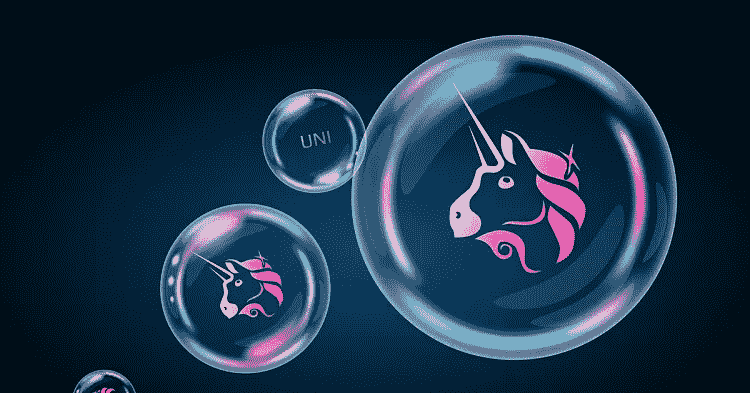

# 这个分散的交易所叫做 UNISWAP。

> 原文：<https://medium.com/coinmonks/the-decentralised-exchange-called-uniswap-e43a8b05500c?source=collection_archive---------54----------------------->

Uniswap 是一种允许用户交易 ERC-20 代币而不需要任何中间人的交换形式，为了理解这种交换形式的独特性，有必要讨论一下交换形式。

**交换的形式。**

首先是传统的交易所，它由负责监管的公司所有，在这种情况下，它被称为集中式交易所，这种形式的交易所还要求用户执行“了解您的客户(KYC)”操作，这意味着他们将在集中式交易所中提交他们的个人信息，如地址或身份证号码。 为了进行交易，交易者必须存入一定数量的钱，并且公司控制着这笔钱，为了进行交易，需要一个“买”和“卖”的指令，该指令将被提交并记录在交易指令簿中，除非买卖双方匹配，否则交易不会发生。

第二种形式的交易所是分散式交易所，这是分散式金融生态系统的一部分，也称为 DEFI 生态系统。这些都是通过使用区块链技术分散的。与需要公司控制和服务器的传统交易所不同，智能合约是所需要的，智能合约是一套自动化的规则，由独立的计算机执行，不受任何人的控制。有了 DEX，就不需要 KYC，只需要用户的钱包。

**交易所和流动性**。

DEX 上的流动性存储在流动性池中，流动性池是一个共享的资金库，公众通过它进行存款。这是一个买卖订单，流动性池中的资金由被称为流动性提供者的人进行存款，流动性提供者(LP)从 DEX 交易费用中获利，这被称为 LP 令牌。

对于传统的交易所，最新的汇率确定代币的价格，直到有另一个交易，从该交易中商定另一个价格，而在 DEX 中没有订单簿，因此，使用一个公式来确定价格，这被称为自动市场行情(AMM)，对于 Uniswap，AMM 被称为 Uniswap 恒定产品市场行情，这是一个直接的公式 a x b = k，例如，a = ETH， b = DAI，k = ETHDAI，代币的价格不是由交易者愿意支付的价格决定的，而是由代币的大小决定的，这种模型有助于保持流动性，无需任何外部市场标记。 Uniswap 上的流动资金池是 ETHWBTC、ETHUSDC、ETHDAI 和 ETHUSDT。

**uni swap 的演变。**

uni WAP 建立在以太坊网络基础设施上，uni WAP 是最受欢迎的 DApp，也是最受欢迎的分支，因为它的代码用于构建其他应用程序，随着时间的推移，已经构建了不同的版本，每个版本都为用户带来了更好的体验。

UNISWAP 的版本。

2018 年 11 月，第一个版本建成，使用这个以太可以交易到 ERC-20 令牌，反之亦然。

V2 于 2020 年 5 月发布，这允许 ERC-20 到 ERC-20 的交易，而无需先存放蚂蚁乙醚或交易乙醚。

V3 于 2021 年 5 月建成，这有助于流动性提供商更好地利用资本，从而使他们能够赚得更多，并降低交易成本，V3 带来了更高效的交易。

**如何使用 UNISWAP？**

*   获得一个以太坊钱包，例如 Metamask 或可以与其他以太坊应用程序集成的钱包。
*   访问 uniswap.org 网站
*   将钱包连接到元掩码
*   向您的钱包注入资金并开始交易，因为代币可以从钱包直接交换到 uniswap 平台。

需要注意的是，Uniswap 平台上发生的交易量是导致价格变化的原因。当您下达交易订单并执行订单时，这种现象称为价格滑移。在取消订单之前，交易者可以对他们能承受的滑点设置一个上限。

Uniswap 中的价格滑移是以太坊网络上的交易时间以及价格可能发生变化的广播和确认时间的结果。

Uniswap 的增长可归因于其代币列表的分散性质，任何用户都可以将代币用于列表，尽管需要注意的是，Uniswap 不对代币的任何形式的研究负责，这导致了许多欺诈性的代币列表，因此，交易商和持有人有责任在投资任何代币之前进行广泛的研究。

**UNITOKEN** 。

Unitoken 于 2020 年 9 月通过向 Uniswap 用户空投的方式引入金融市场，在此之前，每个用户获得 400 个 unitoken，每个 unitoken 当时价值 1200 美元。 unitoken 的目标是让它成为一个治理令牌，令牌的持有者可以影响 Uniswap 的发展并对其进行投票，Unitoken 越多，用户的投票权就越多，但 Unitoken 不仅成为一个治理令牌，还被列为顶级加密货币之一，这是用户通过相信 Unitoken 的未来价值而投资令牌的结果。

> 交易新手？尝试[加密交易机器人](/coinmonks/crypto-trading-bot-c2ffce8acb2a)或[复制交易](/coinmonks/top-10-crypto-copy-trading-platforms-for-beginners-d0c37c7d698c)