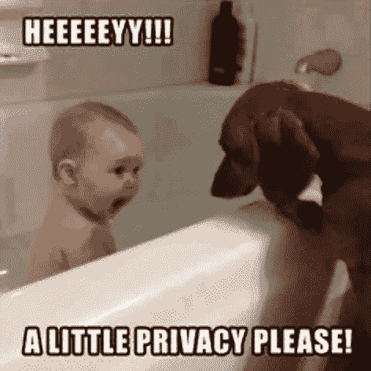
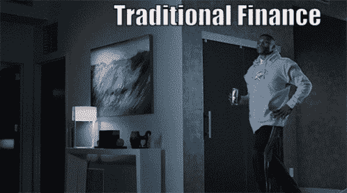
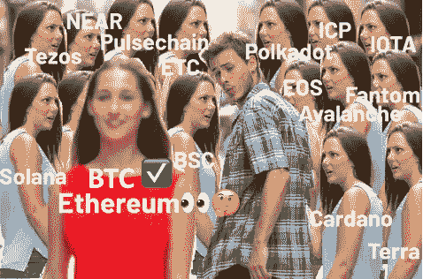
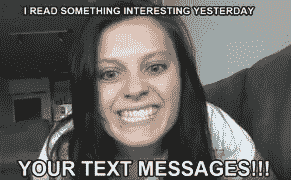
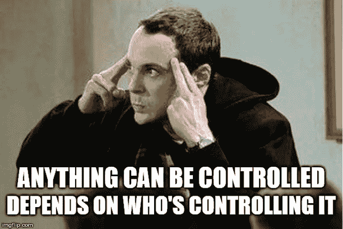

# 逃脱的 DeFi 幻想

> 原文：<https://medium.com/coinmonks/the-defi-fantasy-that-got-away-bfe8f9fe2835?source=collection_archive---------19----------------------->

在加密领域，从来没有沉闷的时刻。截至 2022 年 8 月撰写本文时，已经讨论了从“从 ETH 合并中获利”、“AVAX 密码泄露”到“NFT 贷款协议可能经营的银行”等许多话题。龙卷风现金的制裁最近采取了加密世界风暴，没有双关语。智能合约/代码现在受到限制。

龙卷风现金是一个以太坊区块链为基础的混合器。用户使用它通过将自己的令牌与其他用户的令牌相结合来清除令牌的交易历史记录。像互联网一样，它是好人和坏人都使用的工具。

使用这种技术有不可取的原因，如洗钱，但也有个人的原因，以尊重隐私的理想。

*   有隐私权吗？
*   隐私权是人权吗？

我深入挖掘了我的个人经历和遭遇隐私，但我找不到任何重要的。在亚洲家庭中长大，隐私对亚洲文化来说是陌生的，尤其是在中低收入家庭，隐私不是最重要的。我们唯一重视隐私的时候是当我们做一些我们可能会感到羞耻的淘气的事情的时候。

以下是我的观点，我希望它能给你一些启示和鼓励，让你开始探索 crypto 和 DeFi，它可能什么都不是。

对于加密社区的 OG 来说，对 Tornado Cash 的制裁并不令人惊讶，因为加密本质上倡导人类主权，反对现有政权使用的控制。随着我们迈向一个更加分散的未来，这个问题已经被讨论了很长时间。毫无疑问，在没有足够的监管、反洗钱、KYC 以及 TradFi 以风险管理的名义进行的许多其他强制性检查的情况下，大兄弟不会让 DeFi 继续运营。

然而，最让我惊讶的是蓝筹 DeFi 应用在禁止钱包地址方面的后续行动。DeFi 倡导的不允许、抵制审查和不信任的原则发生了什么？理想情况下，用户应该能够以分散的方式在政府和中央当局的管辖范围之外进行交易。

会有一个没有银行的世界吗？只有时间能证明一切。

当我们为一个新的系统打下基础时，我希望 DeFi 的概念仍然可行，因为这对人类来说是积极的一步。当然，没有人知道最终的游戏会是什么，但在这部戏剧中，我们不能否认，尽管缺乏智能合约创新，但比特币仍然是国王，并提供了最分散的网络。没有必要担心对整个生态系统的有争议的、荡漾的和级联的影响。事实证明，BTC 对任何其他资产类别都拥有主权。

我知道这篇文章对 DeFi 相当悲观，但我还没有放弃 DeFi 的梦想；尽管如此，我们必须明白，我们正在集体进行一场大规模的金融实验，这场实验可能不会带来任何东西，也可能带来革命性的东西。这些只是我的想法，希望对你有所帮助。

回到隐私问题:它有多重要？想想你的前任占有欲特别强的朋友读你的短信或浏览你的手机的时候。我不知道你怎么想，但我确实感觉被侵犯了。

虽然西方人不遗余力地保护他们的隐私，但在东方却并非如此。从文化上讲，保护自己的隐私是个人的责任。

从个人经验来说，我想我对隐私的看法已经随着时间的推移而发生了变化。在我成长的过程中，隐私从来没有在我的家庭中被真正的讨论或强调过。我的父母一直认为，他们有责任确保我作为一个孩子/未成年人在生活的各个方面都做得很好，因此需要控制或监督我的每一个行动，而不是允许我主动探索生活，因为这间接影响了家庭的声誉，或者至少影响了外人(包括一些令人讨厌的亲戚)对这个家庭的看法。给外人留下深刻印象对亚洲家庭来说非常重要。

然而，随着互联网使世界变平，东西方之间的信息不对称越来越小。我对隐私的看法也发生了变化。我现在更倾向于维护隐私准则。当涉及到我们的人身安全时，我认识到隐私的重要性。它不仅仅是不透明。

尽管控制和隐私是两个不相容的原则，但我认为生活应该是平衡的。一切都要适度，尽管这看起来很老套。零控制可能是有害的。

另外，你准备好迎接赛特熊了吗？

感谢阅读，敬请关注更多 DeFi 内容！

作为我的新年决心的一部分，我将分享我在 crypto 的经历，以讲述由我工作中的朋友& crypto OGs 激发的更好的故事。

*免费加密&股票连同推荐启动你的旅程:*[*https://docs . Google . com/spreadsheets/d/1 f2bx-xkvmezorxdzqavgckina 1 PME _ uI9pa _ c4l 4-DM/edit？usp =分享*](https://docs.google.com/spreadsheets/d/1f2bX-xKvmEzOrxDZqAvgCkIna1pmE_uI9pa_C4l4-DM/edit?usp=sharing)

> 交易新手？尝试[加密交易机器人](/coinmonks/crypto-trading-bot-c2ffce8acb2a)或[复制交易](/coinmonks/top-10-crypto-copy-trading-platforms-for-beginners-d0c37c7d698c)