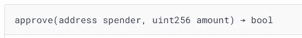
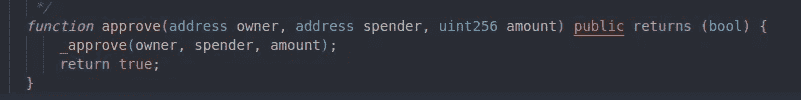
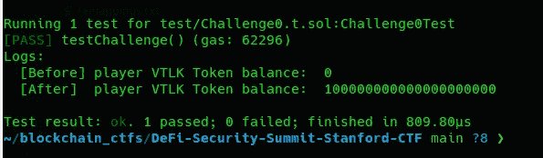
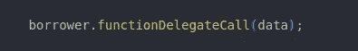
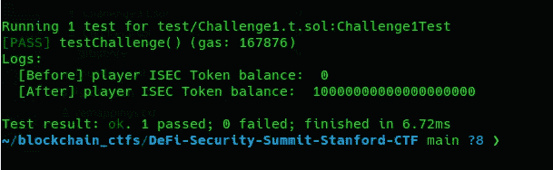
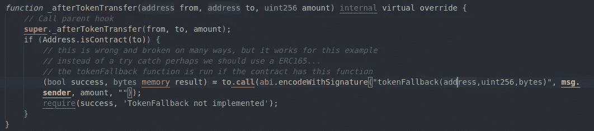
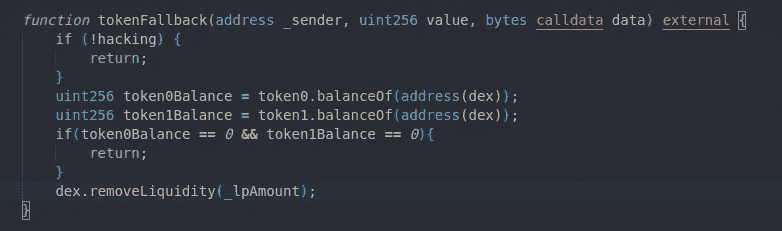
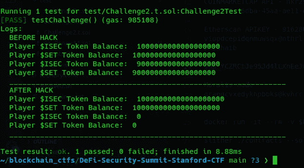
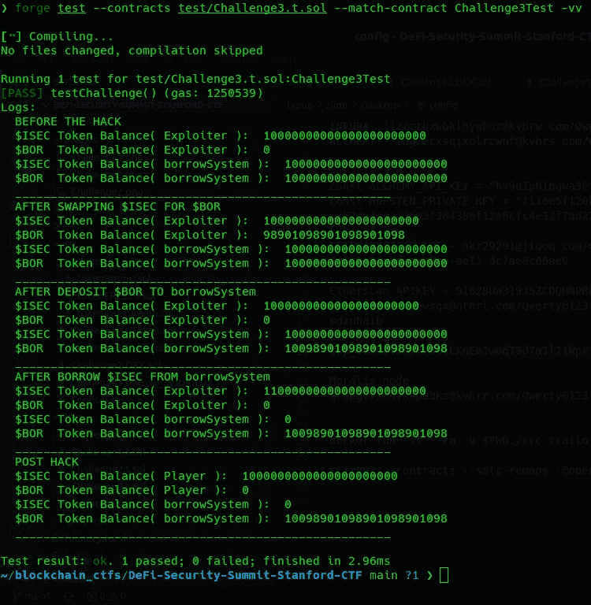

# 斯坦福-CTF 安全峰会

> 原文：<https://medium.com/coinmonks/the-defi-security-summit-stanford-ctf-dfd045b00e2d?source=collection_archive---------10----------------------->

T 何 **CTF** 涵盖了作为开发人员或审计人员必须了解的一些常见的*智能合约漏洞*。在我们开始应对挑战之前，让我们先了解一下我们必须意识到哪些概念有助于解决这些挑战。

> [https://github . com/zzzuhaibmohd/DeFi-Security-Summit-Stanford-CTF](https://github.com/zzzuhaibmohd/DeFi-Security-Summit-Stanford-CTF)

## ERC20 认证

ERC20 `approve`授权`spender`代表所有者或呼叫者花费`amount`数量的代币。一个典型的例子是授予分散式交易所(DEX)交换令牌的许可。如果你盲目批准你与之互动的任何智能合同，恶意消费者可能会掏空你的钱包。

ERC20 Approval

## 快速贷款

**快速贷款**是一种无抵押贷款，允许用户在不提供任何担保的情况下借入资产，只要资产在借入的同一区块内归还。快速贷款的一个典型用例是套利机会。你会看到,$XYZ 在交易所折价交易。所以，你利用这个机会，在一个更便宜的交易所买入 **$XYZ** ，在另一个交易所卖出以获利。恶意用户利用这一特性来操纵令牌价格或治理投票。

## 委派电话

在智能合约生态系统中，我们一般要通过对外调用来与其他合约进行交互。从 *ContractX* 到 *ContractY* 的一个`delegatecall`意味着——我们正在运行 *ContractY* 的代码，存储的是 *ContractX* 。

## 自动做市商(AMM)

这是一种协议，许多分散式交换机(DEX)就是通过这种协议运行的。在一个典型的交易系统中，我们遵循指令簿方法，在这种方法中，一个集中的实体负责为交易提供大部分流动性。但在 Defi 的情况下，用户实际上为资金池提供了流动性，他们从每笔交易中赚取利息。AMM 池可以通过计算池中代币的比率来提供代币的价格，从而充当先知。例如:USDT 联邦理工学院、BTC 联邦理工学院等。,

## 可重入

可重入攻击发生在一个协定对另一个协定进行外部调用的场景中。当外部调用最终对原始函数进行递归调用时，问题就出现了，攻击者可能会耗尽资金。道攻击导致以太坊硬分叉成以太坊和以太坊经典，由于可重入。

## **借贷**

假设你拥有 10 个 ETH，你不想卖掉它，因为你相信它在未来会有很好的回报，但你需要一些现金。因此，你将 ETH 存入像 Aave 这样的协议，这是一个受欢迎的 Defi 借贷平台，他们可以提供高达 **80%** 的抵押稳定硬币，你可以使用这些硬币而不是出售资产。

## 价格先知

像 unis WAP 这样的流行指数是价格先知的一个很好的例子。它的工作方式是根据资产池中的流动性来计算资产的价格。Defi 协议使用单一来源的价格甲骨文是一个非常糟糕的做法。如果攻击者能够以某种方式影响当前价格的来源池的价格，这可能导致一项资产的象征性价格暴跌。一个好的建议是使用 **Chainlink** ，因为它可以从多个来源获取价格。

我认为这些概念应该足够好来继续挑战。无论如何，请跟随这个 [**链接**](https://github.com/secureum/DeFi-Security-Summit-Stanford) ，可以帮助你进一步理解这些概念。

> ***挑战#0***

开发人员实现了一个定制的 **ERC20** `approval`函数，缺少访问控制。对于函数的调用者没有检查。这样一来，任何人都可以调用`approve`功能，向自己授予批准，并花费**所有者的**令牌。

**The Issue**

**Challenge #0**

> ***挑战#1***

Flashloan 合同通常用一个`callback`功能来响应，向借款人提供代币。在函数结束时，借用者需要归还借用的令牌，否则整个交易失败。在我们的挑战中，开发者已经通过`delegatecall`实现了回调。因此，攻击者可以传递函数签名，它将在`LenderPool`的上下文中执行。在挑战中，我们利用它，并允许自己使用代币，然后将代币转让给自己。

**The Issue**

**Challenge #1**

> ***挑战#2***

在 **ERC223** 实现中有一个已知的可重入性错误，其中每个令牌传输都会触发一个回调`tokenFallback`。解决这一挑战的方法是，我们首先向 DEX 添加一些流动性，引发回调(我们忽略不计)，然后继续移除流动性，一旦回调被触发，我们继续调用移除流动性，直到我们耗尽池中的流动性。

**The Issue**

`**tokenFallback Implementation**`

**Challenge #2**

> ***挑战#3***

这个挑战是一个典型的致命组合**闪贷+价格操纵** **攻击的例子。**我们首先通过 Flashloan 借入 **$ISEC** 代币，并将借入代币的 90%换成**$博尔**。由于大量的 **$ISEC** 代币，**$博尔**的价值飙升。现在，被交换的 **$BOR** 代币被存入并且 **$ISEC** 被借走。由于价格和我们持有的 **$BOR** 代币数量的膨胀。我们最终从`borrowSystem`那里借走了所有的 **$ISEC** 代币，结果，从 **$ISEC** 代币中榨干了它。

感谢阅读！

> 交易新手？尝试[加密交易机器人](/coinmonks/crypto-trading-bot-c2ffce8acb2a)或[复制交易](/coinmonks/top-10-crypto-copy-trading-platforms-for-beginners-d0c37c7d698c)