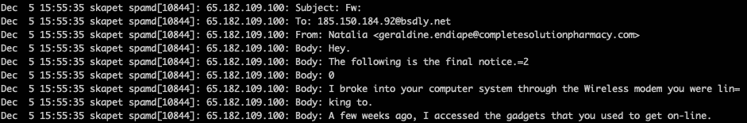

# 卑鄙的，没有好处的，针对…想象中的朋友的勒索运动？

> 原文：<https://medium.com/coinmonks/the-despicable-no-good-blackmail-campaign-targeting-imaginary-friends-9a75952096a4?source=collection_archive---------24----------------------->



Natalia here speaks to our imaginary friend 185.150.184.92

在这篇文章中，我们用真实数据反驳了专家们的假设，即基于禁令的勒索企图会随着时间的推移变得更加“复杂和可信”。

**不应该**存在是个问题。

这是一个如此明显的骗局，**不应该**工作。

然而，我们仍然看到一连串的报道，说有人真的出去买了他们的第一个比特币(或者更有可能是一个比特币的一小部分)，以此来支付敲诈者，这些敲诈者声称他们拥有在进行一些自慰活动时记录 vicim 的视频，以及他们在进行这些活动时应该观看的材料。

偶尔，这些消息中的一条真的会进入某个权威人士的收件箱(就像你的收件箱一样)，有时，某些人会说这些消息代表了一个真正的问题，并且会变得越来越复杂。

**注意:**这款也有，有更多的基本格式，但没有跟踪器，[这里是](https://www.nxdomain.no/~peter/despicable_no_good_blackmail.html)。

我在这里告诉你

1.  那个罪证视频**不存在**，并且
2.  预测这些骗局会变得更加复杂的专家们错了。

如果你偶然看到这篇文章，是因为你收到了其中一条信息，那就不要继续阅读了，请**不要理会这种敲诈企图。**

> 交易新手？在[最佳加密交易](/coinmonks/crypto-exchange-dd2f9d6f3769)上尝试[加密交易机器人](/coinmonks/crypto-trading-bot-c2ffce8acb2a)或[副本交易](/coinmonks/top-10-crypto-copy-trading-platforms-for-beginners-d0c37c7d698c)

我在 2019 年 [*写了一篇关于‘sextortion’骗局的文章:数字表明，我们所拥有的是教育的失败*](https://bsdly.blogspot.com/2020/02/the-sextortion-scams-numbers-show-that.html) ，也有没有追踪器的[](https://nxdomain.no/~peter/the_numbers_show_we_have_a_failure.html)*，总结就是，*

> *每次我看到这些邮件到达一个实际上由一个或多个人阅读的邮箱时，我也会看到几乎相同的邮件试图投递到我现在超过三十万个 [*垃圾邮件*](https://nxdomain.no/~peter/traplist.shtml) *，也称为*假想朋友*的一个子集。**

*自从这篇文章最初写出来后的这些年里，我添加了几次更新——通常是当一些废话到达我阅读的邮箱时——虽然我看到了几种语言的消息，但除了措辞上的一些变化外，没有任何真正的发展。*

*每当这些东西中的一个**到达收件箱时，我的操作序列通常是保存消息并将其添加到[存档](https://nxdomain.no/~peter/wankstortion/)，查看发送 IP 地址是否已经进入稍后导出的阻止列表，如果没有，则手动添加。然后，通过检查导出脚本的日志文件，检查最近捕获的地址数量是否增加***

```
*$ tail -n 96 /var/log/traplistcounts*
```

*查看自上次黑名单导出以来是否有大幅增长*

```
*$ doas spamdb | grep -c TRAPPED*
```

*然后在日志中检查相关活动*

```
*$ tail -n 500 -f /var/log/spamd*
```

*检查同一个日志文件中的完整主题*

```
*$ grep "You are in really big troubles therefore, you much better read" /var/log/spamd*
```

*然后检查旧的存档日志，看看这场运动已经持续了多久*

```
*$ zgrep "You are in really big troubles therefore, you much better read" /var/log/spamd.0.gz*
```

*这一次，活动没有持续足够长的时间来显示旧归档中的痕迹，所以我继续提取发送 IP 地址*

```
*$ grep "You are in really big troubles therefore, you much better read" /var/log/spamd | awk '{print $6}' | tr -d ':' | sort -u*
```

*从提取的地址之一检查活动*

```
*$ grep 183.111.115.4 /var/log/spamd | tee wankstortion/20221123_trapped_183.111.115.4.txt*
```

*将发送者 IP 地址提取到一个环境变量中，*

```
*$ grep trouble /var/log/spamd | awk '{print $6}' | tr -d ':' | sort -u | grep -vc BLACK | tee -a wankstortion/20221123_campaign_ip_addresses.txt*
```

*它将记录自上次日志轮换以来涉及这些 IP 地址的所有活动:*

```
*$ for foo in $troubles ; do grep $foo /var/log/spamd | tee -a wankstortion/20221123_campaign_log_extract.txt ; done*
```

*你会在[档案](https://nxdomain.no/~peter/wankstortion/)中找到所有这些文件，以及一些更早的样本，当你读到这篇文章时，可能还有更新的样本。*

*当收件箱中有类似的东西时，我可能会继续添加到归档中，如果我有时间，也会运行类似于我刚才描述的提取活动。但是除非发生了意想不到的事情，比如发送方方法的实际发展，否则我不会费心去写它。*

*除了说服所谓的受害者不要费心去获得比特币或花掉他们可能有的任何钱，这个话题根本不值得关注。我想象中的朋友都没有，他们就像有人试图欺骗他们之前一样好。*

*晚安，祝你好运。*

> *加入 Coinmonks [电报频道](https://t.me/coincodecap)和 [Youtube 频道](https://www.youtube.com/c/coinmonks/videos)了解加密交易和投资*

# *另外，阅读*

*   *[加密货币储蓄账户](/coinmonks/cryptocurrency-savings-accounts-be3bc0feffbf) | [YoBit 审核](/coinmonks/yobit-review-175464162c62)*
*   *[Botsfolio vs nap bots vs Mudrex](/coinmonks/botsfolio-vs-napbots-vs-mudrex-c81344970c02)|[gate . io 交流回顾](/coinmonks/gate-io-exchange-review-61bf87b7078f)*
*   *[CoinFLEX 评论](https://coincodecap.com/coinflex-review) | [AEX 交易所评论](https://coincodecap.com/aex-exchange-review) | [UPbit 评论](https://coincodecap.com/upbit-review)*
*   *[AscendEx 保证金交易](https://coincodecap.com/ascendex-margin-trading) | [Bitfinex 赌注](https://coincodecap.com/bitfinex-staking) | [bitFlyer 点评](https://coincodecap.com/bitflyer-review)*
*   *[Bitget 回顾](https://coincodecap.com/bitget-review)|[Gemini vs block fi](https://coincodecap.com/gemini-vs-blockfi)cmd |[OKEx 期货交易](https://coincodecap.com/okex-futures-trading)*