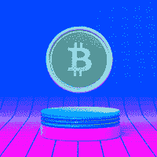
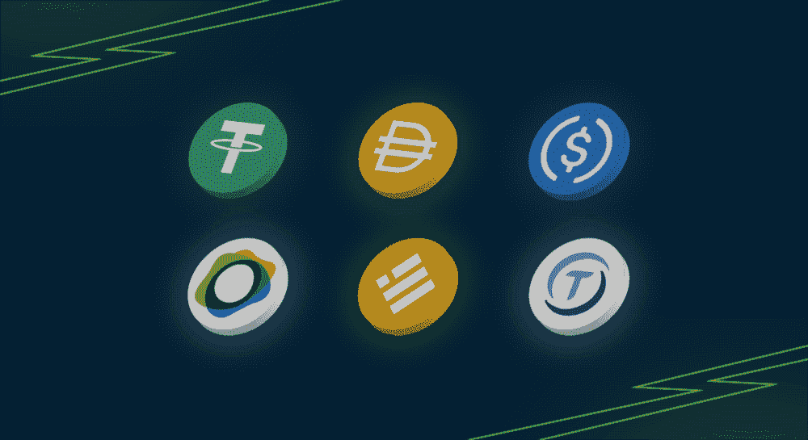

# 不同形式的加密货币

> 原文：<https://medium.com/coinmonks/the-differentforms-of-cryptocurrency-5e27de990982?source=collection_archive---------58----------------------->

Image from Unsplash.com

当你听到“加密货币”这个词时，你是否会立刻感到不寒而栗？又或许你有一个哥们已经在熊市中损失了一大半积蓄，你不禁会想加密货币到底有多残忍？你可能会对加密货币有一些奇怪的评论，尤其是如果你是一个新手。问题是，你是对的吗？

加密货币并不像人们无知地想象的那样残酷。事实上，它们是许多传统事件的发展。

尽管加密货币存在风险，但在决定站在哪一边之前，你必须了解规则。

然而，并非所有的加密货币都与投机有关，或者被视为高度不稳定的投资。

加密货币通常被认为是一种数字货币。许多因素将决定这种数字货币是否具有投机性。

了解加密货币可能采取的各种形式将让你确定什么最符合你的风险偏好，以及如何安全地使用它。让我们来看看不同形式的加密货币列表。

*   [*储值*](#8c01)
*   [*投机资产*](#7b9b)
*   [*稳定点*](#66dc)

Image form giphy

**价值储存**

加密货币可以作为价值储存手段。它们不仅仅是保持一种数字形式；它们的功能类似于现实世界中的资产，可以储存财富和分散投资。利用加密货币作为价值储存手段使它们完全可以移动，这是实物资产不太常见的特征。

[资产支持证券](https://coinmarketcap.com/alexandria/glossary/asset-backed-tokens)就属于这一类。加密货币可以通过得到实物资产(如黄金或房地产)的支持，与实物资产产生直接的价值关系。在这个意义上，加密货币变得易于交易，比传统资产更具流动性。

比特币可以被认为是一种价值储存手段，因为它与充当价值储存手段的实物资产有许多相似之处。价格波动是比特币的一个特点，它与其他 ***储值工具*** 的主要区别在于，它更倾向于投机性。这引发了关于比特币是否具有价值储存功能的讨论。

**投机资产**

你可能最常听说这种加密货币。

虽然比特币可以作为价值储存手段，但你应该知道比特币是一种高度投机的资产；甚至黄金和石油也在商品市场上交易。这解释了一些资产可以采取多种形式。

投机资产自然带有风险。它们是投机性资产，因为它们的价值可能会随着时间的推移而波动，并受到供求或购买和出售加密货币等因素的严重影响。

Cryptocurrencies can be in different forms

投机性加密货币的投资者希望价格会高于他们的进场点(他们买入的价格)以从中获利。还有一些交易者可以通过持有投机性加密货币的多头或空头头寸获利。这些投资者被建议用他们愿意冒险或损失的钱来交易投机性资产，用一种更准确的说法，因为他们知道所涉及的风险。

BNB、Avax、Cake、Solana 和 Apecoin 等加密货币属于投机资产。与比特币不同，这些加密货币通常提供更多的 [DeFi](https://www.coinbase.com/learn/crypto-basics/what-is-defi) 功能，因为它们被用于投机目的以外的目的。

> 交易新手？试试[密码交易机器人](/coinmonks/crypto-trading-bot-c2ffce8acb2a)或[复制交易](/coinmonks/top-10-crypto-copy-trading-platforms-for-beginners-d0c37c7d698c)

**STABLECOINS**

Stablecoins 可能是加密货币的一种形式，加密新手对其了解不多，因为它们经常被讨论。我认为这应该是任何试图了解加密货币的人的基础知识。

稳定币是加密货币，其价值与法定货币挂钩，通常是美元。最广泛使用的版本是、和戴的 stablecoins。这些稳定的货币可以以 1:1 的比率保持其美元价值不变。

Stablecoins are tied to fiat

它本质上是你的常规法定货币，以数字英镑、美元、欧元或其他想要的货币的形式出现。这就是说，稳定的硬币可以与任何法定货币挂钩，并保持其原始价值。

举个例子，你去越南。如果你必须使用越南盾进行数字形式的购物，你可能会选择 VNDCT(一种与越南盾挂钩的假想稳定币)。VNDCT 可以与其法定价值保持 1 比 1 的比率，并且可以用于尽可能多的法定交易；供应商必须愿意接受加密货币，这个过程才能无缝。

Stablecoin 可以在您的[数字钱包](https://www.investopedia.com/terms/d/digital-wallet.asp)中转移任意数量的资金，并且在不转移实物现金的情况下进行交易。想象一下，你必须把 1 亿美元搬到街对面；很难不被注意到。然而，如果你的电子钱包里有同样多的钱，你也可以神不知鬼不觉地做同样的事情。现在，那很酷！

稳定的收入使投资者和交易者在市场上具有竞争优势。它提供了一个从没有波动性的硬币中获益的机会，或者是一个避免即将到来的损失的避风港。这消除了将加密货币资产转换为法定货币的直接需求，而不用担心贬值。

在持有稳定货币的同时，最有可能发生亏损的情况是，通货膨胀或其他可能损害一国金融稳定的因素导致法定货币的真实价值下降。

也许你不太喜欢交易投机性的加密资产；然后，你可能想试着持有一些稳定的美元币，感受一下数字货币是如何运作的。

$$$ way!

然而，在选择你喜欢的那种之前，了解不同的[形式的稳定硬币](https://www.google.com/amp/s/101blockchains.com/types-of-stablecoins/amp/)是很重要的。