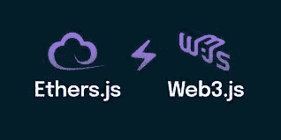

# Ethers.js 和 Web3.js 之间的区别

> 原文：<https://medium.com/coinmonks/the-distinctions-between-ethers-js-and-web3-js-8e51f60083ce?source=collection_archive---------0----------------------->

**简介**

你可能遇到过 ethers.js，尤其是在测试智能合约时，作为前端区块链开发人员或后端智能合约开发人员的 web3.js。我相信这两个库是最重要的节点包，它们提供了与智能合约交互的不同方式，并在兼容 EVM 的区块链中处理事务。

在本文中，我将介绍这两者之间的区别以及它们如何与网络交互。

**先决条件**

要从本文中获得更多信息，您需要:

1.  JavaScript 和 Node.js 的知识
2.  对智能合同、web3 和区块链技术有基本的了解

**什么是图书馆？**

简单地说，库是一个打包的、可重用的代码段，它执行单个函数或一组密切相关的函数。因此，您可以在程序中添加一个库，并在需要实现该功能时访问它，而不是从头开始编写代码。

假设您正在建造一栋房子，而不是一个应用程序。你的房子需要的东西之一是一个炉子，但是当你可以从货架上买一个炉子的时候，从头开始造一个炉子并不是特别实际。一个图书馆对于一个程序，一个炉子对于一个家。有一些你已经熟悉的库和工具。

**什么是醚类？**

Ethers.js 库旨在成为一个完整而紧凑的库，用于与以太坊区块链及其生态系统进行交互。它最初是为 ethers.io 设计的，后来扩展成了一个更通用的库。

**乙醚的特性. js**

1.  将您的私钥安全地保存在您的客户端中
2.  导入和导出 JSON 钱包(Geth、Parity 和 crowdsale)
3.  进出口 BIP 39 助记短语(12 字备份短语)和高清钱包(英语、意大利语、日语、韩语、简体中文、繁体中文；更多即将推出)。
4.  元类从任何契约 ABI 创建 JavaScript 对象，包括 ABIv2 和人类可读的 ABI。
5.  通过 [JSON-RPC](https://github.com/ethereum/wiki/wiki/JSON-RPC) 、 [INFURA](https://infura.io/) 、 [Etherscan](https://etherscan.io/) 、 [Alchemy](https://alchemyapi.io/) 、 [Cloudflare](https://developers.cloudflare.com/distributed-web/ethereum-gateway/) 或 [MetaMask](https://metamask.io/) 连接以太坊节点。
6.  ENS 名为一等公民；它们可以在任何可以使用以太坊地址的地方使用。
7.  Tiny (~88kb 压缩；284kb 未压缩)。
8.  满足您所有以太坊需求的完整功能
9.  大量的[文档](https://docs.ethers.io/)。
10.  维护和添加的大量测试用例。
11.  完整的 TypeScript 就绪，带有定义文件和完整的 TypeScript 源代码。
12.  MIT 许可(包括*所有*的依赖)；完全开源，随心所欲

**web 3 . js 是什么？**

Web3.js 是一个库集合，允许开发人员使用 HTTP、IPC 或 WebSocket 与远程或本地以太坊节点进行交互。

您可以使用此库创建与区块链通信的网站或客户端。这可以包括从一个用户向另一个用户传输以太网、检查来自智能合约的数据以及设计智能合约等。

# Ethers.js 和 Web3.js 之间的区别

与 web3.js 不同，它为单个实例化的 web3 对象提供了与区块链交互的方法，ethers.js 将 API 划分为两个不同的角色。提供者是以太坊网络的匿名连接，而签名者可以访问私钥，可以对交易进行签名。ethers 团队希望这种关注点分离给开发人员更多的灵活性。

**与示例的比较**

以下是开发人员可能在他们的 dapp 中包含的一些常见功能。您会注意到它们提供了相同的功能，只是 API 略有不同。

**使用元掩码 wallet 创建提供商**

**web3**

*const web 3 = new web 3(web 3 . given provider)；*

**醚类**

*const provider = new ethers . providers . web 3 provider(window . ether eum)*

**获取账户余额**

**web3**

*const balance = await web 3 . eth . get balance(" 0x 0 ")*

**醚类(支持 ENS！)**

*const balance = await provider . get balance(" ethers . eth ")*

## 实例化合同

**web3**

*const my contract = new web 3 . eth . contract(ABI，合同地址)；*

**醚类**

*const myContract =新醚。契约(contractAddress，ABI，provider . get signer())；*

## 调用合同方法

**web3**

*const balance = await my contract . methods . balance of(" 0x 0 ")。调用()*

**醚类**

*const balance = await my contract . balance of(" ethers . eth ")*

**结论**

在这段阅读中，我们学到了:

1.什么是 web3.js 和 ethers.js 库

2.如何使用这两者来签订智能合同

3.以及它们之间的区别

**链接**

文件:【https://docs.ethers.io/v5/getting-started/ 

文件:【https://github.com/web3/web3.js/tree/v1.8.1 

YouTube:[https://www.youtube.com/watch?v=yk7nVp5HTCk](https://www.youtube.com/watch?v=yk7nVp5HTCk)

> 交易新手？尝试[加密交易机器人](/coinmonks/crypto-trading-bot-c2ffce8acb2a)或[复制交易](/coinmonks/top-10-crypto-copy-trading-platforms-for-beginners-d0c37c7d698c)