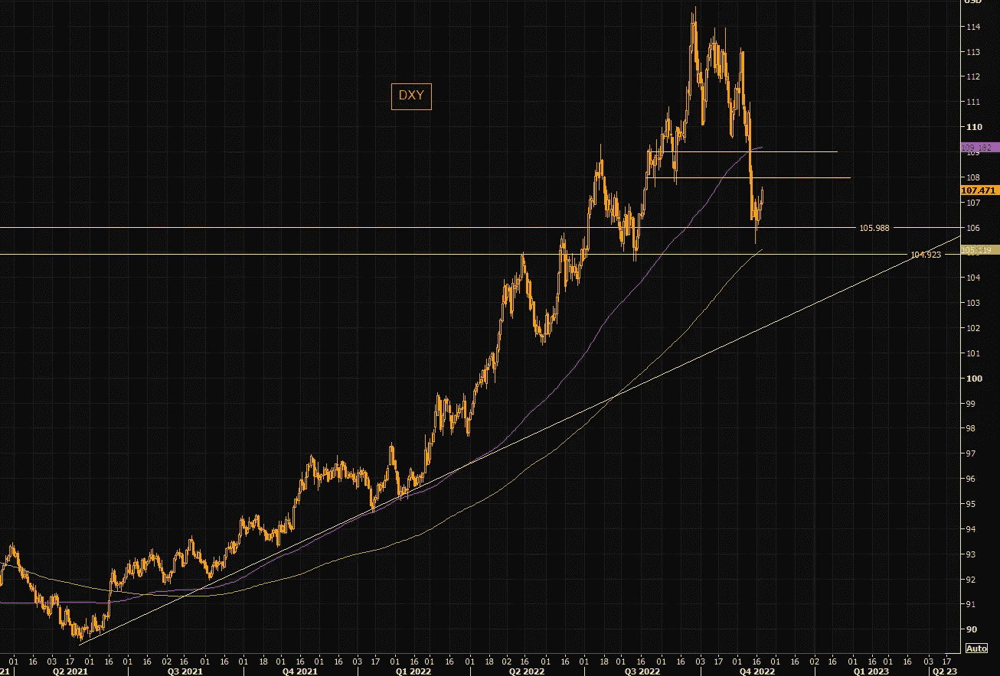
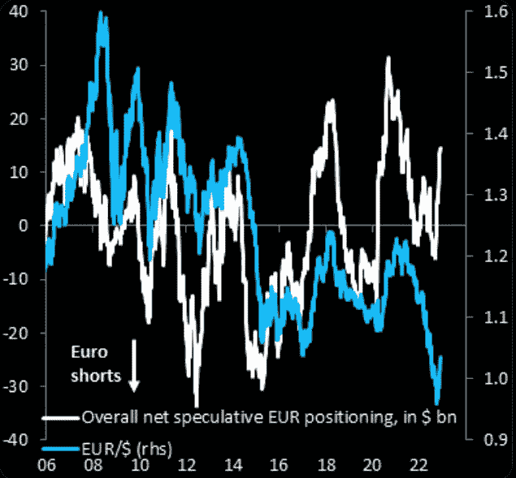
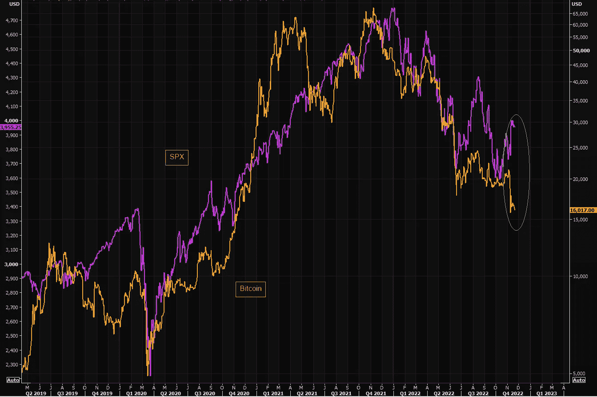
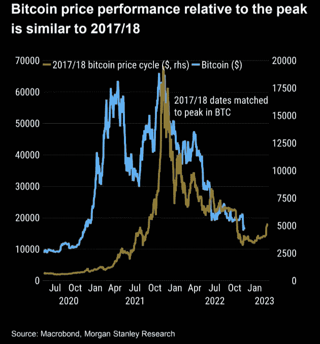
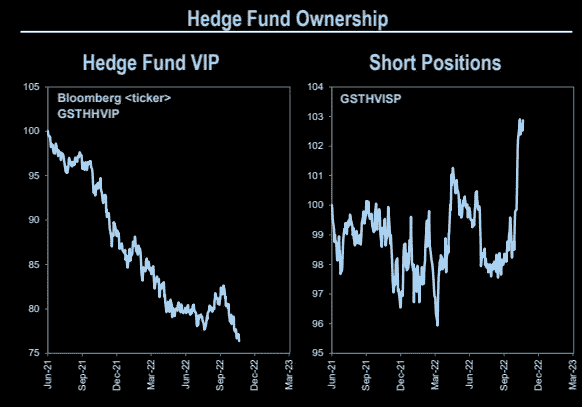
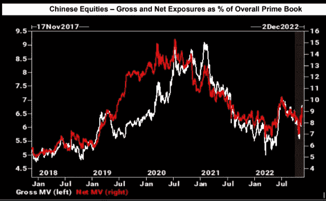
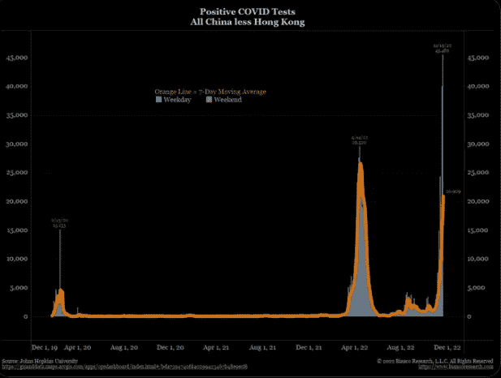

# 美元逆转，比特币 2017 崩盘 V 今日，对冲基金恐怖

> 原文：<https://medium.com/coinmonks/the-dollar-reversal-bitcoin-2017-crash-v-today-hedge-fund-horror-e54adb9c89f5?source=collection_archive---------31----------------------->

嘿，我是基兰！市场又将迎来新的一周，以下是需要注意的关键事件，以及来自投资银行的最有趣的宏观研究。我希望能在本周的[贸易挑战](http://www.traderseed.io/)中与你交谈，并且一如既往，如果你有任何问题，请在下面给我留言。

# 每周观察列表

本周美国感恩节假期在周四，所以一些市场将在周四和 Fri 减少时间，所以请确保在你的 MT4 邮箱标签中检查市场开放时间。

由于流动性不足导致过大和长时间的波动，市场本周应该会出现大量机会。本周，美联储将于周三公布 11 月会议纪要，经合组织将于周二公布其对全球经济的最新预测&周三来自欧元区、英国和美国的 PMI 数据可能会增加波动性，因此预计市场将会波动！

# 宏观视角

**美元逆转**——在经历了过去几周的美元疲软之后，我们现在看到了强劲的反弹。美元是当今市场的王者，因此美元指数(DXY)重新定价将导致所有以美元计价的市场重新定价。

**共识刚刚翻转做空美元。**正是时候，就在美元反弹之际，“最近几周，外汇投机头寸全力以赴做多欧元。压倒性的市场共识是，我们已经看到欧元/美元的低点”。永远记住，大众通常是错误的。

**S & P500 和 BTC 相关性。最近，由于加密技术的崩溃，这种分歧被打破了。然而，两者之间的差距通常会迅速填补。无论 SP500 经济下滑，还是 BTC 奋起直追，这都值得关注。**

**比特币 2017 今日崩盘 v。**比特币 2022 年的崩盘看起来与 2017 年相似。如果模拟是跟踪，我们应该看到一个更低的推动，然后底部可能会在。“在街上有血的时候买”罗斯柴尔德男爵，18 世纪

**对冲基金的恐怖。对冲基金陷入了各种各样的麻烦。对冲基金 VIP 股票继续大幅下挫，对冲基金“卖空最多”的股票现在价格上涨。**

中国股票——每个人都在买。过去几周，投资者对中国股票的敞口迅速增加。从不可投资到 FOMO。

**在风暴中收购——中国 COVID。就像变魔术一样，就在所有人都蜂拥而至的时候，中国的 Covid 阳性检测呈抛物线状。谁能想到呢？:)**

我希望你觉得这很有趣，很有用。一如既往，我只是一个电子邮件，所以只要回复此邮件，如果你有任何反馈或问题。

祝你一周愉快！
基兰
**www.traderseed.io**

想交易本周的市场吗？ 100k 节目 **$75** 起！！点击这里查看新节目 [**！**](http://www.traderseed.io/)

[**查看节目**](http://www.traderseed.io/)

> 交易新手？尝试[加密交易机器人](/coinmonks/crypto-trading-bot-c2ffce8acb2a)或[复制交易](/coinmonks/top-10-crypto-copy-trading-platforms-for-beginners-d0c37c7d698c)