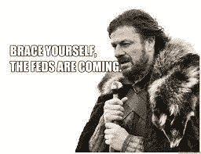
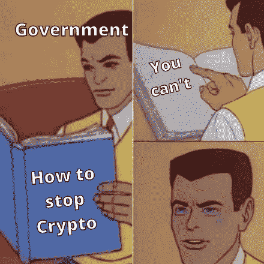

# 多米诺骨牌已经开始倒下了..

> 原文：<https://medium.com/coinmonks/the-dominoes-have-already-started-falling-cfe5a0c17cb1?source=collection_archive---------27----------------------->

Is insider trading a big problem in crypto?

这是我很久以前写的，当时司法部指控内特·查斯坦。

我觉得这很可悲。

可怜的内特·查斯坦。

错误的地点，错误的时间？

他做了什么？

他基本上知道比特币基地下一步会上市哪些硬币，并使用一堆匿名钱包来购买硬币。

一旦硬币被比特币基地上市，价格通常会上涨，他通过抛售获得可观的利润。

经典的领跑。

坦率地说，在传统金融领域，这种事情可能一直都在发生。

我们只是不了解或没有接触到华尔街镀金大门背后的这些交易。

内特甚至没有从所有的麻烦中获得那么多利润。

他必须成为联邦调查局的榜样。

现在他们行动迅速，最近指控另一名前 CoinBase 员工内幕交易。

但你知道什么更让人担心吗？

Sooner or later

联邦调查局的人来了。

他们想要监管那些不受监管的。

把法律带到了无法无天的西部。

驯服野兽。

试图控制一场疯狂的加州丛林大火，这场大火烧毁了沿途的一切。

为什么他们还在尝试？

或许散户投资者损失太大了？

难道仅仅是因为有太多的资金在流动，他们无法忽视吗？

或者这真的是未来，他们宁愿控制它，然后忽视它？

内特做了件坏事。

这是非法的吗？

我也这么认为

是发生在 TradFi 吗？

也许吧。

政府只是让他成为其他人的榜样吗？

绝对的。

看起来联邦调查局正处于战争状态，追捕加密世界中任何非法和恶意的人和事。

看看其他人在说什么:

“毫不奇怪，在联邦大陪审团指控 Nat Chastain 涉嫌在 OpenSea marketplace 上出售的 NFT 中进行内幕交易后，加密界的许多人都吓坏了。”

“他们下一步会去抓其他人。它开始了，”拥有 19 万 Twitter 粉丝的 web3 开发者 Loopify 写道。"

NFT 媒体公司 M3taverse 的创始人 Roberto Nickson 也对这一消息感到震惊。“疯了，”他在推特上写道。“史无前例。不会是最后一次。美国政府不再玩游戏了。未来还会有更多。”

Should or could the gov regulate crypto effectively?

Crypto 是一个蛮荒的西部，没有规则意味着无限的自由和最大的效果。

任何人都可以做他们想做的任何事情，钱源源不断。

更多的钱意味着更多的人进入这个领域，这总是导致更多的坏演员和骗子捕食无辜的人。

当更多无辜的人受到伤害时，监管者和政府就很难忽视，他们必须采取行动。

当联邦政府和监管机构介入并开始清理街道时，自由受到限制，使加密变得有趣和免费的东西不再存在。

这是一个良性或恶性的循环，监管者在平衡生态系统方面发挥着关键作用。

多米诺骨牌已经开始倒下了。

下一个是谁？

-

政府应该监管密码吗？

-

# startups # business # startupx # growth # success # social media # culture # entrepreneur # strategy # eth #比特币#加密货币# NFT # getrich # branding # cobie # Jordan fish # front running # coin base #义警#区块链

> 交易新手？试试[加密交易机器人](/coinmonks/crypto-trading-bot-c2ffce8acb2a)或者[复制交易](/coinmonks/top-10-crypto-copy-trading-platforms-for-beginners-d0c37c7d698c)