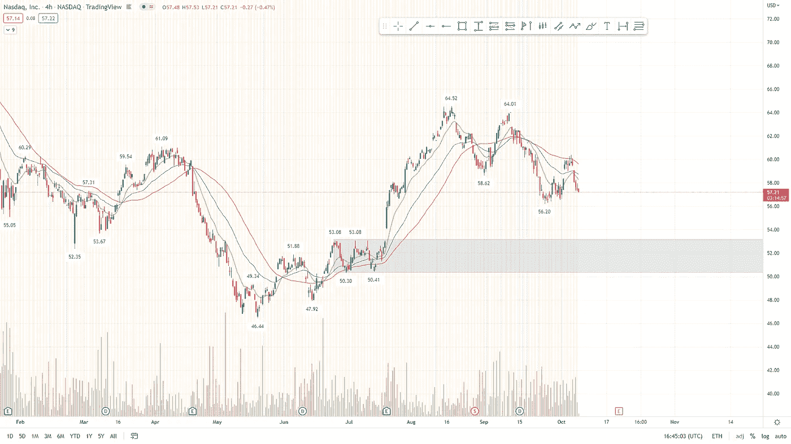
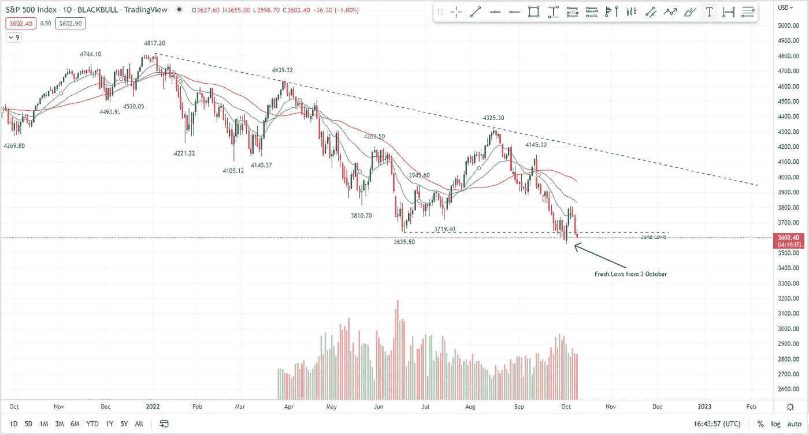
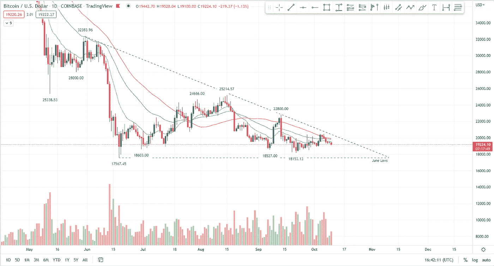

# 世界末日的故事还在继续

> 原文：<https://medium.com/coinmonks/the-doomsday-narrative-continues-in-crypto-and-stocks-9fc88d31ff6d?source=collection_archive---------47----------------------->

# 在本周的报告中

*   瑞士瑞信银行，新的雷曼兄弟，或者只是膨胀的恐惧？
*   失业率持续上升，有哪些影响？
*   币安 BNB 连锁黑客，多少钱和如何？
*   整体股票市场概述。
*   BTC 价格分析。
*   纳斯达克价格分析。

‍

‍

# 瑞士信贷集团

‍

瑞士瑞信银行一直面临潜在的偿付能力问题，这无疑是本周的热门话题。

正如我们在上周的时事通讯中所报道的，一些养老基金上周得到了英国央行的救助。

仅这两件事就完美地代表了全球经济的日益脆弱。

瑞士瑞信银行被传言为下一个雷曼兄弟的主要区别在于，在 2007 年大金融危机开始时，雷曼兄弟并没有濒临破产的风险。

然而，随着对这家高杠杆投资银行的情绪恶化，破产成了一个自我实现的预言。

那么，瑞士瑞信银行是否正处于破产边缘，急需救助或收购呢？

没有，但由于该银行长期偿付能力的低概率，市场正在对瑞士瑞信银行失去信心。

尽管市场不敢苟同，但瑞士瑞信银行的资不抵债还不至于让人立即担忧。

违约风险不是 CS 近期的关键问题，市场信心才是关键。如果信心继续下降，对于像瑞士瑞信银行这样的投资银行来说，主要的风险是信誉的下降将导致融资问题。

难以为其短期债务找到买家将对瑞士瑞信银行的偿付能力构成巨大威胁。

**许多人将此与 2008 年的雷曼兄弟崩溃相提并论。**

尽管市场似乎确实认为违约的可能性相当大，需要纾困，但这几乎肯定不会很快发生，除非一些全球催化剂导致了这种违约。

尽管这条新闻对市场肯定意义重大，但它引发的 FUD 更多，而非国际金融体系的风险。

‍

# 工作报告

‍

在就业市场，我们本周看到一些数据显示，美国 8 月份职位空缺减少了 110 万个，为 2020 年 4 月以来的最大降幅。

‍

8 月份，辞职和裁员的数量都保持相对平稳，表明公司目前不打算重新招聘职位。

‍

因此，我们看到招聘明显停止，这将影响到经济的许多领域。

‍

在解雇现有员工之前，暂停雇佣新员工总是第一步。

‍

失业率是经济周期的一个重要指标，但往往落后于实际市场。

‍

美联储希望我们关注延迟指标，以免恐慌接踵而至。让我们看看下周 CPI 等大数据会发生什么。出来了。

‍

# BNB 连锁黑客

‍

‍

**10 月 6 日星期四，币安的 BNB 连锁店被迫暂时关闭**,原因是“潜在漏洞”,连锁店证据显示，该漏洞可能针对高达 5 . 7 亿美元的加密货币。

‍

最初的令牌移动表明，攻击者瞄准了多达 200 万个 BSC 令牌，价值约 5.7 亿美元。
‍

‍
但币安首席执行官赵昌鹏后来在推特上估计，攻击者只能带走其中的 1 亿美元。
‍

“由于不正常的活动，我们暂停 BSC，”(BNB 链由 BNB 信标链和 BNB 智能链‘BSC’组成)。

BNB 链从其官方账户发推文，后来证实该活动是一个“潜在的利用”，并将该利用描述为“被遏制”。

**自从黑客和 BNB 链宣布将举行一系列链上治理投票来决定是否应该冻结被黑客攻击的资金以来，链已经恢复了全部功能。**

此外，还将对漏洞赏金奖励系统进行投票，以防止未来黑客攻击的发生。

链上数据显示，今天下午，一名攻击者从 BSC 令牌中心提取了两笔 100 万个 BSC 令牌，该攻击者通过跨链交换、桥接和借用来入侵加密资产。

最后，BNB 的验证推特承诺**“所有资金都是安全的”**，并表示将进一步“帮助冻结任何转移”(这似乎不安全)。

‍

# 价格分析:大图片股票概述

‍

虽然主要指数继续走低的可能性仍然很大，但一旦指数在熊市中达到关键移动平均线以下的高延伸水平，逆势反弹往往就会出现。

‍

在这些长期的下跌趋势中，你往往会看到空头获利了结，这可能会导致巨大的空头压力之间的漂亮反弹。

‍

诚然，大量的短期收盘似乎不太可能，因为世界末日的叙事是目前市场上极为突出的。

‍

大多数股票看起来想要更低，并继续走低，就像在标准普尔 500 看到的那样，甚至通常相对强劲的 QQQ 也表现不佳。

‍

对我来说，这似乎不是底部，只是短期反弹，继续走低的可能性大于长期底部。

‍

也就是说，市场上的事情变化非常快，一切皆有可能。
‍

‍:与标准普尔 500 指数(图 2)相比，纳斯达克指数(图 1)似乎仍然非常强劲。

*图 1 4H 纳斯达克 2022 年 2 月—2022 年 9 月(交易视图)*

*图 2 1D S&p500 2021 年 9 月—2022 年 9 月(交易视图)*

‍

# 价格分析:比特币

与股票市场相比，比特币表现出持续的强劲，试图上涨一段时间，但不断遭到拒绝。
‍

一段时间以来，比特币也显示出比 US30 和其他股票更稳定。

‍

自 6 月份的低点以来，比特币没有再创新低。

‍

相比之下，比 6 月份低点低 2%的标准普尔 500 BTC 表现出了很强的实力。【‍】‍

**BTC 的最终目标似乎仍然很明确，在 9-14k 之间。**

‍

根据最终目标，图 3 中当前的下降三角形对比特币多头来说不是好兆头。
‍

‍
**在合适的全球市场条件下，向上突破是可能的，但没什么好赌的。**

‍

*图 3 1D BTC 2022 年 4 月—2022 年 9 月(TradingView)*

> 交易新手？尝试[加密交易机器人](/coinmonks/crypto-trading-bot-c2ffce8acb2a)或[复制交易](/coinmonks/top-10-crypto-copy-trading-platforms-for-beginners-d0c37c7d698c)