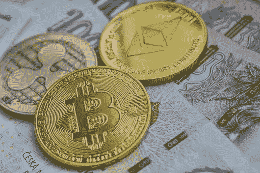

# 在尼日利亚购买加密货币的简便方法

> 原文：<https://medium.com/coinmonks/the-easy-way-to-buy-cryptocurrency-in-nigeria-b01b4605659f?source=collection_archive---------60----------------------->

加密货币正逐渐成为货币的未来。主要金融机构开始接受它作为一种支付形式，更多的企业开始采用它作为一种替代货币形式。这种转变可能会逐渐发生，但随着时间的推移，加密货币将成为交易和支付的规范。然而，在尼日利亚进入加密领域可能有点复杂，因为加密货币是被禁止的。

不同国家有不同的法律来指导与加密相关的活动。在本文中，我们将深入尼日利亚的加密领域，以及如何参与其中。在尼日利亚，情况有点危险，因为你不能直接与银行进行与加密相关的交易。2021 年早些时候，尼日利亚中央银行通过了一项指令，停止所有商业银行为加密交易提供便利。从那以后，加密活动对尼日利亚人来说一直是个挑战。
加密交易所已经找到了更简单的方法来帮助尼日利亚人交易加密货币，其中最受欢迎的是点对点(P2P)转账。到目前为止，这是在尼日利亚购买加密货币最简单、最可行的方式。P2P 交易是如何运作的？我们以 Paxful 点对点为例；当有交易加密货币的请求时，Paxful 将其与反请求相匹配，(将买入请求与卖出请求相匹配)，双方进行谈判，并在所有条件都对双方有利时进行交易。

> 交易新手？试试[密码交易机器人](/coinmonks/crypto-trading-bot-c2ffce8acb2a)或者[复制交易](/coinmonks/top-10-crypto-copy-trading-platforms-for-beginners-d0c37c7d698c)

一些加密交易所将整个过程向前推进了一步，成立了一个专门处理 P2P 交易的团队。所以，这些是你与之交流的人，更像是你自己从交易所购买，而不是等待你的请求得到满足。通过这种方式，欺诈和诈骗等风险大大降低。大多数交换平台都有这些选项；像 Remitano，Yellowcard.io，Localbitcoins 等等。
如果你热衷于在尼日利亚购买加密货币，这里有一个简短的指南。

*   首先，做你的研究，选择一个你会喜欢使用的交流平台。注意他们的费用——有些交易所的费用可能比其他交易所低，但在承诺之前，要确保你对整体服务感到满意。
*   继续创建帐户并输入您的个人信息。这些交易所通常都有非常友好的用户界面，所以入门应该不会太难。
*   检查可用的支付方式和资金你的奈拉钱包。
*   在为你的钱包注入资金后，你可以继续购买任何你选择的加密货币。
*   最后，确保了解 naira 中加密货币的最新消息和价格，因为这将帮助您在购买数字资产时做出最明智的决定。

有许多可供选择的平台；奎达克斯、币安、鲁诺、库科恩、北海巨妖、奈拉 Ex、Gate.io 等。作为一名加密货币交易者，你可能希望每隔一段时间就把你的资产换成奈拉。你可以在 Dart Africa、Prestmit、Roqqu 或 Breet App 等平台上轻松做到这一点。 [Dart Africa](http://dartafrica.io) 是在尼日利亚销售加密资产的最可靠平台。该平台保证了从开始到结束的平稳和容易的过程。此外，客户服务是一流的，确保您在需要时可以获得所有帮助。Dart Africa 支持约 7 种加密货币；比特币、、、戴、以太坊、和莱特币。