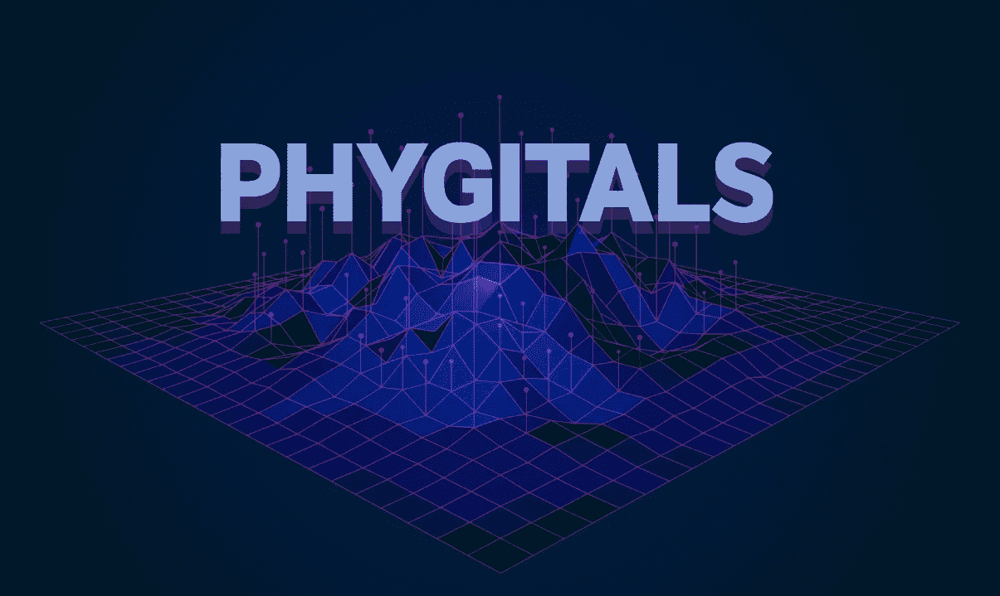

# 数字 NFT 的出现

> 原文：<https://medium.com/coinmonks/the-emergence-of-phygital-nfts-c5c7b391900b?source=collection_archive---------41----------------------->

我已经写了一系列关于不可替换的令牌及其作为加密领域中的一个利基的日益增长的重要性的文章。尽管熊市条件到目前为止已经吞噬了 2022 年的加密空间，但这一重要性仍在增长。

在这篇文章中，我试图解释非功能性语言是如何以一种被称为数字非功能性语言的新形式迅速融入日常生活的。实质上，物理非功能性资产是与物理资产直接相关的非功能性资产。它们将 NFT 带出其功能受限的典型数字空间。物理资产的功能更像物理资产的复制品，它们可以用来验证所有权和确认真实性。

# 非功能性测试的增长范围？

我们逐渐看到了 NFTs 的发展。到目前为止，我们已经看到它们从静止的猿类图像变成了艺术和房地产领域的有形资产。部分非金融资产也已出现，用于将原本缺乏流动性的实物资产证券化。现在，轮到物理 NFTs 充当连接数字和物理项目的桥梁了。

从所有迹象来看，数字 NFTs 可能是开启商业规模 NFTs 的关键。到目前为止，我们已经看到它们在多个主流企业和行业中的创新应用。时尚行业已经在采用 phygital NFTs 方面处于领先地位，同时我们也看到了它们在葡萄酒和奢侈饮料行业的引入。

# Phygital NFTs 在哪里使用？

数字 NFT 的使用程度和范围尚不清楚。然而，早期的承诺是好的。这使得人们相信，数字 NFTs 可能会导致不可替代令牌的广泛采用。

phygital NFTs 被迅速采用的一些领域包括时装、饮料、供应链和活动票务。当元宇宙变得商业化时，时装业将进一步受益于 NFT 的数字化。这是因为用户在订购服装和其他时尚配饰之前，可以在元宇宙试穿。

在活动票务中，数字资产可能成为验证门票购买的新方式，只需在活动中进行简单扫描，即可确认购买的真实性。这可能有助于减少足球和橄榄球比赛等公共活动的瓶颈。

# 结果

非物质文化遗产可能是非物质文化遗产主流化的关键。它们可能会成为全球采用不可替代代币的催化剂。目前，采用仍处于早期阶段，但从所有迹象来看，phygital NFTs 可能是 NFT 商业化的渠道。

> 交易新手？试试[加密交易机器人](/coinmonks/crypto-trading-bot-c2ffce8acb2a)或者[复制交易](/coinmonks/top-10-crypto-copy-trading-platforms-for-beginners-d0c37c7d698c)