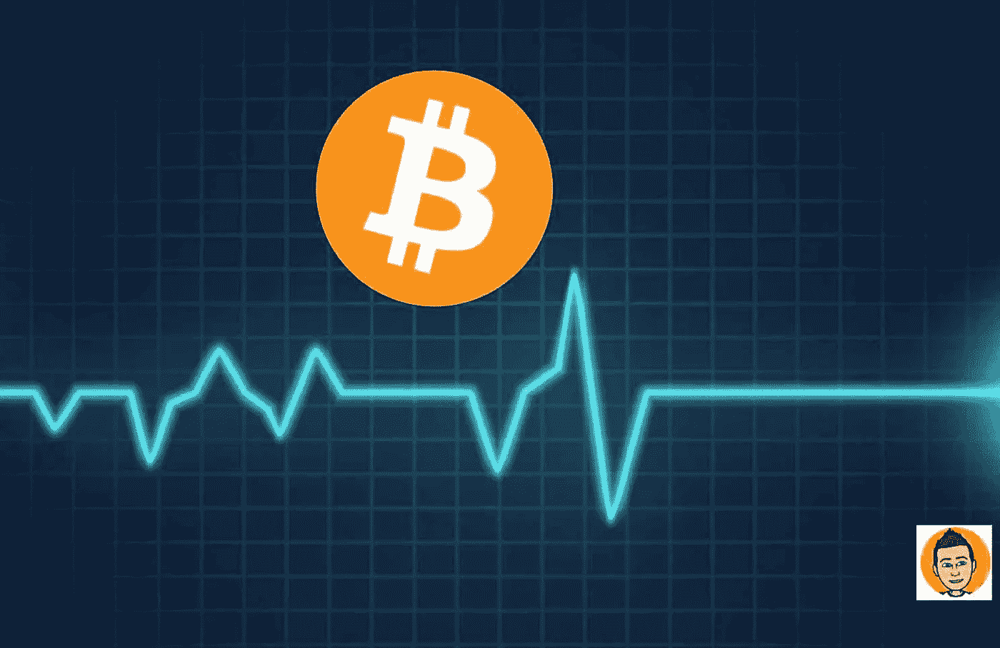

# 比特币被动收益的终结？

> 原文：<https://medium.com/coinmonks/the-end-of-bitcoin-passive-income-120170dc39d7?source=collection_archive---------1----------------------->

在过去的几年里，我们很多比特币市场的人开始借出我们的硬币来赚取被动收入。毕竟，我们为什么不应该呢？我们有两个选择。要么冷藏你的 BTC，要么坐在交易所里无所事事。或者把它借给第三方服务来赚取可观的被动收入。我们大多数对比特币深信不疑的人都知道，这个游戏的名字是获取尽可能多的 BTC…