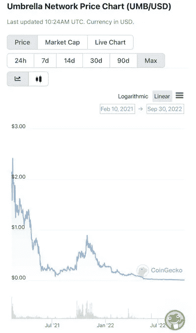
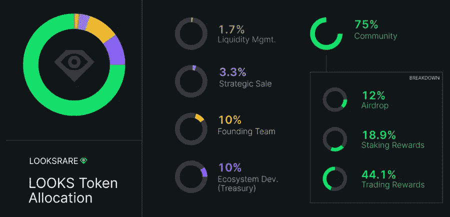
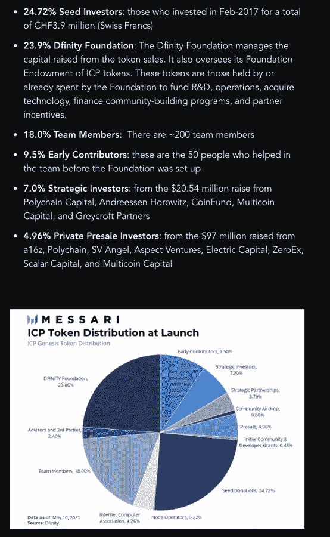
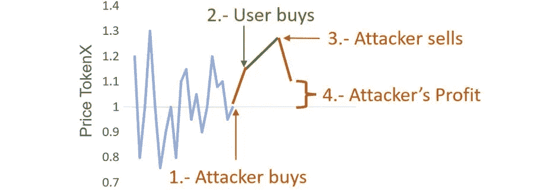
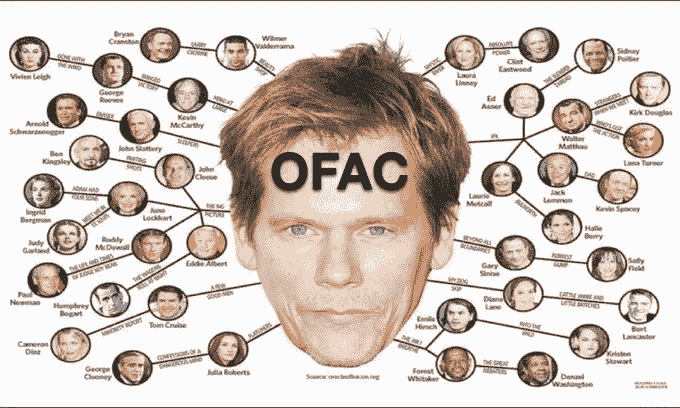
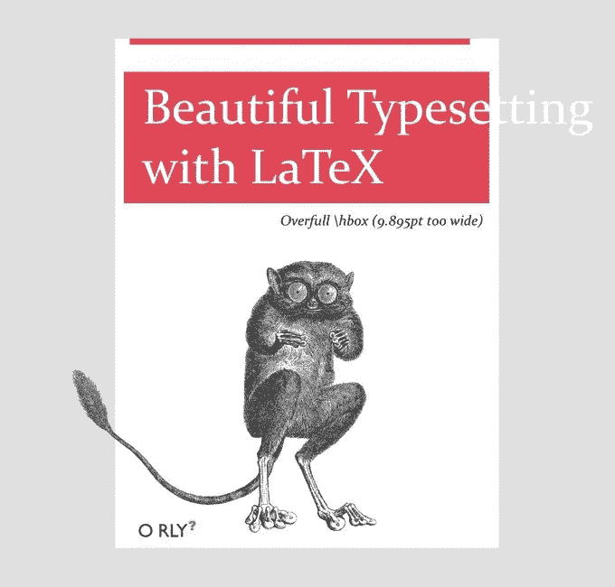
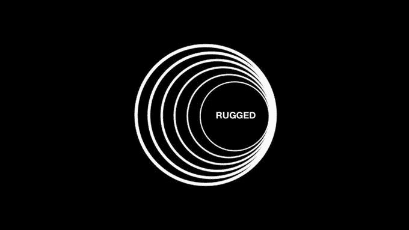
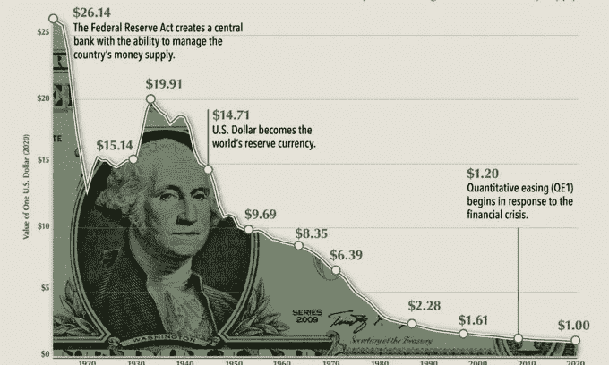

# 密码碎片的完整列表。省省你的钱吧！

> 原文：<https://medium.com/coinmonks/the-entire-list-of-crypto-rags-save-your-money-54fd2affe378?source=collection_archive---------13----------------------->

当一个开发团队突然放弃一个项目，并卖掉或拿走所有的流动资金时，加密行业就会陷入困境。这个名字来源于短语“把地毯从(某人)下面拉出来”，意思是出人意料地撤回支持。

这是我在研究中发现的地毯品种目录。

几周前，我在研究这个问题时发现了这篇[论文](https://arxiv.org/pdf/2201.07220.pdf)。Uniswap 上 97.7%的代币是地毯。事实上更糟糕的是，以下大多数地毯品种都在 2.3%以内

我们先来看看:

## 🤷**基础地毯**

这是一个退出骗局。你给我钱，我答应你一些事，我就做一件。我赢了，你输了。

## 🤵🏻**经典地毯**

经典，产生于分散的加密地牢。dex 引入了分散式做市。如果我做了市场。我拿着地毯。你应该经常问自己这样的问题，“谁掌握着地毯”(流动性)。

典型的 xy = k AMM 是由创建该对并最终确定挂牌价格的人发起的。如果我用 100k [$NICK](https://twitter.com/search?q=%24NICK&src=cashtag_click) 代币和 100 [$ETH](https://twitter.com/search?q=%24ETH&src=cashtag_click) 创建一个池。我设定市场利率。如果你买 [$NICK](https://twitter.com/search?q=%24NICK&src=cashtag_click) 代币并投入 [$ETH](https://twitter.com/search?q=%24ETH&src=cashtag_click) ，我就可以拉地毯。Yoink。

## 🐳象征性的地毯

**“流动性被锁定！没有更多的地毯了。如果剩余的供应是可获得的，那么锁定流动性除了给德根斯一种虚假的安全感之外没有任何作用。如果我持有 1000 万枚[$尼克](https://twitter.com/search?q=%24NICK&src=cashtag_click)代币，即使 LP 代币被锁定，我也可以通过扔掉我的备用代币袋并逃之夭夭来将所有的代币(几乎)抽走🏃🏼‍♀️**

## 🐌**慢地毯**

对于更有眼光，长期思维的骗子。这次我要“公平发射”一个令牌。通常情况下，有这么多零，你无法理解你买的是什么。然后我要把它抽出来。我说的是比基尼女郎洗兰博基尼的视频。公共交通上的广告。文营销！“在这里，宝贝！”然后我要慢慢地把这个混蛋榨干，这样就没人会注意到了。

## 😈**狡猾的地毯**

**“哦，不，我们被黑了！”** 实际上，我正看着我控制的多 sig 上那些丰厚的利润，喝得酩酊大醉，然后订了一张去阿卡普尔科的机票。没关系，你得了斯德哥尔摩综合症，在我当众哭泣时，你会安慰我。

## 📈📉**泵和地毯**

**大发布来了，快上车。好吧，这是一笔 7 万美元公共拨款，尽管我知道电报集团有 500 万美元的加密需求被搁置。

越有竞争力越好。200 个插槽 100k 个应用程序。然后将该需求导入 DEX 列表。让流动性变薄，这样你就能更快地沿着 xyk 曲线上升。**

太棒了，现在你的阴沟屎币价值 50 亿 FDV，现在是时候扔掉你的内幕包了。不管你是否有 3 年的既得利益，你都可以在上市当天还清本金。把它归零。

这种图表模式很常见

## 🔎内部地毯

[@cobie](https://twitter.com/cobie) 在他的激励结构文章[https://cobie.substack.com/p/incentives-structures…](https://t.co/vTO6ys5Lmh)中钉住了这一点，饼状图上五颜六色的切片很可能都是同一组。内部人员。他们的目标是拿走你的钱。

可以说，后 ICO 时代的所有代币都有这种元素。风投想要你的流动性。退出。这是转折点。然而，如果推得太远，整个经济将永远无法复苏。比如 [$ICP](https://twitter.com/search?q=%24ICP&src=cashtag_click) 。

## 🤖算法地毯

自动化地毯堆栈并持续部署。这主要包括部署一些与合法硬币相同的标记，并说服德根斯这是真的。基本地毯更接近垃圾邮件。这是 97.7%的大部分人生活的地方

## 🥪地毯三明治

把你的滑点容忍度设的太高了？你会变得强壮。三明治攻击包括不知情的 degen 向 DEX 发送 Tx，然后“MEV 搜索者”发现他们的交易，并在同一个街区跑在他们前面卖回给他们。

## 🌀防尘毯

你有一个. eth 和足够受欢迎的脏钱抗议吗？祝你好运，现在就从任何一个中央交易所退出你的钱。现在你还得填写一些文件来证明你下半辈子不是恐怖分子。坚固耐用。

培根地毯( [@spengrah](https://twitter.com/spengrah) )你躲过了灰尘的袭击，但是你认识的人用现金，他们给你寄钱。现在你强壮了。事实上，有人送了一些给你。你也很强壮。五次跳跃，我们都归零。

## 📃蒸汽地毯

全是白皮书和梦想，仅此而已。圈内人知道这一点，比你先脱身。(见，基本上每个 ICO)。注意，如果你用乳胶写你的白皮书，梦想会更难实现。

## 🌉桥牌地毯

你快乐地在一条链子上玩耍，用的是乙醚，而不是乙醚，这是一张桥梁合同的借据。但是桥被黑了。如果跳楼不能买断你的股份，你就一无所有了。

## 🖨The 充气地毯

你粗犷，我粗犷，每个人都粗犷。看着你的纸币在你眼前变成卫生纸。我们阻止这一切的唯一方法就是让每个人都变穷。经济学 101。

## 🥒山姆地毯山姆

Rugmaster General 的 Bankman-Fried 得到 rekt，因为他认为地毯游戏永远不会停止。他用你的钱去买流动性差的狗屎硬币，他(和他的朋友们)打算把这些钱扔给正常人。但是音乐停止了，我们得到了 100 亿美元的大地毯

> 暂时就这样了。在评论中分享你自己的地毯品种。我肯定还有很多很多。我希望这篇文章能帮助你在未来避开一些地毯。请分享提高认识😉

> 交易新手？试试[密码交易机器人](/coinmonks/crypto-trading-bot-c2ffce8acb2a)或者[复制交易](/coinmonks/top-10-crypto-copy-trading-platforms-for-beginners-d0c37c7d698c)