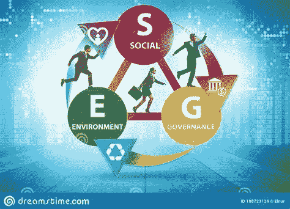

# 环境、社会和治理行政命令及其对隐密体的影响

> 原文：<https://medium.com/coinmonks/the-environmental-social-governance-executive-order-and-its-impact-on-the-cryptoverse-d0baf669ec5c?source=collection_archive---------37----------------------->

dreamstime

“全球‘环境、社会和治理’(ESG)的兴起本质上是伪装成环境管理的重商主义，这是美国人应该关注的事情。”凯文·罗伯茨博士传统基金会。

2021 年 2 月，总统发布行政命令，要求“联邦政府…