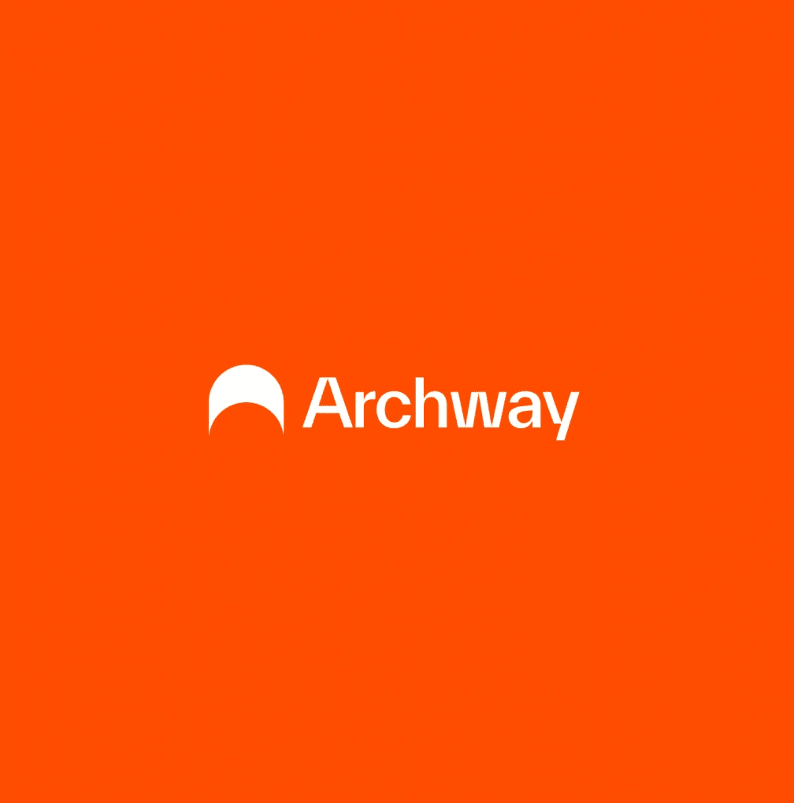
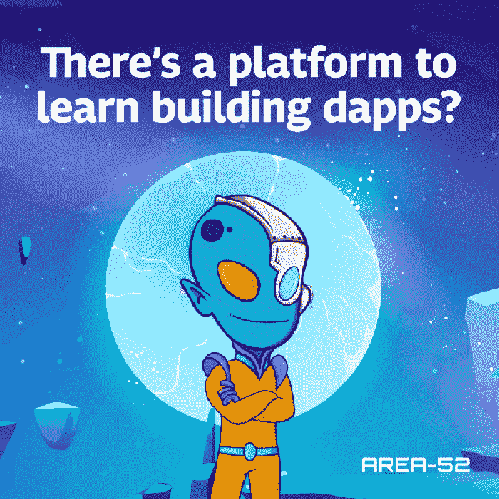

# 必须有种子资金的时代随着 Archway 的出现而终结

> 原文：<https://medium.com/coinmonks/the-era-of-must-have-seed-funding-comes-to-an-end-with-archway-82b16e26d39c?source=collection_archive---------22----------------------->

**这是一个互联网&创业者的故事。在那里，互联网给了每个企业家一条不受歧视地接触用户的途径。互联网给企业家指明了方向，让他们知道顾客对企业的期望是什么。互联网给了你一个收集创业信息的途径。不要忘记，互联网也确实让那些成功的初创企业更接近他们的投资者。**

事实上，web 3.0 区块链和加密货币领域将这些优势提升到了一个新的水平。我们看到，作为核心实体的开发者现在可以独立使用真正意义上的区块链([，这是真正的链间](https://twitter.com/archwayHQ/status/1592318805912748032?ref_src=twsrc%5Etfw%7Ctwcamp%5Etweetembed%7Ctwterm%5E1592318805912748032%7Ctwgr%5E826fccf8cc4dc624395049afa257deac99646340%7Ctwcon%5Es1_c10&ref_url=https%3A%2F%2Fpublish.twitter.com%2F%3Fquery%3Dhttps3A2F2Ftwitter.com2FarchwayHQ2Fstatus2F1592318805912748032widget%3DTweet))，并部署应用程序，链的用户确保 dApp 产生足够的收入来运行其运营。

> Archway 打造这一链条的愿景是为所有人提供**【平等机会】**。它引入了一种模型，在这种模型中，它确保所有开发人员社区都有“平等的机会”在他们的链上构建和部署合同。

Learn and Build

对于有想法并希望创建概念证明的开发人员来说，没有其他平台可以保证产生足够的收入(取决于您的应用程序有多受欢迎)。这里列出了一些已经在实施的想法[。如果你有什么想法，请联系我们。](/archwayhq/dapp-rewards-on-archway-e8dcc888aed9)

有用的来源:

[简讯](https://www.archway.io/updates) // [不和](https://discord.gg/archwayhq) // [推特](https://twitter.com/archwayhq) // [Github](https://github.com/archway-network)

> 交易新手？尝试[加密交易机器人](/coinmonks/crypto-trading-bot-c2ffce8acb2a)或[复制交易](/coinmonks/top-10-crypto-copy-trading-platforms-for-beginners-d0c37c7d698c)