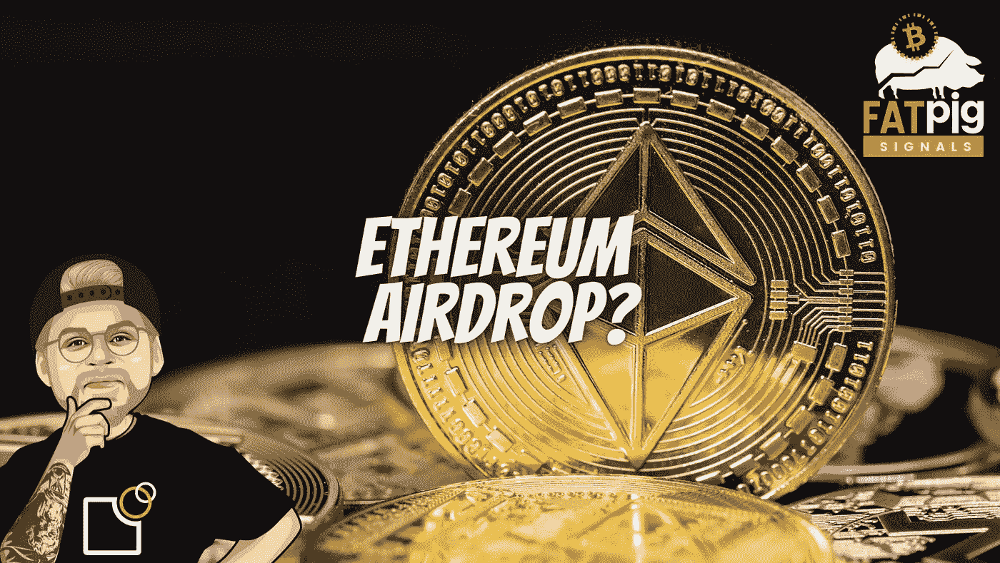

# 以太坊合并的以太空投策略

> 原文：<https://medium.com/coinmonks/the-eth-airdrop-strategy-for-the-ethereum-merge-29d57e7cc678?source=collection_archive---------1----------------------->

合并即将到来，区块链将从工作证明转变为利益证明。很可能会有两个甚至更多的以太坊版本和一个免费获取以太的方法。在这方面，CoinGecko 的联合创始人最近分享了他对即将到来的合并活动的策略。

# 免费 ETH 感谢以太坊合并？