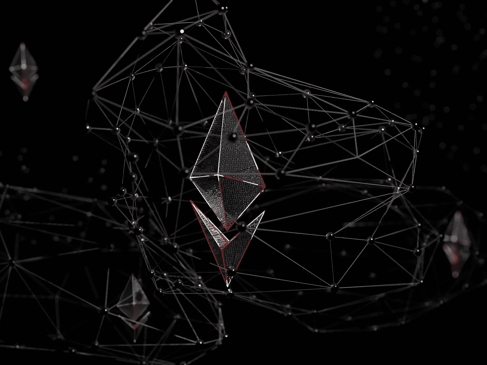

# 🤯ETH 合并及其误区

> 原文：<https://medium.com/coinmonks/the-eth-merge-its-misconceptions-f37c5bccbdfd?source=collection_archive---------15----------------------->

# 内容(3 分钟阅读):

*   🤔本周在《加密与经济》中…
*   🔀合并及其误解。
*   🌪️龙卷风现金制裁，许多的第一个。
*   👨 👩 👧 👧Startupy——社区管理的搜索引擎
*   🥊比特币基地被击中了
*   🏖️个人退休帐户，避税帐户
*   📰热门阅读
*   🙏🏻感激…

# 🤔本周在《加密与经济》中…

市场一片繁荣。美国 CPI 同比通胀率达到 8.5%；这低于 8.7%的预期。

美国股指周五锁定周涨幅，继投资者在周四下午因[好于预期的通胀数据](https://www.wsj.com/livecoverage/stock-market-news-today-08-11-2022/card/treasury-yields-rebound-signal-ongoing-inflation-concerns-sg7KgVlBMiEN1rr39q3V)而热情消退后，又迎来了积极的一周。

以太坊最终测试歌尔丽成功！

# 🔀合并及其误解。

添加替代文本

在[以太坊](http://ycobitcoin.com/)合并的同时，协议从 POW(工作证明)到 POS(利益证明)的迁移已经成功通过了最终测试，并计划在 9 月 19 日进行，同时在过去几周内提升 ETH 的价格。有许多误解可能不会产生一些人认为的结果。

**误区一:**合并后以太坊燃气费会降低

以太坊即将升级将降低以太坊臭名昭著的燃气费(交易费)是投资者中流传的最大误解之一。虽然降低天然气费用是每个投资者的愿望，但合并是共识机制的变化，将以太坊区块链从 PoW 过渡到[proof-of-stage(PoS)](https://cointelegraph.com/blockchain-for-beginners/proof-of-stake-vs-proof-of-work:-differences-explained)。

相反，降低以太坊的天然气费用需要努力扩大网络容量和吞吐量。开发者社区目前正在致力于一个[以 rollup 为中心的路线图](https://ethereum-magicians.org/t/a-rollup-centric-ethereum-roadmap/4698)来降低交易成本。

**误区二:**合并后以太坊交易会更快

可以有把握地认为以太坊交易不会明显更快。然而，这个谣言有一些真实性，因为 Beacon Chain 允许验证器每 12 秒发布一个块，在 mainnet 上大约是 13.3 秒。

虽然以太坊开发商认为过渡到 PoS 将使区块产量增加 10%，但用户不会注意到这一微小的改善。

**误解 3** :合并将导致以太坊区块链的停工

与认为合并会给以太坊带来积极结果的误解相反，一个流行的谣言认为计划中的升级会暂时关闭以太坊区块链。

开发人员预计，当区块从使用 PoW 构建过渡到使用 PoS 构建时，不会出现停机。

**误解 4:** 合并后投资者将可以撤回所持股份

由 ETH([ETH](https://cointelegraph.com/ethereum-price))1:1 支持的加密货币 Staked ETH (stETH)，目前被锁定在信标链上。虽然用户希望能够收回他们的 stETH 资产，但是开发者社区已经确认升级并不能促进这种改变。

stETH holdings 的退出将在合并后的下一次重大升级期间进行，即所谓的上海升级。因此，在合并后的至少 6-12 个月内，这些资产将保持锁定和非流动性。

**误解 5:** 在上海升级之前，验证者不能提取 ETH 奖励

虽然 stETH 在 Shangai 升级后恢复提款之前仍然对投资者封锁，但验证者将可以立即从执行层或以太坊 mainnet 获得费用奖励和在大宗提议期间赚取的最大可提取价值(MEV)。

由于费用补偿不是新发行的令牌，它将立即对验证器可用。

> *结论:* [*以太坊*](http://ycobitcoin/) *合并有很多好处，但是也有很多误区，上面提到过。切分和侧链将提高交易速度，从而降低费用，但合并本身不会。然而，一次成功的合并将为这个领域注入信心，随着技术变得更加稳定、安全和强大，我们将看到更多的价格上涨和更多的采用。*

# 🌪️龙卷风现金制裁，许多的第一个。

本周，美国政府彻底撼动了整个密码世界。

财政部[批准](https://bovyzb.clicks.mlsend.com/te/cl/eyJ2Ijoie1wiYVwiOjEyMTA1OSxcImxcIjo2MzI0Mjg3MTM4NDMxMDk5OSxcInJcIjo2MzI0MjkwMDM4NDc3NzU3MX0iLCJzIjoiMDUzZGE0OTdhNDdhMzg0MiJ9)加密混合器[龙卷风现金](https://decrypt.co/resources/what-are-coin-mixers-tornado-cash-how-do-they-work)以及与该服务相关的几个加密钱包地址。这意味着该协议及其相关的智能合同现在被列入黑名单，美国人使用它们是非法的。

Tornado 是一款[隐私工具](https://decrypt.co/resources/what-are-privacy-coins-monero-zcash-and-dash-explained)，让用户混淆他们的资金去向。它把区块链技术的透明度变成了一个黑匣子，隐藏你的加密活动。

Elliptic 在一份报告中说，大约有价值 76 亿美元的密码确实通过了 Tornado，但其中只有 15 亿美元是非法获得的(因此是洗钱的)。

另一家区块链监测公司 chain analysis 也[报告称](https://bovyzb.clicks.mlsend.com/te/cl/eyJ2Ijoie1wiYVwiOjEyMTA1OSxcImxcIjo2MzI0Mjg3MTQxODkxNDAxMixcInJcIjo2MzI0MjkwMDM4NDc3NzU3MX0iLCJzIjoiOTdhMjIyNzcxNzE0YWU5ZCJ9)这 76 亿美元中有将近一半来自 DeFi(根据 chain analysis 的说法，其中没有一笔是非法的)。

[立即订阅](https://yarocelis.substack.com/subscribe?utm_medium=web&utm_source=subscribe-widget&utm_content=68692477)

> *结论:美国和许多其他政府将继续更积极地调查和传唤分散和集中的交易所，以找到更多关于加密交易的信息。众所周知，政府的职责是保护法定货币，而加密对法定货币的统治地位构成了威胁。分散式交易所并不像许多人认为的那样安全，不会受到政府部门的影响，它们渴望加强自己的权力。*

[启动-](https://beta.startupy.world/membership/?ref=yarocelis)

添加替代文本

> 我很高兴地宣布，我已经成为 Startupy 的策展人和会员。一个社区管理的搜索引擎。零 SEO BS。 [*我邀请你加入这个为漫游、研究和思考而设计的知识和见解的令人愉快的图书馆。*](https://beta.startupy.world/membership/?ref=yarocelis)

# 🥊比特币基地被击中了

这个隐秘的冬天重创了比特币基地。财务结果显示，由于熊市吓跑了日常投资者，该交易所第二季度亏损 11 亿美元。但高管们试图在报告中表现出勇敢的一面，他们表示:“事情从来没有看上去那么糟糕。”在这三个月中，交易量骤降 30%，至 2170 亿美元。尽管该交易所在 2021 年最后一个季度拥有 1120 万名月度交易用户——当时比特币创下了 68700 美元的历史新高——但这一数字已降至 900 万。交易费收入是比特币基地商业模式的一大部分，但许多用户的交易量减少了。拥有 62 亿美元银行存款的布莱恩·阿姆斯特朗(Brian Armstrong)希望走出熊市。

添加替代文本

加密货币是这些天每个人都在谈论的东西之一。有各种不同的交易所可以交易 e crypto 但是很多人没有意识到他们在税费上损失了多少。

iTrustCapital 允许其客户通过个人退休账户或个人退休帐户投资 crypto，而不必担心税收或费用。

IRA 是避税账户，这意味着你所有的加密交易都是免税的，并且可以随着时间的推移免税。

没有隐藏的费用。[要了解更多信息，请点击此处并开通免费账户。](https://itrustcapital.com/referral100?utm_source=partner&utm_medium=youtube&utm_campaign=partner637&oid=10&affid=637)

[分享 Yaro 的技术& WebX 简讯](https://yarocelis.substack.com/?utm_source=substack&utm_medium=email&utm_content=share&action=share)

# 📰热门阅读

*   [通货紧缩告诉了我们房地产市场什么](https://bitcoinmagazine.com/markets/deflation-and-a-real-estate-market-crash)
*   发光的不一定是金子:联合国机构抨击加密技术的采用
*   [尽管出现崩溃，养老基金仍对加密技术感兴趣](https://www.theblock.co/post/163492/pension-funds-remain-interested-in-crypto-despite-crash-wsj?utm_source=cryptopanic&utm_medium=rss)
*   [Dogecoin 的竞争对手柴犬爆发，由于比特币和以太坊的阻力，市值达到 100 亿美元](https://dailyhodl.com/2022/08/14/dogecoin-competitor-shiba-inu-erupts-hitting-10000000000-market-cap-as-bitcoin-and-ethereum-tap-resistance/)
*   [周日，SHIB 股价飙升 30 %, doge coin 股价攀升](https://decrypt.co/107436/shiba-inu-spikes-30-on-sunday-dogecoin-climbs)
*   [比特币基地强调闪电网络可能会颠覆价值 1500 亿美元的支付行业](https://dailyhodl.com/2022/08/14/coinbase-highlights-lightning-networks-potential-disruption-of-the-150000000000-payments-industry/)
*   [本周最值得关注的五种加密货币:BTC、阿达、尤尼、林克、CHZ](https://cointelegraph.com/news/top-5-cryptocurrencies-to-watch-this-week-btc-ada-uni-link-chz)
*   [Polygon，Fantom 准备采取重大价格行动](https://cryptobriefing.com/polygon-fantom-poised-for-significant-price-action/?utm_source=cryptopanic&utm_medium=rss)
*   [以太坊上链活跃度达到 5 年低点，但没什么问题](https://u.today/ethereum-on-chain-activity-reaches-5-years-low-but-there-is-nothing-wrong-with-it)

> 加入 Coinmonks [电报频道](https://t.me/coincodecap)和 [Youtube 频道](https://www.youtube.com/c/coinmonks/videos)了解加密交易和投资

# 另外，阅读

*   [XT.COM 评论](https://coincodecap.com/profittradingapp-for-binance)币安评论 |
*   [SmithBot 评论](https://coincodecap.com/smithbot-review) | [4 款最佳免费开源交易机器人](https://coincodecap.com/free-open-source-trading-bots)
*   [比特币基地僵尸程序](/coinmonks/coinbase-bots-ac6359e897f3) | [AscendEX 审查](/coinmonks/ascendex-review-53e829cf75fa) | [OKEx 交易僵尸程序](/coinmonks/okex-trading-bots-234920f61e60)
*   [如何在印度购买比特币？](/coinmonks/buy-bitcoin-in-india-feb50ddfef94) | [WazirX 评论](/coinmonks/wazirx-review-5c811b074f5b)
*   [加密交易机器人](/coinmonks/crypto-trading-bot-c2ffce8acb2a) | [Probit 审查](https://coincodecap.com/probit-review)